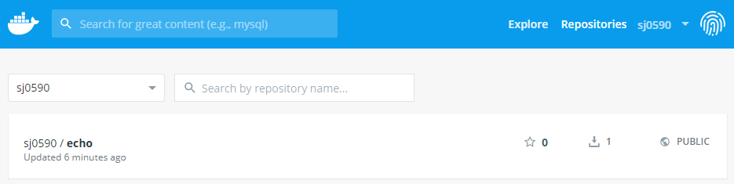
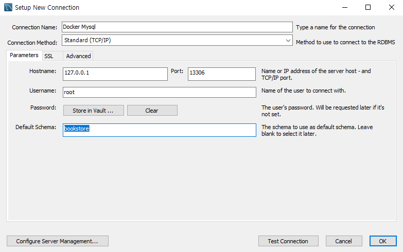
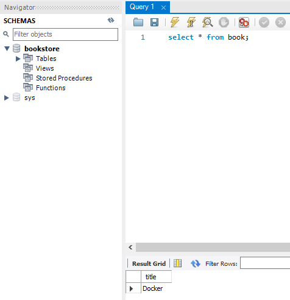
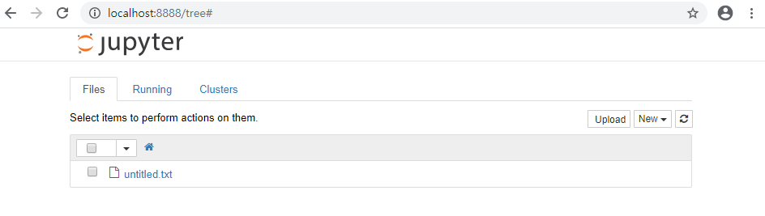
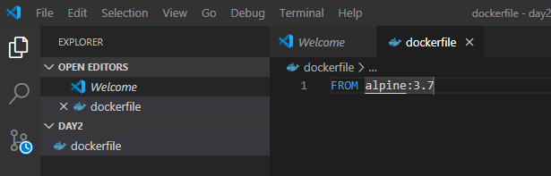
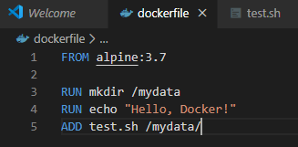
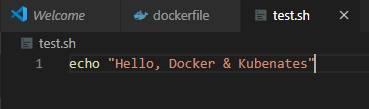
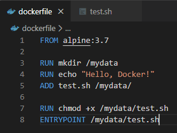

# 도커(Docker)

```shell

C:\Users\HPE\Work\docker\day1\go>docker build -t example/echo:latest .
   # 현재 파일에 'example/echo'라는 도커 이미지 빌드
Sending build context to Docker daemon  3.584kB
Step 1/4 : FROM golang:1.10
 ---> 6fd1f7edb6ab
Step 2/4 : RUN mkdir /echo
 ---> Running in f36d232e0c15
Removing intermediate container f36d232e0c15
 ---> 5aedc47fdedc
Step 3/4 : COPY main.go /echo
 ---> e380cf9d2fa9
Step 4/4 : CMD ["go", "run", "/echo/main.go"]
 ---> Running in 38de8f4d00cc
Removing intermediate container 38de8f4d00cc
 ---> a41c3dd980e8
Successfully built a41c3dd980e8
Successfully tagged example/echo:latest
SECURITY WARNING: You are building a Docker image from Windows against a non-Windows Docker host. All files and directories added to build context will have '-rwxr-xr-x' permissions. It is recommended to double check and reset permissions for sensitive files and directories.

C:\Users\HPE\Work\docker\day1\go>docker images
REPOSITORY          TAG                 IMAGE ID            CREATED             SIZE
example/echo        latest              a41c3dd980e8        6 seconds ago       760MB
<none>              <none>              f62da6482724        14 minutes ago      750MB
helloworld          latest              4deb3afc35dd        16 hours ago        123MB
ubuntu              16.04               c6a43cd4801e        11 days ago         123MB
golang              1.10                6fd1f7edb6ab        10 months ago       760MB
golang              1.9                 ef89ef5c42a9        17 months ago       750MB
gihyodocker/echo    latest              3dbbae6eb30d        24 months ago       733MB
```

## 도커 서버

```bash
C:\Users\HPE\Work\docker\day1\go>docker run example/echo:latest
2019/12/31 00:47:08 start server
```

```bash
## 제 2cmd

Microsoft Windows [Version 10.0.17134.1184]
(c) 2018 Microsoft Corporation. All rights reserved.

C:\Users\HPE>docker ps
CONTAINER ID        IMAGE                     COMMAND                  CREATED             STATUS              PORTS                    NAMES
c0621f065f5f        example/echo:latest       "go run /echo/main.go"   27 seconds ago      Up 25 seconds                                optimistic_colden
abe038ef5a9e        gihyodocker/echo:latest   "go run /echo/main.go"   16 hours ago        Up 16 hours         0.0.0.0:9000->8080/tcp   funny_blackburn

C:\Users\HPE>docker stop c0621f065f5f
c0621f065f5f
```

.

.

.


## 도커 이미지 다루기

* 도커 이미지: 도커 컨테이너를 만들기 위한 템플릿으로, 우분투같은 운영체제로 구성된 파일 시스템은 물론, 실행환경의 설정정보까지 포함한다.

* docker image pull - 이미지 내려받기

  ```bash
  HPE@DESKTOP-DFE1UPJ MINGW64 ~/Work/docker/day1 (master)
  $ docker image pull jenkins:latest
     #jenkins 이미지 내려받기
  latest: Pulling from library/jenkins
  55cbf04beb70: Already exists
  1607093a898c: Already exists
  9a8ea045c926: Already exists
  d4eee24d4dac: Already exists
  c58988e753d7: Pulling fs layer
  794a04897db9: Pulling fs layer
  70fcfa476f73: Pulling fs layer
  ...
  ```

* docker image tag - 이미지에 태그 붙이기

  ```bash
  HPE@DESKTOP-DFE1UPJ MINGW64 ~/Work/docker/day1 (master)
  $ docker image tag example/echo:latest example/echo:0.1.0
  
  HPE@DESKTOP-DFE1UPJ MINGW64 ~/Work/docker/day1 (master)
  $ docker image ls
  REPOSITORY                 TAG                 IMAGE ID            CREATED             SIZE
  gihyodocker/concretetest   latest              3b499711dd9d        59 minutes ago      760MB
  mygolang                   1.10                3b499711dd9d        59 minutes ago      760MB
  example/echo               0.1.0               9f7f478050c4        About an hour ago   750MB
  example/echo               latest              9f7f478050c4        About an hour ago   
  750MB
  ...
  ```

* docker image push - 이미지를 외부에 공개하기

  ```bash
  HPE@DESKTOP-DFE1UPJ MINGW64 ~/Work/docker/day1 (master)
  $ docker image tag example/echo:latest sj0590/echo:0.1.0
     # docker image push 명령으로 example/echo:latest 이미지를 도커 허브에 등록하기 위해서는 먼저  	   docker image tag 명령을 사용해서 example/echo 이미지의 네임스페이스를 먼저 바꿔야한다.
     
  HPE@DESKTOP-DFE1UPJ MINGW64 ~/Work/docker/day1 (master)
  $ docker images
     # 아래와 같이 sj0590/echo로 네임스페이스 example가 등록된 것을 볼 수 있다. 
  REPOSITORY                 TAG                 IMAGE ID            CREATED             SIZE
  gihyodocker/concretetest   latest              3b499711dd9d        About an hour ago   760MB
  mygolang                   1.10                3b499711dd9d        About an hour ago   760MB
  example/echo               0.1.0               9f7f478050c4        About an hour ago   750MB
  example/echo               latest              9f7f478050c4        About an hour ago   750MB
  sj0590/echo                0.1.0               9f7f478050c4        About an hour ago   750MB
  ...
  
  HPE@DESKTOP-DFE1UPJ MINGW64 ~/Work/docker/day1 (master)
  $ docker image push sj0590/echo:0.1.0
     #네임스페이스를 등록했으니 docker image push 명령어를 사용하여 인자로 등록할 이미지를 지정한다.
  The push refers to repository [docker.io/sj0590/echo]
  8d9fbaf1f464: Preparing
  939eb040563c: Preparing
  186d94bd2c62: Preparing
  24a9d20e5bee: Preparing
  ```

​          


## 도커 컨테이너 다루기

* docker container run - 컨테이너 생성 및 실행

* docker container ls - 도커 컨테이너 목록 보기

  ```bash
  HPE@DESKTOP-DFE1UPJ MINGW64 ~/Work/docker/day1 (master)
  $ docker container run -t -d -p 8080 --name echo1 example/echo:latest
     # docker container ls에서 확인 가능하도록 컨테이너 실행
  f042b5a5e9e14453e099776cbc34ee24987513f6630c2e953ce121f0da013c8e
  
  HPE@DESKTOP-DFE1UPJ MINGW64 ~/Work/docker/day1 (master)
  $ docker container run -t -d -p 8080 --name echo2 example/echo:latest
     # docker container ls에서 확인 가능하도록 컨테이너 실행
  0ecfc5db9935eda233eb3690b0f4f71d069cef6c69ab4c36f55e5169fce5da7a
  
  HPE@DESKTOP-DFE1UPJ MINGW64 ~/Work/docker/day1 (master)
  $ docker container ls
     # 현재 실행 중인 컨테이너 목록 출력
  CONTAINER ID        IMAGE                 COMMAND                  CREATED              STATUS              PORTS                     NAMES
  0ecfc5db9935        example/echo:latest   "go run /echo/main.go"   About a minute ago   Up About a minute   0.0.0.0:32770->8080/tcp   echo2
  f042b5a5e9e1        example/echo:latest   "go run /echo/main.go"   About a minute ago   Up About a minute   0.0.0.0:32769->8080/tcp   echo1
  
  HPE@DESKTOP-DFE1UPJ MINGW64 ~/Work/docker/day1 (master)
  $ docker container ls -q
     # 컨테이너 id 출력
  4f63978eaec0
  c6babec124f4
  
  HPE@DESKTOP-DFE1UPJ MINGW64 ~/Work/docker/day1 (master)
  $ docker container ls --filter "name=echo1"
     # 특정 조건을 만족하는 컨테이너의 목록 출력
     # docker container ls --filter "필터명=값"
     # 이름이 echo1인 컨테이너 출력
  CONTAINER ID        IMAGE                 COMMAND                  CREATED             STATUS              PORTS                     NAMES
  f042b5a5e9e1        example/echo:latest   "go run /echo/main.go"   20 minutes ago      Up 20 minutes       0.0.0.0:32769->8080/tcp   echo1
  ```

* docker container stop -  컨테이너 정지하기

  ```bash
  HPE@DESKTOP-DFE1UPJ MINGW64 ~/Work/docker/day1 (master)
     # 컨테이너 정지하기
     # docker container stop 컨테이너id_또는_컨테이너명
  $ docker container stop f042b5a5e9e1
  f042b5a5e9e1
  ```

* docker container restart - 컨테이너 재시작하기

  ```bash
  HPE@DESKTOP-DFE1UPJ MINGW64 ~/Work/docker/day1 (master)
     # 컨테이너 재시작 하기 
     # docker container stop 컨테이너id_또는_컨테이너명
  $ docker container restart f042b5a5e9e1
  f042b5a5e9e1
  ```

* docker container restart - 컨테이너 재시작하기

  ```bash
  HPE@DESKTOP-DFE1UPJ MINGW64 ~/Work/docker/day1 (master)
  $ docker ps -a
     # 컨테이너 실행 및 정지를 반복하다 보면 다음과 같이 정지된 컨테이너가 여럿 생긴다.
     # 쓸모 없는 컨테이너에 대해 stop까지만 진행된 상황
  CONTAINER ID        IMAGE                 COMMAND                  CREATED             STATUS                      PORTS                     NAMES
  0ecfc5db9935        example/echo:latest   "go run /echo/main.go"   7 minutes ago       Up 6 minutes                0.0.0.0:32770->8080/tcp   echo2
  f042b5a5e9e1        example/echo:latest   "go run /echo/main.go"   7 minutes ago       Up 7 minutes                0.0.0.0:32769->8080/tcp   echo1
  4f63978eaec0        sj0590/echo:0.1.0     "go run /echo/main.go"   25 minutes ago      Exited (2) 13 seconds ago                             myserver
  c6babec124f4        sj0590/echo:0.1.0     "go run /echo/main.go"   2 hours ago         Exited (2) 3 seconds ago                              my-goserver
  
  HPE@DESKTOP-DFE1UPJ MINGW64 ~/Work/docker/day1 (master)
     # stop을 통해 정지시킨 container를 완전히 파기하려면 rm명령어를 사용한다.
  $ docker container rm c6babec124f4
  c6babec124f4
  
  HPE@DESKTOP-DFE1UPJ MINGW64 ~/Work/docker/day1 (master)
     # stop을 통해 정지시킨 container를 완전히 파기하려면 rm명령어를 사용한다.
  $ docker container rm 4f63978eaec0
  4f63978eaec0
  
  HPE@DESKTOP-DFE1UPJ MINGW64 ~/Work/docker/day1 (master)
  $ docker ps -a
     # rm 실행 후 실행중인 컨테이너를 출력해보면 stop까지만 진행되었던 컨테이너들이 완전히 파기된 것을 확인할 수 있다.
  CONTAINER ID        IMAGE                 COMMAND                  CREATED             STATUS              PORTS                     NAMES
  0ecfc5db9935        example/echo:latest   "go run /echo/main.go"   8 minutes ago       Up 8 minutes        0.0.0.0:32770->8080/tcp   echo2
  f042b5a5e9e1        example/echo:latest   "go run /echo/main.go"   8 minutes ago       Up 8 minutes        0.0.0.0:32769->8080/tcp   echo1
  ```

  

  ## 운영과 관리를 위한 명령

* docker container  prune - 컨테이너 파기

  ```bash
  HPE@DESKTOP-DFE1UPJ MINGW64 ~/Work/docker/day1 (master)
  $ docker container prune
     # 쓸모 없는 컨테이너(정지시킨 컨테이너) 삭제 
  WARNING! This will remove all stopped containers.
  Are you sure you want to continue? [y/N] y
  Deleted Containers:
  f42794fb5eb0311add2b4d431782dca48dec396535b362090f0f7884d200491e
  482fa258368899d6de3fe2da75e38bad6977124abe647ed46ef399342ff1e2b4
  ...
  ```

* docker image  prune - 이미지 파기

  ```bash
  $ docker image prune
     # 디스크 용량을 차지하는 쓸모 없는 이미지 삭제
  WARNING! This will remove all dangling images.
  Are you sure you want to continue? [y/N] y
  Deleted Images:
  deleted: sha256:a41c3dd980e8a745fcd276df1803c5a6189eb0a36e445f7336a7f72ae355a8d6
  deleted: sha256:e380cf9d2fa9a6b30d708cca65da0a48685fe67801207059a16479f3495d48e3
  ...
  ```

* docker system  prune - 사용하지 않는 도커 이미지 및 컨테이너, 볼륨, 네트워크 등 모든 도커 리소스를 일괄적으로 삭제


## 도커 컴포즈를 여러 컨테이너 실행하기

###  mysql 

```bash
$ docker search --limit 5 mysql
NAME                  DESCRIPTION                                     STARS               OFFICIAL            AUTOMATED
mysql                 MySQL is a widely used, open-source relation…   8982                [OK]    
mysql/mysql-server    Optimized MySQL Server Docker images. Create…   667                                     [OK]
mysql/mysql-cluster   Experimental MySQL Cluster Docker images. Cr…   59                          
bitnami/mysql         Bitnami MySQL Docker Image                      35                                      [OK]
circleci/mysql        MySQL is a widely used, open-source relation…   16  

HPE@DESKTOP-DFE1UPJ MINGW64 ~/Work/docker/day1 (master)
$ docker pull mysql:5.7
5.7: Pulling from library/mysql
804555ee0376: Pulling fs layer
c53bab458734: Pulling fs layer
ca9d72777f90: Pulling fs layer
2d7aad6cb96e: Pulling fs layer
...

HPE@DESKTOP-DFE1UPJ MINGW64 ~/Work/docker/day1 (master)
$ docker images
REPOSITORY                 TAG                 IMAGE ID            CREATED             SIZE
mysql                      5.7                 db39680b63ac        2 days ago          437MB
ubuntu                     16.04               c6a43cd4801e        12 days ago         123MB
...

HPE@DESKTOP-DFE1UPJ MINGW64 ~/Work/docker/day1 (master)
$ docker run -d -p 13306:3306 -e MYSQL_ALLOW_EMPTY_PASSWORD=true --name my-mysql mysql:5.7
a8b63c9754fc5481b4ce21fc8c275863115e7abc53394ae2e188c447235c973d

HPE@DESKTOP-DFE1UPJ MINGW64 ~/Work/docker/day1 (master)
$ docker ps
CONTAINER ID        IMAGE                 COMMAND                  CREATED             STATUS              PORTS                                NAMES
a8b63c9754fc        mysql:5.7             "docker-entrypoint.s…"   6 seconds ago       Up 4 seconds        33060/tcp, 0.0.0.0:13306->3306/tcp   my-mysql
0ecfc5db9935        example/echo:latest   "go run /echo/main.go"   42 minutes ago      Up 42 minutes       0.0.0.0:32770->8080/tcp              echo2
f042b5a5e9e1        example/echo:latest   "go run /echo/main.go"   42 minutes ago      Up 18 minutes       0.0.0.0:32771->8080/tcp              echo1

HPE@DESKTOP-DFE1UPJ MINGW64 ~/Work/docker/day1 (master)
$ docker exec -it my-mysql bash
   # Windows의 Gitbash를 MinTTY로 사용할 때는 지원을 하지 않아 오류 발생
the input device is not a TTY.  If you are using mintty, try prefixing the command with 'winpty'

HPE@DESKTOP-DFE1UPJ MINGW64 ~/Work/docker/day1 (master)
   # 'winpty'를 사용해 오류 해결
$ winpty docker exec -it my-mysql bash
root@a8b63c9754fc:/# ls
bin   dev                         entrypoint.sh  home  lib64  mnt  proc  run   srv  tmp  var
boot  docker-entrypoint-initdb.d  etc            lib   media  opt  root  sbin  sys  usr
root@a8b63c9754fc:/# mysql -h127.0.0.1 -uroot
Welcome to the MySQL monitor.  Commands end with ; or \g.
Your MySQL connection id is 6
Server version: 5.7.28 MySQL Community Server (GPL)

Copyright (c) 2000, 2019, Oracle and/or its affiliates. All rights reserved.

Oracle is a registered trademark of Oracle Corporation and/or its
affiliates. Other names may be trademarks of their respective
owners.

Type 'help;' or '\h' for help. Type '\c' to clear the current input statement.
```

```mysql
mysql> show databases;
+--------------------+
| Database           |
+--------------------+
| information_schema |
| mysql              |
| performance_schema |
| sys                |
+--------------------+
4 rows in set (0.00 sec)

mysql> create database bookstore;
Query OK, 1 row affected (0.00 sec)

mysql> create table book(title varchar(50));
Query OK, 0 rows affected (0.31 sec)

mysql> insert into book values("Docker");
Query OK, 1 row affected (0.07 sec)
```



​	=> workbench에서 위 설정과 같은 새로운 connection을 생성



​	=> connection에 들어가보면 이와 같이 'bookstore' DB를 확인할 수 있고 'book'

```bash
HPE@DESKTOP-DFE1UPJ MINGW64 ~/Work/docker/day1 (master)
$ docker stop my-mysql
   # 빠져나와서 컨테이너 정지시키고 마무리
my-mysql
```


### python tensorflow

``` bash
HPE@DESKTOP-DFE1UPJ MINGW64 ~/Work/docker/day1 (master)
$ docker run -d -p 8888:8888 teamlab/pydata-tensorflow:0.1
   # 8888주소로 python의 tensorflow를 사용할 수 있는 Jupyter연결 
   # host pc가 가지고 있는 위치 : 도커 컨테이너의 위치
Unable to find image 'teamlab/pydata-tensorflow:0.1' locally
0.1: Pulling from teamlab/pydata-tensorflow
f069f1d21059: Pulling fs layer
ecbeec5633cf: Pulling fs layer
ea6f18256d63: Pulling fs layer
54bde7b02897: Pulling fs layer
...
047af7b3a92f20ebc09068ab98083f0ffa10423b8196bb913915d700bb48d36e
```



 => localhost:8888로 접속하면 jupyter로 연결되는 걸 확인할 수 있다.


### alpine





```bash
### 새로운 command창
HPE@DESKTOP-DFE1UPJ MINGW64 ~ (master)
$ cd /c/Users/HPE/Work/docker/day2

HPE@DESKTOP-DFE1UPJ MINGW64 ~/Work/docker/day2 (master)
$ ls
   # dockerfile이 생성된 것 확인 가능
dockerfile

HPE@DESKTOP-DFE1UPJ MINGW64 ~/Work/docker/day2 (master)
$ docker build -t fromtest:0.1 .
   # 
Sending build context to Docker daemon  2.048kB
Step 1/1 : FROM alpine:3.7
3.7: Pulling from library/alpine
5d20c808ce19: Pulling fs layer
5d20c808ce19: Verifying Checksum
5d20c808ce19: Download complete
5d20c808ce19: Pull complete
Digest: sha256:8421d9a84432575381bfabd248f1eb56f3aa21d9d7cd2511583c68c9b7511d10
Status: Downloaded newer image for alpine:3.7
 ---> 6d1ef012b567
Successfully built 6d1ef012b567
Successfully tagged fromtest:0.1
SECURITY WARNING: You are building a Docker image from Windows against a non-Windows Docker host. All files and directories added to build context will have '-rwxr-xr-x' permissions. It is recommended to double check and reset permissions for sensitive files and directories.

HPE@DESKTOP-DFE1UPJ MINGW64 ~/Work/docker/day2 (master)
$ docker images
REPOSITORY                 TAG                 IMAGE ID            CREATED             SIZE
alpine                     3.7                 6d1ef012b567        9 months ago        4.21MB
fromtest                   0.1                 6d1ef012b567        9 months ago        4.21MB
...

HPE@DESKTOP-DFE1UPJ MINGW64 ~/Work/docker/day2 (master)
$ docker build -t runtest:0.1 .
   #
Sending build context to Docker daemon  2.048kB
Step 1/3 : FROM alpine:3.7
 ---> 6d1ef012b567
Step 2/3 : RUN mkdir /mydata
 ---> Using cache
 ---> b686fa917f63
Step 3/3 : RUN echo "Hello, Docker!"
 ---> Using cache
 ---> 52655c41ef45
Successfully built 52655c41ef45
Successfully tagged runtest:0.1
SECURITY WARNING: You are building a Docker image from Windows against a non-Windows Docker host. All files and directories added to build context will have '-rwxr-xr-x' permissions. It is recommended to double check and reset permissions for sensitive files and directories.

HPE@DESKTOP-DFE1UPJ MINGW64 ~/Work/docker/day2 (master)
$ docker images
REPOSITORY                  TAG                 IMAGE ID            CREATED             SIZE
runtest                     0.1                 52655c41ef45        15 minutes ago      4.21MB
fromtest                    0.1                 52655c41ef45        15 minutes ago      4.21MB
...

HPE@DESKTOP-DFE1UPJ MINGW64 ~/Work/docker/day2 (master)
$  docker run -it --name runtest runtest:0.1
the input device is not a TTY.  If you are using mintty, try prefixing the command with 'winpty'

HPE@DESKTOP-DFE1UPJ MINGW64 ~/Work/docker/day2 (master)
$ docker run -it --name runtest runtest:0.1
the input device is not a TTY.  If you are using mintty, try prefixing the command with 'winpty'

HPE@DESKTOP-DFE1UPJ MINGW64 ~/Work/docker/day2 (master)
$ winpty docker run -it --name runtest runtest:0.1

```






```bash
HPE@DESKTOP-DFE1UPJ MINGW64 ~/Work/docker/day2 (master)
$ docker build -t addtest:0.1 .
Sending build context to Docker daemon  3.072kB
Step 1/4 : FROM alpine:3.7
 ---> 6d1ef012b567
Step 2/4 : RUN mkdir /mydata
 ---> Using cache
 ---> b686fa917f63
Step 3/4 : RUN echo "Hello, Docker!"
 ---> Using cache
 ---> 52655c41ef45
Step 4/4 : ADD test.sh /mydata/
 ---> 314ae72c3ba9
Successfully built 314ae72c3ba9
Successfully tagged addtest:0.1
SECURITY WARNING: You are building a Docker image from Windows against a non-Windows Docker host. All files and directories added to build context will have '-rwxr-xr-x' permissions. It is recommended to double check and reset permissions for sensitive files and directories.

HPE@DESKTOP-DFE1UPJ MINGW64 ~/Work/docker/day2 (master)
$ docker images
REPOSITORY                  TAG                 IMAGE ID            CREATED             SIZE
addtest                     0.1                 314ae72c3ba9        14 seconds ago      4.21MB
fromtest                    0.1                 52655c41ef45        23 minutes ago      4.21MB
runtest                     0.1                 52655c41ef45        23 minutes ago      4.21MB
...

HPE@DESKTOP-DFE1UPJ MINGW64 ~/Work/docker/day2 (master)
$ winpty docker run -it --name addtest addtest:0.1
```




```bash
HPE@DESKTOP-DFE1UPJ MINGW64 ~/Work/docker/day2 (master)
$ docker build -t entrytest:0.1 .
Sending build context to Docker daemon  3.072kB
Step 1/6 : FROM alpine:3.7
 ---> 6d1ef012b567
...
Successfully built 512930cf3f8e
Successfully tagged entrytest:0.1
SECURITY WARNING: You are building a Docker image from Windows against a non-Windows Docker host. All files and directories added to build context will have '-rwxr-xr-x' permissions. It is recommended to double check and reset permissions for sensitive files and directories.

HPE@DESKTOP-DFE1UPJ MINGW64 ~/Work/docker/day2 (master)
$ docker images
REPOSITORY                  TAG                 IMAGE ID            CREATED             SIZE
entrytest                   0.1                 512930cf3f8e        13 seconds ago      4.21MB
addtest                     0.1                 314ae72c3ba9        4 minutes ago       4.21MB
fromtest                    0.1                 52655c41ef45        27 minutes ago      4.21MB
runtest                     0.1                 52655c41ef45        27 minutes ago      4.21MB
...

HPE@DESKTOP-DFE1UPJ MINGW64 ~/Work/docker/day2 (master)
$ winpty docker run -it --name entrytest entrytest:0.1
Hello, Docker & Kubenates
```


##  컨테이너 실전 구축 및 배포

### 퍼시스턴스 데이터를 다루는 방법 - 데이터 볼륨

* 데이터 볼륨  : 도커 컨테이너 안의 디렉터리를 디스크에 퍼시스턴스 데이터로 남기기 위한 장치로, 호스트와 컨테이너 사이의 디렉터리 공유 및 재사용 기능을 제공한다.  이미지를 수정하고 새로 컨테이너를 생성해도 같은 데이터 볼륨을 계속 사용할 수 있다. 또, 데이터 볼륨은 컨테이너를 파기해도 디스크에 그대로 남으므로 컨테이너로 상태를 갖는 애플리케이션을 실행하는데 적합하다.

```bash
HPE@DESKTOP-DFE1UPJ MINGW64 ~ (master)
$ cd /c/Users/HPE/Work/docker/day2/volume

HPE@DESKTOP-DFE1UPJ MINGW64 ~/Work/docker/day2/volume (master)
$ docker build -t example/mysql-data:latest .
Sending build context to Docker daemon  2.048kB
Step 1/3 : FROM busybox
latest: Pulling from library/busybox
...
Successfully built 765e12132e5b
Successfully tagged example/mysql-data:latest
SECURITY WARNING: You are building a Docker image from Windows against a non-Windows Docker host. All files and directories added to build context will have '-rwxr-xr-x' permissions. It is recommended to double check and reset permissions for sensitive files and directories.

HPE@DESKTOP-DFE1UPJ MINGW64 ~/Work/docker/day2/volume (master)
$ docker run -d --name mysql-data example/mysql-data:latest
f296c039d031884a36887f3693bcaa7ee5dda503fa8fefd2f5f31bc50567112b

HPE@DESKTOP-DFE1UPJ MINGW64 ~/Work/docker/day2/volume (master)
$ docker ps -a
CONTAINER ID        IMAGE                           COMMAND                  CREATED             STATUS                      PORTS                                      NAMES
f296c039d031        example/mysql-data:latest       "bin/true"               37 seconds ago      Exited (0) 34 seconds ago                                              mysql-data
...

HPE@DESKTOP-DFE1UPJ MINGW64 ~/Work/docker/day2/volume (master)
$ docker run -d --name mysql \
>     -e "MYSQL_ALLOW_EMPTY_PASSWORD=yes" \
>     -e "MYSQL_DATABASE=volume_test" \
>     -e "MYSQL_USER=exaple" \
>     -e "MYSQL_PASSWORD=exaple" \
>     --volumes-from mysql-data \
>     mysql:5.7
dbb4e9b36d46b11f1fce14e79a76196d52fcdb1e2bdebb1a66b8a96e6f2c835a

HPE@DESKTOP-DFE1UPJ MINGW64 ~/Work/docker/day2/volume (master)
$ docker exec -it mysql
"docker exec" requires at least 2 arguments.
See 'docker exec --help'.

Usage:  docker exec [OPTIONS] CONTAINER COMMAND [ARG...]

Run a command in a running container


HPE@DESKTOP-DFE1UPJ MINGW64 ~/Work/docker/day2/volume (master)
$ winpty docker exec -it mysql bash
root@dbb4e9b36d46:/# mysql -uroot
Welcome to the MySQL monitor.  Commands end with ; or \g.
Your MySQL connection id is 2
Server version: 5.7.28 MySQL Community Server (GPL)

Copyright (c) 2000, 2019, Oracle and/or its affiliates. All rights reserved.

Oracle is a registered trademark of Oracle Corporation and/or its
affiliates. Other names may be trademarks of their respective
owners.

Type 'help;' or '\h' for help. Type '\c' to clear the current input statement.

mysql> exit
Bye
root@dbb4e9b36d46:/# exit
exit

HPE@DESKTOP-DFE1UPJ MINGW64 ~/Work/docker/day2/volume (master)
$ winpty docker exec -it mysql mysql -uroot volume_test
Welcome to the MySQL monitor.  Commands end with ; or \g.
Your MySQL connection id is 3
Server version: 5.7.28 MySQL Community Server (GPL)

Copyright (c) 2000, 2019, Oracle and/or its affiliates. All rights reserved.

Oracle is a registered trademark of Oracle Corporation and/or its
affiliates. Other names may be trademarks of their respective
owners.

Type 'help;' or '\h' for help. Type '\c' to clear the current input statement.

mysql> create table user(id int primary key auto_increment, name varchar(20));
Query OK, 0 rows affected (0.32 sec)

mysql> insert into user(name) values('test1');
Query OK, 1 row affected (0.04 sec)

mysql> insert into user(name) values('test2');
Query OK, 1 row affected (0.04 sec)

mysql> insert into user(name) values('test3');
Query OK, 1 row affected (0.04 sec)

mysql> show databases;
+--------------------+
| Database           |
+--------------------+
| information_schema |
| mysql              |
| performance_schema |
| sys                |
| volume_test        |
+--------------------+
5 rows in set (0.00 sec)

mysql> select * from user;
+----+-------+
| id | name  |
+----+-------+
|  1 | test1 |
|  2 | test2 |
|  3 | test3 |
+----+-------+
3 rows in set (0.00 sec)

```


