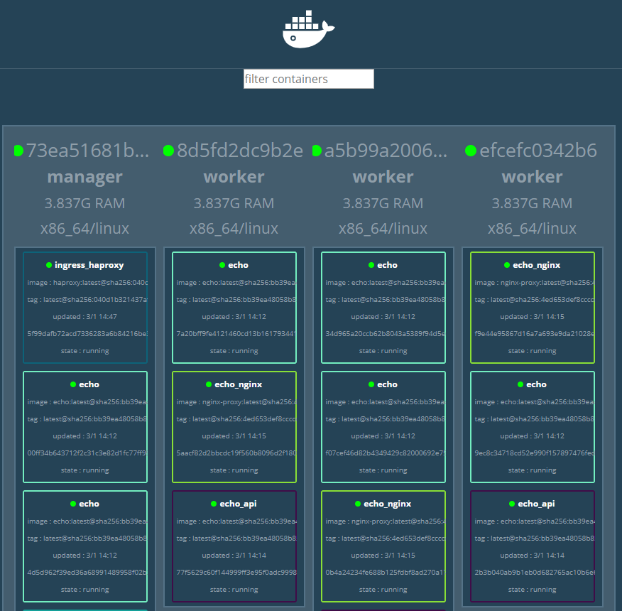

# 도커 - 3.5 컨테이너 배치 전략

### Docker swarm

#### 	여러 대의 도커 호스트로 스웜 클러스터 구성하기

```yaml
 ## docker-compose.yml 파일 작성
 ## 여러 컨테이너에 대한 옵션을 docker-compose.yml이라는 파일로 작성하면, docker-compose up이라는 한 번의 명령어로 서비스를 시작할 수 있다.
version: "3"
services: 
  registry:
    container_name: registry
    image: registry:latest
    ports: 
      - 5000:5000
    volumes: 
      - "./registry-data:/var/lib/registry"

  manager:
    container_name: manager
    image: docker:19.03.5-dind
    privileged: true
    tty: true
    ports:
      - 8000:80
      - 9000:9000
    depends_on: 
      - registry
    expose: 
      - 3375
    command: "--insecure-registry registry:5000"
    volumes: 
      - "./stack:/stack"

  worker01:
    container_name: worker01
    image: docker:19.03.5-dind
    privileged: true
    tty: true
    depends_on: 
      - manager
      - registry
    expose: 
      - 7946
      - 7946/udp
      - 4789/udp
    command: "--insecure-registry registry:5000"

  worker02:
    container_name: worker02
    image: docker:19.03.5-dind
    privileged: true
    tty: true
    depends_on: 
      - manager
      - registry
    expose: 
      - 7946
      - 7946/udp
      - 4789/udp
    command: "--insecure-registry registry:5000"

  worker03:
    container_name: worker03
    image: docker:19.03.5-dind
    privileged: true
    tty: true
    depends_on: 
      - manager
      - registry
    expose: 
      - 7946
      - 7946/udp
      - 4789/udp
    command: "--insecure-registry registry:5000"
```

=>  컴포즈를 실행하면 registry 컨테이너 1대, manager 1대, worker 컨테이너가 01부터 03번 까지 3대, 총 5대 컨테이너가 실행 상태가 된다.

1. docker-compose up (R, M, W1, W2, W3)

```powershell
> docker-compose up -d
Creating network "swarm_default" with the default driver
Creating registry ... done
Creating manager  ... done
Creating worker02 ... done
Creating worker03 ... done
Creating worker01 ... done

> docker ps
   # 컨테이너들이 정상적으로 작동(up)되고 있는 것을 확인할 수 있다
CONTAINER ID        IMAGE                 COMMAND                  CREATED              STATUS              PORTS                                                                   NAMES
03ac63f10157        docker:19.03.5-dind   "dockerd-entrypoint.…"   56 seconds ago       Up 52 seconds       2375-2376/tcp, 4789/udp, 7946/tcp, 7946/udp                             worker03
c2f4692a91c4        docker:19.03.5-dind   "dockerd-entrypoint.…"   56 seconds ago       Up 52 seconds       2375-2376/tcp, 4789/udp, 7946/tcp, 7946/udp                             worker01
c479e3202993        docker:19.03.5-dind   "dockerd-entrypoint.…"   56 seconds ago       Up 51 seconds       2375-2376/tcp, 4789/udp, 7946/tcp, 7946/udp                             worker02
e93ec04a8743        docker:19.03.5-dind   "dockerd-entrypoint.…"   58 seconds ago       Up 56 seconds       2375-2376/tcp, 3375/tcp, 0.0.0.0:9000->9000/tcp, 0.0.0.0:8000->80/tcp   manager
dfe0b59e584c        registry:latest       "/entrypoint.sh /etc…"   About a minute ago   Up 58 seconds       0.0.0.0:5000->5000/tcp                                                  registry
```


###  서비스

: 애플리케이션을 구성하는 일부 컨테이너를 제어하기 위한 단위를 의미한다.

```powershell
> docker exec -it manager sh
   #manager에 접속
```

```bash
$ docker service ls
   #서비스 목록을 확인해보면 아무것도 없는 것을 확인할 수 있다.
ID                  NAME                MODE                REPLICAS            IMAGE               PORTS
$ docker service create --replicas 1 --publish 8000:8080 --name echo registry:5000/example/echo:latest
   #registry 컨테이너에 등록해 둔 5000/example/echo:latest를 사용해 서비스(복재된 단일 컨테이너)를 생성해준다. 
5aig272hgjvnr1x6lpq4kussk
overall progress: 1 out of 1 tasks
1/1: running   [==================================================>]
verify: Service converged
$ docker service ls
   #서비스 목록을 확인해보면 항목이 추가된 것을 확인할 수 있다.
ID                  NAME                MODE                REPLICAS            IMAGE                               PORTS
5aig272hgjvn        echo                replicated          1/1                 registry:5000/example/echo:latest   *:8000->8000/tcp
$ docker service scale echo=6
   # 서비스의 Replica 스케일을 6으로 늘려준다. 즉, 실행 중인 컨테이너가 6개가 된다.
echo scaled to 6
overall progress: 6 out of 6 tasks
1/6: running   [==================================================>]
2/6: running   [==================================================>]
3/6: running   [==================================================>]
4/6: running   [==================================================>]
5/6: running   [==================================================>]
6/6: running   [==================================================>]
verify: Service converged
$ docker service ls
   #서비스 목록을 확인해보면 Replica 스케일이 정상적으로 정가한 것을 확인할 수 있다.
ID                  NAME                MODE                REPLICAS            IMAGE                               PORTS
5aig272hgjvn        echo                replicated          6/6                 registry:5000/example/echo:latest   *:8000->8000/tcp
$docker service ps echo
   #echo서비스가 잘 생성되었는지 확인할 수 있다. 
ID                  NAME                IMAGE                               NODE                DESIRED STATE       CURRENT STATE                ERROR               PORTS
edczz6pdmzdb        echo.1              registry:5000/example/echo:latest   8d5fd2dc9b2e        Running             Running 5 minutes ago
owrlo8021ebv        echo.2              registry:5000/example/echo:latest   a5b99a2006b4        Running             Running about a minute ago
sf0vbuovd1wl        echo.3              registry:5000/example/echo:latest   a5b99a2006b4        Running             Running about a minute ago
248niy3vqzom        echo.4              registry:5000/example/echo:latest   8d5fd2dc9b2e        Running             Running about a minute ago
hjzxavevdtaj        echo.5              registry:5000/example/echo:latest   efcefc0342b6        Running             Running about a minute ago
tr0fhejsfccm        echo.6              registry:5000/example/echo:latest   73ea51681b84        Running             Running about a minute ago
```


### 스택

: 하나 이상의 서비스를 그룹으로 묶은 단위로, 애플리케이션 전체를 구성한다. 서비스는 애플리케이션 이미지를 하나밖에 다루지 못하지만, 여러 서비스가 협조해 동작하는 형태로는 다양한 애플리케이션을 구성할 수 잇다. 이를 구현하기 위한 상위 개념이 바로 스택으로, 스택을 사용하면 여러 서비스를 함께 다룰 수 있다.

#### 스택 만들기

```powershell
> docker exec -it manager sh
```

```bash
$ docker network create --driver=overlay --attachable ch03
   # 스택을 사용해 배포된 서비스 그룹은 overlay 네트워크에 속한다. overlay 네트워크란 여러 도커 호스트      에 걸쳐 배포된 컨테이너 그룹을 같은 네트워크에 배치하기 위한 기술을 말한다. 
afsoxbbluwjr6rmm6gebgl36o
$ docker network ls
NETWORK ID          NAME                DRIVER              SCOPE
f110645040a9        bridge              bridge              local
afsoxbbluwjr        ch03                overlay             swarm
16675a7e9af0        docker_gwbridge     bridge              local
8fde25da4827        host                host                local
rwj2c0i89vc3        ingress             overlay             swarm
97cb43658447        none                null                local
```

```yaml
 ## ch03-webapi.yml 파일 작성
version: "3"
sevices:
    nginx:
        image: gihyodocker/nginx-proxy
        deploy:
            replicas: 3 #컨테이너는 하나지만 
            placement:
                constraints: [node.role != manager] #mansger가 아닌 대상에 대해서만 설치하겠다.
        environment:
            BACKEND_HOST: echo_api:8080
        depends_on:
            -api
        networks:
    api:
        image: registry:5000/example/echo:latest
        deploy:
            replicas: 3
            placement:
                constraints: [node.role != manager]
        networks:
            - ch03
networks:
    ch03: 
        external: true
```

#### 스택 배포하기

```bash
$ docker stack deploy -c /stack/ch03-webapi.yml echo
Creating service echo_nginx
Creating service echo_api
```

#### 배포된 스택 확인하기

```bash
$ docker stack services echo
   # 스택 echo에 배포된 서비스 목록 확인
ID                  NAME                MODE                REPLICAS            IMAGE                               PORTS
nq945igpg87m        echo_nginx          replicated          3/3                 gihyodocker/nginx-proxy:latest
ozdkog3tlgp2        echo_api            replicated          3/3                 registry:5000/example/echo:latest
$ docker stack ps echo
   # 스택이 컨테이너 그룹을 어떻게 배포했는지 확인할 수 있다.
ID                  NAME                IMAGE                               NODE                DESIRED STATE       CURRENT STATE           ERROR               PORTS
dau03al2txxw        echo_api.1          registry:5000/example/echo:latest   8d5fd2dc9b2e        Running             Running 3 minutes ago
jd5k2pnftur0        echo_nginx.1        gihyodocker/nginx-proxy:latest      a5b99a2006b4        Running             Running 3 minutes ago
bi7bz5gwf82d        echo_api.2          registry:5000/example/echo:latest   a5b99a2006b4        Running             Running 3 minutes ago
vhc9g7vjf6gv        echo_nginx.2        gihyodocker/nginx-proxy:latest      8d5fd2dc9b2e        Running             Running 3 minutes ago
i488hfkzl06z        echo_api.3          registry:5000/example/echo:latest   efcefc0342b6        Running             Running 3 minutes ago
uk0qjek98pbp        echo_nginx.3        gihyodocker/nginx-proxy:latest      efcefc0342b6        Running             Running 3 minutes ago
```


#### visualizer를 사용해 컨테이너 배치 시각화하기

: 스웜 클러스터에 컨테이너 그룹이 어떤 노드에 어떻게 배치됐는지 시각화해주는 visualizer라는 애플리케이션이 있다. 이 애플리케이션은 도커 허브에서 dockersamples/ visualizer라는 이미지로 배포한다.  

```yaml
 ## visualizer.yml 파일 작성
version: "3"
services:
    app:
        image: dockersamples/visualizer
        ports:
            - "9000:8080"
        volumes:
            - /var/run/docker.sock:/var/run/docker.sock:
        deploy:
            model: global
            placement:
                constraints: [node.role=manager]
```

```bash
$ docker stack deploy -c /stack/visualizer.yml visualizer
   # visualizer라는 이름의 서비스 생성
Creating network visualizer_default
Creating service visualizer_app
$ docker service ps visualizer_app
ID                  NAME                                       IMAGE                             NODE                DESIRED STATE       CURRENT STATE            ERROR               PORTS
oztb5doak2si        visualizer_app.m9jyqnmrt2fl97cmfi4k3bxg9   dockersamples/visualizer:latest   e93ec04a8743        Running             Running 41 seconds ago
   # service가 저장된 Node를 확인해보면 e93ec04a8743로 
   # $ docker ps 로 확인했던 container들 중
   # manager의 ID와 일치하는 걸 확인할 수 있다. 다음은 docker ps를 실행한 출력 결과 중 일부
   #e93ec04a8743        docker:19.03.5-dind   "dockerd-entrypoint.…"   58 seconds ago         Up 56 seconds       2375-2376/tcp, 3375/tcp, 0.0.0.0:9000->9000/tcp, 0.0.0.0:8000-       >80/tcp   manager
```

=> 결과적으로 localhost: 9000으로 접근하면 컨테이너들의 배치 상황을 볼 수 있다.




