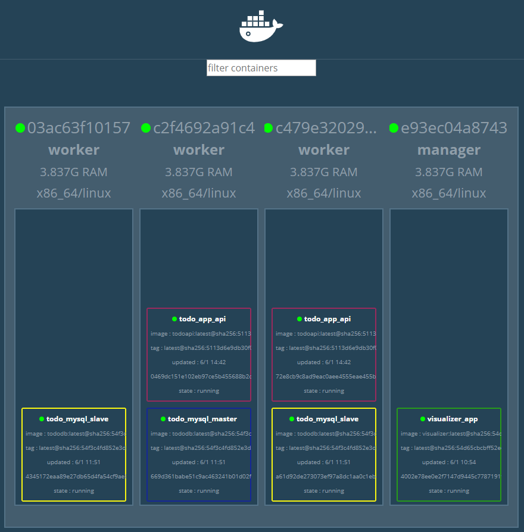

# 도커 - 4. 스웜을 이용한 실전 애플리케이션 개발

## mysql 서비스 구축

### 데이터베이스 컨테이너 구성

1. Mater/Slave 구조 구축

   * Docker hub의 Mysql 5.7 이미지로 생성

   * Master/Slave 컨테이너는 두 역할을 모두 수행할 수 있는 하나의 이미지로 생성

   * Mysql_Master 환경 변수의 유무에 따라 Master, Slave 결정

   * replicas 값을 조절해 슬레이브를 늘릴 수 있게 함

     

### MySQL 설정

: 마스터-슬레이브를 구성하려면 MySQL의 설정 파일인 mysqld.cnf를 수정해야 한다. 

```cnf
[mysqld]
character-set-server = utf8mb4
collation-server = utf8mb4_general_ci
pid-file	= /var/run/mysqld/mysqld.pid
socket		= /var/run/mysqld/mysqld.sock
datadir		= /var/lib/mysql
#log-error	= /var/log/mysql/error.log
# By default we only accept connections from localhost
#bind-address	= 127.0.0.1
# Disabling symbolic-links is recommended to prevent assorted security risks
symbolic-links=0
relay-log=mysqld-relay-bin 
relay-log-index=mysqld-relay-bin 

log-bin=/var/log/mysql/mysql-bin.log 
   #레플리케이션을 사용하기 위해서는 바이너리 로그를 출력할 경로를 설정해야 한다.
```

=> server-id 값은 모든 서버에서 중복되지 않아야 하기 때문에 'mysqld.cnf' 파일에 이 값을 기재하면 안된다. server-id 값을 파일에 추가하기 위해 'tododb/add-server-id.sh' 파일에 다음과 같은 스크립트를 작성한다.

```sh
#!/bin/bash -e
OCTETS=(`hostname -i | tr -s '.' ' '`)

MYSQL_SERVER_ID=`expr ${OCTETS[2]} \* 256 + ${OCTETS[3]}`
echo "server-id=$MYSQL_SERVER_ID" >> /etc/mysql/mysql.conf.d/mysqld.cnf
```

### 레플리케이션

:마스터와 슬레이브 간 레플리케이션 설정을 준비하고, 슬레이브 컨테이너가 실행될 때 자동으로 레플리카로 설정되게 한다. 

```sh
 ## tododb/prepare.sh 파일
#!/bin/bash -e

# (1) 환경 변수로 마스터와 슬레이브를 지정
if [ ! -z "$MYSQL_MASTER" ]; then
  echo "this container is master"
  return 0
fi

echo "prepare as slave"

# (2) 슬레이브에서 마스터와 통신 가능 여부 확인
if [ -z "$MYSQL_MASTER_HOST" ]; then
  echo "mysql_master_host is not specified" 1>&2
  return 1
fi

while :
do
  if mysql -h $MYSQL_MASTER_HOST -u root -p$MYSQL_ROOT_PASSWORD -e "quit" > /dev/null 2>&1 ; then
    echo "MySQL master is ready!"
    break
  else
    echo "MySQL master is not ready"
  fi
  sleep 3
done

# (3) 마스터에 레플리케이션용 사용자 생성 및 권한 부여
IP=`hostname -i`
IFS='.'
set -- $IP
SOURCE_IP="$1.$2.%.%"
mysql -h $MYSQL_MASTER_HOST -u root -p$MYSQL_ROOT_PASSWORD -e "CREATE USER IF NOT EXISTS '$MYSQL_REPL_USER'@'$SOURCE_IP' IDENTIFIED BY '$MYSQL_REPL_PASSWORD';"
mysql -h $MYSQL_MASTER_HOST -u root -p$MYSQL_ROOT_PASSWORD -e "GRANT REPLICATION SLAVE ON *.* TO '$MYSQL_REPL_USER'@'$SOURCE_IP';"

# (4) 마스터의 binlog 포지션 정보 확인
MASTER_STATUS_FILE=/tmp/master-status
mysql -h $MYSQL_MASTER_HOST -u root -p$MYSQL_ROOT_PASSWORD -e "SHOW MASTER STATUS\G" > $MASTER_STATUS_FILE
BINLOG_FILE=`cat $MASTER_STATUS_FILE | grep File | xargs | cut -d' ' -f2`
BINLOG_POSITION=`cat $MASTER_STATUS_FILE | grep Position | xargs | cut -d' ' -f2`
echo "BINLOG_FILE=$BINLOG_FILE"
echo "BINLOG_POSITION=$BINLOG_POSITION"

# (5) 레플리케이션 시작
mysql -u root -p$MYSQL_ROOT_PASSWORD -e "CHANGE MASTER TO MASTER_HOST='$MYSQL_MASTER_HOST', MASTER_USER='$MYSQL_REPL_USER', MASTER_PASSWORD='$MYSQL_REPL_PASSWORD', MASTER_LOG_FILE='$BINLOG_FILE', MASTER_LOG_POS=$BINLOG_POSITION;"
mysql -u root -p$MYSQL_ROOT_PASSWORD -e "START SLAVE;"

echo "slave started"
```

### MySQL_dOCKERFILE

```dockerfile
FROM mysql:5.7

# (1) 패키지 업데이트 및 wget 설치
RUN apt-get update
RUN apt-get install -y wget

# (2) entrykit 설치
RUN wget https://github.com/progrium/entrykit/releases/download/v0.4.0/entrykit_0.4.0_linux_x86_64.tgz
RUN tar -xvzf entrykit_0.4.0_linux_x86_64.tgz
RUN rm entrykit_0.4.0_linux_x86_64.tgz
RUN mv entrykit /usr/local/bin/
RUN entrykit --symlink

# (3) 스크립트 및 각종 설정 파일 복사
COPY add-server-id.sh /usr/local/bin/
COPY etc/mysql/mysql.conf.d/mysqld.cnf /etc/mysql/mysql.conf.d/
COPY etc/mysql/conf.d/mysql.cnf /etc/mysql/conf.d/
COPY prepare.sh /docker-entrypoint-initdb.d
COPY init-data.sh /usr/local/bin/
COPY sql /sql

# (4) 스크립트, mysqld 실행
ENTRYPOINT [ \
  "prehook", \
    "add-server-id.sh", \
    "--", \
  "docker-entrypoint.sh" \
]

CMD ["mysqld"]
```

#### 빌드 및 스웜 클러스터에서 사용하기

6. mysql 이미지 생성 -> Push(registry)

```BASH
$ docker image build -t ch04/tododb:latest .
   # dockerfile을 빌드해 ch04/tododb:latest라는 이름의 이미지 생성
Sending build context to Docker daemon  32.77kB
Step 1/16 : FROM mysql:5.7
 ---> db39680b63ac
Step 2/16 : RUN apt-get update
 ---> Running in c4abc9c50f95
 ...
$ docker image tag ch04/tododb:latest localhost:5000/ch04/tododb:latest
   # 이미지를 워커 노드에서 사용할 수 있도록 'localhost:5000/ch04/tododb:latest' 태그를 붙여 레지스	   트리에 등록한다. 
$ docker push localhost:5000/ch04/tododb:latest
The push refers to repository [localhost:5000/ch04/tododb]
a32e4ba3ad84: Pushed
212e8539a175: Pushed
...
```

7. (M) docker network 생성(overlay)

```bash
$ docker network create --driver=overlay --attachable todoapp
pc4zjzsn05vqas8ea89i1ymi7
```

8. (M) to-do mysql stack deploy 추가

```bash
$ docker network create --driver=overlay --attachable todoapp
pc4zjzsn05vqas8ea89i1ymi7
$ ls -al /stack
total 21
drwxrwxrwx    2 root     root          4096 Jan  3 07:20 .
drwxr-xr-x    1 root     root          4096 Jan  6 01:22 ..
-rwxr-xr-x    1 root     root           426 Jan  3 05:47 ch03-ingress.yml
-rwxr-xr-x    1 root     root           624 Jan  3 04:38 ch03-webapi.yml
drwxrwxrwx    2 root     root             0 Jan  3 07:19 todo
-rwxr-xr-x    1 root     root           913 Jan  3 07:19 todo-mysql.yml
-rwxr-xr-x    1 root     root           310 Jan  3 06:01 visualizer.yml
```


##### 스웜으로 배포하기

9. (M) mysql Master 접속

```bash
$ docker stack deploy -c /stack/todo-mysql.yml todo_
mysql
Creating service todo_mysql_slave
Creating service todo_mysql_master
$ docker service ls
ID                  NAME                MODE                REPLICAS            IMAGE                              PORTS
v94zpezxgw55        todo_mysql_master   replicated          1/1                 registry:5000/ch04/tododb:latest
ua24g9q2dheg        todo_mysql_slave    replicated          2/2                 registry:5000/ch04/tododb:latest
7htgig2wuwbo        visualizer_app      global              1/1                 dockersamples/visualizer:latest    *:9000->8080/tcp
```

```powershell
> docker container exec -it c2f4692a91c4 docker container -it c2f4692a91c4.lc1pskg83tkuk5ith7q0mt1y0 init-data.sh
unknown shorthand flag: 'i' in -it
See 'docker container --help'.

Usage:  docker container COMMAND

Manage containers

Commands:
  attach      Attach local standard input, output, and error streams to a running container
  commit      Create a new image from a container's changes
  cp          Copy files/folders between a container and the local filesystem
  create      Create a new container
  diff        Inspect changes to files or directories on a container's filesystem
  exec        Run a command in a running container
  export      Export a container's filesystem as a tar archive
  inspect     Display detailed information on one or more containers
  kill        Kill one or more running containers
  logs        Fetch the logs of a container
  ls          List containers
  pause       Pause all processes within one or more containers
  port        List port mappings or a specific mapping for the container
  prune       Remove all stopped containers
  rename      Rename a container
  restart     Restart one or more containers
  rm          Remove one or more containers
  run         Run a command in a new container
  start       Start one or more stopped containers
  stats       Display a live stream of container(s) resource usage statistics
  stop        Stop one or more running containers
  top         Display the running processes of a container
  unpause     Unpause all processes within one or more containers
  update      Update configuration of one or more containers
  wait        Block until one or more containers stop, then print their exit codes

PS C:\Users\HPE\Work\docker\day4\swarm\todo\tododb>
PS C:\Users\HPE\Work\docker\day4\swarm\todo\tododb>
PS C:\Users\HPE\Work\docker\day4\swarm\todo\tododb>
PS C:\Users\HPE\Work\docker\day4\swarm\todo\tododb>
PS C:\Users\HPE\Work\docker\day4\swarm\todo\tododb> docker container exec -it c2f4692a91c4 docker container -it c2f4692a91c4.lc1pskg83tkuk5ith7q0mt1y0 mysql -u gihyo tododb
unknown shorthand flag: 'i' in -it
See 'docker container --help'.

Usage:  docker container COMMAND

Manage containers

Commands:
  attach      Attach local standard input, output, and error streams to a running container
  commit      Create a new image from a container's changes
  cp          Copy files/folders between a container and the local filesystem
  create      Create a new container
  diff        Inspect changes to files or directories on a container's filesystem
  exec        Run a command in a running container
  export      Export a container's filesystem as a tar archive
  inspect     Display detailed information on one or more containers
  kill        Kill one or more running containers
  logs        Fetch the logs of a container
  ls          List containers
  pause       Pause all processes within one or more containers
  port        List port mappings or a specific mapping for the container
  prune       Remove all stopped containers
  rename      Rename a container
  restart     Restart one or more containers
  rm          Remove one or more containers
  run         Run a command in a new container
  start       Start one or more stopped containers
  stats       Display a live stream of container(s) resource usage statistics
  stop        Stop one or more running containers
  top         Display the running processes of a container
  unpause     Unpause all processes within one or more containers
  update      Update configuration of one or more containers
  wait        Block until one or more containers stop, then print their exit codes

Run 'docker container COMMAND --help' for more information on a command.
```

```bash
 ## 새로운 master console
$ docker exec -it ('$ docker service ps syqhevyteaqt'를 통해 확인한 master의 Node주소) sh
   # master로 접속
$ docker ps
$ docker exec -it (master의 ip주소) bash
   # 데이터를 넣으려는 container의 정보가 부족해서 Error가 날 수 있다
$ docker container exec -it manager docker service ps todo_mysql_slave --no-trunc --filter "desired-state=running" --format "docker container exec -it {{.Node}} docker container exec -it {{.Name}}.{{.ID}} bash"
   # docker service ps 명령의 --format 옵션을 잘 이용하면 특정 컨테이너에 데이터를 넣는 명령을 표준      출력할 수 있다.
   # 출력값을 복사해 다음 명령어로 붙여넣기 하면 root 로 접속되는 걸 확인할 수 있다 
```

```bash
$ docker container exec -it manager docker service ps todo_mysql_master --no-trunc --filter "desired-state=running"
ID                          NAME                  IMAGE                                                                                                      NODE                DESIRED STATE       CURRENT STATE               ERROR               PORTS
lc1pskg83tkuk5ith7q0mt1y0   todo_mysql_master.1   registry:5000/ch04/tododb:latest@sha256:54f3c4fd852e3d3292413dde9237a0ef1764f44df438f91d50386c9b9a5b656c   c2f4692a91c4        Running             Running about an hour ago

$ docker container exec -it manager docker service ps todo_mysql_master --no-trunc --filter "desired-state=running" --format "docker exec -it {{.Node}} docker container exec -it {{.Name}}.{{.ID}} bash"
docker exec -it c2f4692a91c4 docker container exec -it todo_mysql_master.1.lc1pskg83tkuk5ith7q0mt1y0 bash
$ docker exec -it c2f4692a91c4 docker container exec -it todo_mysql_master.1.lc1pskg83tkuk5ith7q0mt1y0 init-data.sh

$ docker exec -it c2f4692a91c4 docker container exec -it todo_mysql_master.1.lc1pskg83tkuk5ith7q0mt1y0 mysql -u gihyo -pgihyo tododb
mysql: [Warning] Using a password on the command line interface can be insecure.
Reading table information for completion of table and column names
You can turn off this feature to get a quicker startup with -A
```

```mysql
> select*from todo limit 1\G
*************************** 1. row ***************************
     id: 1
  title: MySQL 도커 이미지 만들기
content: MySQL 마스터와 슬레이브를 환경 변수로 설정할 수 있는 MySQL 이미지 생성
 status: DONE
created: 2020-01-06 04:44:00
updated: 2020-01-06 04:44:00
1 row in set (0.00 sec)
```

```bash
$ docker container exec -it manager docker service ps todo_mysql_slave --no-trunc --filter "desired-state=running" --format "docker container exec -it {{.Node}} docker container exec -it {{.Name}}.{{.ID}} bash"
docker container exec -it 03ac63f10157 docker container exec -it todo_mysql_slave.1.qk8li6s35y9s103b1ptd8ts60 bash
docker container exec -it c479e3202993 docker container exec -it todo_mysql_slave.2.6cz2ugjt5uceg5gz1oyou5u9y bash

$ docker container exec -it 03ac63f10157 docker container exec -it todo_mysql_slave.1.qk8li6s35y9s103b1ptd8ts60 mysql -u gihyo -pgihyo tododb

$ docker container exec -it c479e3202993 docker container exec -it todo_mysql_slave.1.6cz2ugjt5uceg5gz1oyou5u9y mysql -u gihyo -pgihyo tododb
```

```mysql
> select*from tot 1\G
*************************** 1. row ***************************
     id: 1
  title: MySQL 도커 이미지 만들기
content: MySQL 마스터와 슬레이브를 환경 변수로 설정할 수 있는 MySQL 이미지 생성
 status: DONE
created: 2020-01-06 04:44:00
updated: 2020-01-06 04:44:00
1 row in set (0.00 sec)
```

```bash
$ docker exec -it c2f4692a91c4 docker container exec -it todo_mysql_master.1.lc1pskg
83tkuk5ith7q0mt1y0 bash


root@669d361babe5:/# apt-get install -y net-tools
Reading package lists... Done
Building dependency tree
Reading state information... Done
...

root@669d361babe5:/# netstat -ntpl
Active Internet connections (only servers)
Proto Recv-Q Send-Q Local Address           Foreign Address         State       PID/Program name   
tcp        0      0 127.0.0.11:40005        0.0.0.0:*               LISTEN      -                  
tcp6       0      0 :::3306                 :::*                    LISTEN      -  

$ docker exec -it 03ac63f10157 docker container exec -it todo_mysql_slave.1.qk8li6s3
5y9s103b1ptd8ts60 bash

root@4345172eaa89:/# apt-get install -y net-tools
Reading package lists... Done
Building dependency tree
Reading state information... Done
...

root@4345172eaa89:/# netstat -ntpl
Active Internet connections (only servers)
Proto Recv-Q Send-Q Local Address           Foreign Address         State       PID/Program name   
tcp        0      0 127.0.0.11:44865        0.0.0.0:*               LISTEN      -                  
tcp6       0      0 :::3306                 :::*                    LISTEN      -                  
$ docker exec -it c479e3202993 docker container exec -it todo_mysql_slave.2.6cz2ugjt
5uceg5gz1oyou5u9y bash

root@a61d92de2730:/# apt-get install -y net-tools
Reading package lists... Done
Building dependency tree
Reading state information... Done
...

root@a61d92de2730:/# netstat -ntpl
Active Internet connections (only servers)
Proto Recv-Q Send-Q Local Address           Foreign Address         State       PID/Program name   
tcp        0      0 127.0.0.11:39909        0.0.0.0:*               LISTEN      -                  
tcp6       0      0 :::3306                 :::*                    LISTEN      -                  
```

curl -XGET http://todo_app_api:8080/todo?status=DONE

docker container exec -it manager docker service ps todo_app_api --no-trunc --filter "desired-state=running" --format "docker container exec -it {{.Node}} docker container exec -it {{.Name}}.{{.ID}} bash"

curl -XPUT -d '{"id"9, "title:"}'

