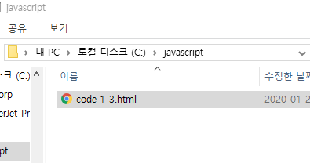
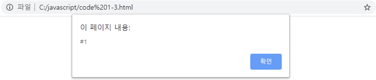
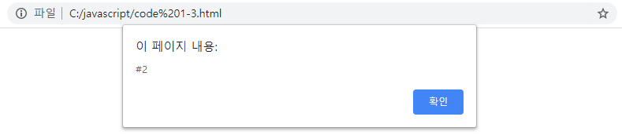
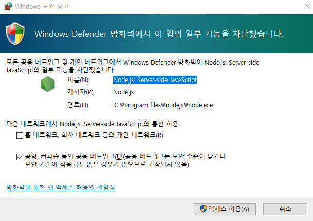
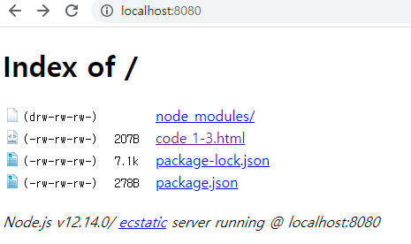
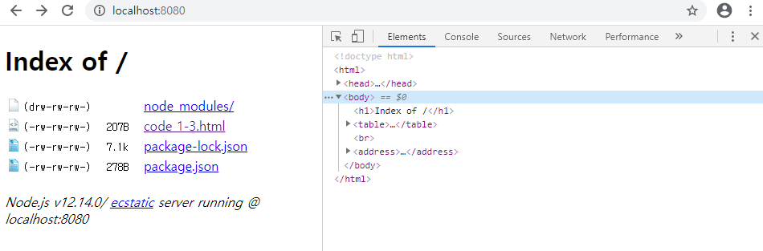
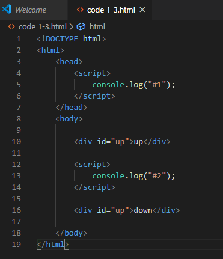
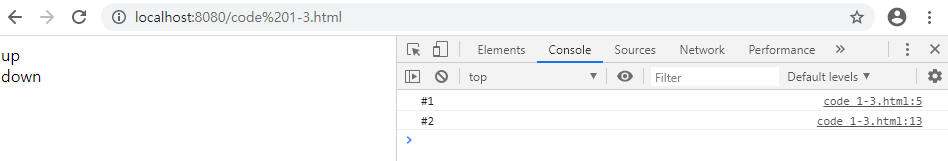
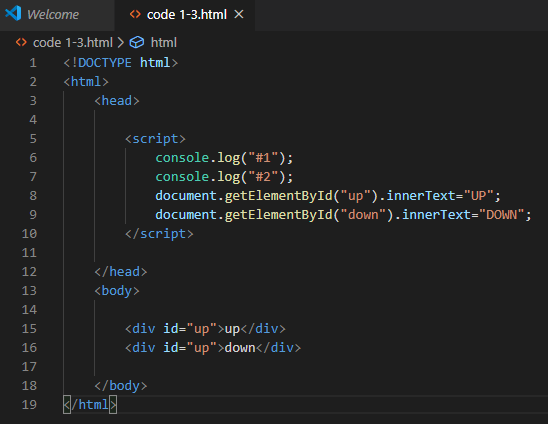
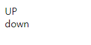

# Javascript

* 웹 브라우저에서 많이 사용하는 프로그래밍 언어
* 초기 웹은 정적인 글자들로만 꾸며졌지만, 자바스크립트가 나오고부터 웹 문서의 내용을 동적으로 바꾸거나 사용자가 마우스를 클릭하는 것과 같은 이벤트를 처리할 수 있게 됨

### 웹에서 애플리케이션으로

#### 초기의 웹

* 변화 없는 정적 글자들의 나열
* 웹은 하이퍼링크라는 매개체를 사용해 웹 문서가 연결된 거대한 책에 불과

#### 자바스크립트의 등장

* 웹 문서의 내용을 동적으로 바꾸거나 마우스 클릭 같은 이벤트 처리

#### 웹은 애플리케이션의 모습에 점점 가까워짐

* 구글, 마이크로소프트에서는 웹 브라우저만으로 워드, 엑셀, 파워포인트 같은 애플리케이션 사용 가능
* 웹 애플리케이션은 웹 브라우저만 있으면 언제 어디서나 사용 가능


### 자바스크립트의 종류

* 자바스크립트는 ECMAScript라는 이름으로 표준화
* ECMAScript와 jscript는 모두 자바스크립트를 의미


### <html파일 만들기>

* HTML5 표준 형식의 코드

  => 개발 편의성, 호환 가능성(정규화)에서 높은 효율성

  :기본 페이지의 head 태그 사이에 script 태그 삽입

* 기본 용어

  >  div id="mydiv" 

  => div는 태그명, id="mydiv"는 속성
  => 태그 요소에 따라 사용자에게 어떻게 보여질지 결정됨

* 예시

```html
<!DOCTYPE html>
<html>
    <head>
        <script>
            alert("#1");
        </script>
    </head>
    <body>
        <script>
            alert("#2")
        </script>
    </body>
</html>
```



=> 완성된 파일에 접속해보면 html파일에서 입력한것의 결과로 경고창 연속 출력






### <http-server  설치>

``` shell
C:\javascript> npm init -y
Wrote to C:\javascript\package.json:

{
  "name": "javascript",
  "version": "1.0.0",
  "description": "",
  "main": "index.js",
  "scripts": {
    "test": "echo \"Error: no test specified\" && exit 1"
  },
  "keywords": [],
  "author": "",
  "license": "ISC"
}

C:\javascript> npm install http-server -g
C:\Users\HPE\AppData\Roaming\npm\http-server -> C:\Users\HPE\AppData\Roaming\npm\node_modules\http-server\bin\http-server
C:\Users\HPE\AppData\Roaming\npm\hs -> C:\Users\HPE\AppData\Roaming\npm\node_modules\http-server\bin\http-server
+ http-server@0.12.1
added 27 packages from 35 contributors in 2.485s
```

```bash
C:\javascript> npx http-server  
	-- 서버 실행
Starting up http-server, serving ./
Available on:
  http://10.0.75.1:8080
  http://192.168.56.1:8080
  http://169.254.185.210:8080
  http://59.29.224.19:8080
  http://192.168.111.1:8080
  http://10.0.0.1:8080
  http://127.0.0.1:8080
  http://172.25.112.145:8080

```



​	=> 액세스 허용



=> loclahost: 8080으로 연결하면 "javascript" reposirory로 연결됨



=>`F12`키를 누르면 오른쪽에 html창이 나타나는걸 확인할 수 있다

---





=> 경고창 설정을console.log("#1"), console.log("#2")로 바꾸고 <div id="up">up</div>, <div id="up">down</div>를 추가해주면 다음과 같이 출력



---




=>  document.getElementById("up").innerText="UP" 명령어를 추가한다

​	  이 때, 중요한 점은 5째 줄의 up보다 뒤쪽에 script가 나왔다는 것!




