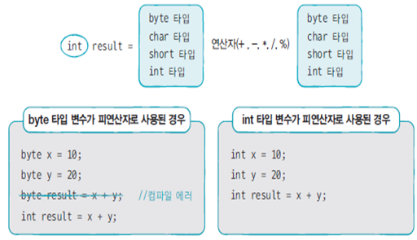
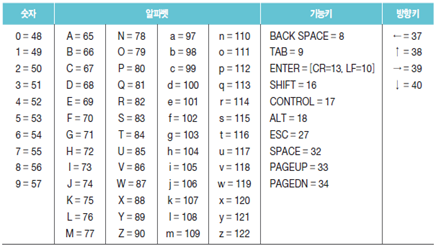

# java

## 변수

: 값을 저장할 수 있는 메모리의 특정 주소에 붙여진 이름

 

### 변수 **선언** 

* int  age;   ⇐ 정수(int)값을 저장할 수 있는 age 변수를 선언

  double value;  

  ====== =====

  타입  이름

* 동일 타입의 변수는 콤마로 구분해서 동시에 정의

  int x;    ⇒ int x, y, z;

  int y; 

  int z; 


### **변수** **이름** **규칙**

* 첫번째 글자는 문자, "$", "_"이어야 하고, 숫자로 시작할 수 없다.
  * price, $price, _companyName ⇐ 가능
  * 1v, @speed, $#value ⇐ 불가능

* 영어 대소문자를 구분한다.
  * firstName과 firstname은 다른 변수이다. 

* 첫번째 글자는 소문자로 시작하고, 다른 단어가 붙을 경우 첫문자를 대문자로 한다. (관례)
  * maxSpeed, firstName, carBodyColor, …

* 변수 이름의 길이는 제한이 없다. 

* 자바 예약어는 변수 이름으로 사용할 수 없다.


### **자바 예약어**

: 자바 언어에서 의미를 가지고 사용되는 단어

**기본 타입** ⇒ boolean, byte, char, short, int, long, float,     double

**접근 제한자** ⇒ private, public,     protected

**클래스와 관련된 것** ⇒ class, abstract, interface, extends, implements, enum

**객체와 관련된 것** ⇒ new, instanceof, this, super, null

**메소드와 관련된 것** ⇒ void, return

**제어문과 관련된 것** ⇒ if, else, switch, case, default, for, do, while,     break, continue

**논리값** ⇒ true, false

**예외 처리와 관련된 것** ⇒ try, catch, finally, throw, throws

**기타** ⇒ package, import, synchronized,     final, static 


* 변수에 값을 저장할 때 대입 연산자를 사용

  int score;      // ⇐ 변수를 선언

  score = 90;   // ⇐ 변수에 값을 대입

* 변수 초기화 = 변수에 최초로 값을 대입하는 것

  int score = 90;  // ⇐ 변수 선언과 동시에 값을 할당(초기화)

* 변수를 초기화하지 않고 변수를 사용할 수 있을까?

  → 초기화하지 않으면 사용할 수 없다.

* 변수 사용 = 변수 값을 이용해서, 출력문이나 연산식을 수행하는 것

```java
public class HelloJava {
	public static void main(String[] args) {
		int hour = 3;
		int minute = 5;

		//	출력문에 사용
		System.out.print(hour + "시간 " + minute + "분은 ");
		
		//	계산식에서 사용 
		int totalMinute = hour * 60 + minute;
		System.out.println(totalMinute + "분입니다.");		
	}
}
```

* 변수 값 복사 = 변수의 값을 다른 변수에 저장

  int x = 10;

  int y = x;

  x = 20;

  System.out.println("x = " + x + ", y = " + y); // x = 20, y = 10

* int[] x = new int[ 10 ];

  int[] y = x;

  x[0] = 20;

  System.out.println("x[0] = " + x[0] + ", y[0] = " + y[0]);  // x = 20, y = 20

* 로컬 변수 = 메소드 블록 내에서 선언된 변수

  → 메소드 블록 내에서만 사용이 가능

  → 메소드 실행이 끝나면 자동으로 삭제

```java
public class HelloJava {     
    public static void main(String[] args) {   ------------+     
        int value1 = 10;                                   |
        if (value1 > 0) {           ----------------+      |
            int value2 = 20;                        |      |
            System.out.print(value1);               |      |
            System.out.print(value2);               |      |
        }                           ----------------+      |
        for (int i = 0; i < 1; i ++) {      --------+      |
            int value3 = 30;                        |      |
            System.out.print(value1);               |      |
            System.out.print(value2);               |      |
            System.out.print(value3);               |      |
        }                           ----------------+      |
        System.out.print(value1);                          |
        System.out.print(value2);                          |
        System.out.print(value3);                          |
    }       -----------------------------------------------+
}
```


## **Java Data Type**

ㄴ Primitive Type

  ㄴ Boolean Type**(boolean)**

  ㄴ Numeric Type

​    ㄴ Integral Type

​      ㄴ Integer Type**(short, int, long)**

​      ㄴ Floating Point Type**(float, double)**

​    ㄴ Character Type**(char)**

ㄴ Reference Type

  ㄴ Class Type

  ㄴ Interface Type

  ㄴ Array Type

  ㄴ Enum Type

  ㄴ etc.

> <데이터 타입 속성>
>
> Type    Bits   Range of Values
>
> \----------------------------------------------------------------------------------------
>
> byte     8bits  -2^7 ~ 2^7-1 (-128 ~ 127)
>
> short    16bits  -2^15 ~ 2^15-1 (-32768 ~ 32767)
>
> int     32bits  -2^31 ~ 2^31-1 (-2147483648 ~ 2147483647)
>
> long    64bits  -2^63 ~ 2^63-1 (-9223372036854775808 ~ 9223372036854775807)
>
> float    32bits  0x0.000002P-126f ~ 0x1.fffffeP+127f
>
> double   64bits  0x0.0000000000001P-1022 ~ 0x1.fffffffffffffP+1023 
>
> char    16bits  \u0000 ~ \uffff (0 ~ 2^15-1) * 자바에서 unsgined로 동작하는 자료형
>
> boolean   1bit   true, false


---


리터럴(literal) = 소스 코드에서 프로그래머가 직접 입력한 값

String name = "hong-gildong";

int  age = 23;

==   ===   ===

타입  이름  리터럴


### **정수 리터럴**

* 2진수 : 0b 또는 0B로 시작하고 0과 1로만 구성
  - 0b1011   ⇒ 11
  - 0B10100   ⇒ 20
* 8진수 : 0으로 시작하고 0~7 사이의 숫자로 구성
  - 013    ⇒ 11
  - 0206    ⇒ 134
* 10진수 : 소수점 없이 0~9 사이의 숫자로 구성
* 16진수 : 0x 또는 0X로 시작하고 0~9, a~f(A~F) 사이의 문자로 구성


### **char** **타입** **-** **하나의** **문자를** **저장**

작은 따움표로 감싼 문자 리터럴

char var1 = 'A';      ⇒ 유니코드 65

char var2 = '';

char var3 = '홍';

char var4 = 65;    ⇒ 'A'

char var5 = 0x0041;  ⇒ 'A'


### 문자열 (String)

큰 따움표로 감싼 문자들

char var1 = "A";      ⇒ X

String var2 = 'A';  ⇒ X

String var3 = "A";  ⇒ O


### **이스케이프** **문자** (escape)

* 문자열 내부에서 \는 이스케이프 문자를 뜻 함

  *  // 나는 "자바"를 좋아합니다. 

    String str = "나는 \"자바\"를 좋아합니다.";

  * // 번호   이름     나이  (항목들을 일정 간격을 띄워쓰기)

    String str = "번호\t이름\t나이";

* \t     ⇒ 일정 간격(탭) 만큼 띄움

  \n     ⇒ 줄바꿈(라이피드)

  \r     ⇒ 캐리지 리턴

  \"     ⇒ " 출력

  \'     ⇒ ' 출력

  \\     ⇒ \ 출력

  \u16진수  ⇒ 16진수에 해당하는 문자를 출력

```JAVA
public class HelloJava {
	public static void main(String[] args) {
		System.out.println("1\t2\t3\t4");
		System.out.println("a\tb\tc\td");
		
		System.out.println("1\n2\n3");
		System.out.println("a\rb\rc");
		
		System.out.println("1\"2\"3");
		System.out.println("1\'2\'3");
		System.out.println("1\\2\\3");
		
		System.out.println("1\u00413");	// u0041 = A
	}
}
```


### **자동 타입 변환 (promotion)**

* 값의 허용 범위가 작은 타입이 큰 타입으로 저장될 때 ⇒ 큰타입 = 작은타입;

  byte < short < int < long < float < double

  byte byteValue = 10;

  int intValue = byteValue;

* char 타입을 int 타입으로 자동 타입 변환하면 유니코드 값이 int 타입에 저장

```JAVA
public class HelloJava {
	public static void main(String[] args) {
		char charValue = 'A';
		int intValue = charValue;
		
		System.out.println(charValue);	// A
		System.out.println(intValue);		// 65
	}
}
```


### **강제** **타입** **변환** **(castring)**

* 큰 허용 범위 타입을 작은 허용 범위 타입으로 강제로 나누어 한 조각만 저장

  ⇒ 캐스팅 연산자를 사용

   

  작은허용범위타입 = (작은허용범위타입) 큰허용범위타입;

```java
public static void main(String[] args) {
		int intValue = 256;
		byte byteValue = (byte)intValue;

		System.out.println(intValue);		// 10
		System.out.println(byteValue);	// 10
		
		// 실수 타입을 정수 타입으로 캐스팅하면 소수점 이하를 버림
		double doubleValue = 3.14;
		int intValue2 = (int)doubleValue;
		System.out.println(doubleValue);	// 3.14
		System.out.println(intValue2);	// 3
	}
```


* 자동 타입 변환이 발생하는 경우 (예)

  

   

  피 연산자 중 하나가 long 타입이면 다른 피연자는 long 타입으로 자동 변환

  피 연산자 중 하나가 double 타입이면 다른 피연자는 double 타입으로 자동 변환

```java
public static void main(String[] args) {
		// 정수 연산의 결과를 실수로 저장할 때
		{
			int x = 1;
			int y = 2;
			double result = x / y;
			System.out.println(result); // 0.0
		}		
		{ 
			int x = 1;
			int y = 2;
			double result = (double)x / y;
			System.out.println(result); // 0.5
		}
		{ 
			int x = 1;
			int y = 2;
			double result = x / (double)y;
			System.out.println(result); // 0.5
		}
		{ 
			int x = 1;
			int y = 2;
			double result = (double)x / (double)y;
			System.out.println(result); // 0.5
		}
	}
```


### **+** **연산자**

* 문자열 결합 ⇐ 피연산자 중 하나라도 문자열인 경우 (나머지 피연산자는 모두 문자열로 자동 변환)
* 덧셈 연산 ⇐ 피연산자가 모두 숫자

```java
public static void main(String[] args) {
		int value = 3 + 7;
		System.out.println(value);	// 10
		
		String s1 = "3" + 7;
		System.out.println(s1);		// "3" + 7 = "3" + "7" = "37"
		
		int value2 = 3 + 7 + 5;
		System.out.println(value2);	// 15
		
		String s2 = 1 + 2 + "3";
		System.out.println(s2);		// (1+2)+"3" = 3+"3" = "3"+"3" = "33"
		
		String s3 = 1 + "3" + 7;
		System.out.println(s3);		// "1"+"3"+7 = "13"+7 = "13"+"7" = "137"
	}
```


### **문자열을** **기본** **타입으로** **강제** **타입** **변환**

* 숫자 외 요소를 포함한 문자열을 숫자 타입 변환하면 NumberFormatException이 발생

```java
public static void main(String[] args) {
		String stringValue = "";

		stringValue = "10";
		byte byteValue = Byte.parseByte(stringValue);			// 

		stringValue = "200";
		short shortValue = Short.parseShort(stringValue);		// 

		stringValue = "300000";
		int intValue = Integer.parseInt(stringValue);			// 

		stringValue = "400000000";
		long longValue = Long.parseLong(stringValue);			// 

		stringValue = "12.345";
		float floatValue = Float.parseFloat(stringValue);		// 

		stringValue = "12.345";
		double doubleValue = Double.parseDouble(stringValue);		// 

		stringValue = "true"; // or "false"					
		boolean booleanValue = Boolean.parseBoolean(stringValue);	//
		
		System.out.println(byteValue);	// 10
		System.out.println(shortValue);	// 200	
		System.out.println(intValue);		// 300000
		System.out.println(longValue);	// 400000000
		System.out.println(floatValue);	// 12.345
		System.out.println(doubleValue);	// 12.345
		System.out.println(booleanValue);	// true
	}
```


### **기본 타입을 문자열로 변환**

String stringValue = String.valueOf(data)


## **시스템** **입출력**

* System.out.println("Hello Java!!!"); 
  ⇒ https://docs.oracle.com/javase/8/docs/api/java/lang/System.html

  println(내용) ⇒ 내용을 출력하고 행을 변경

  print(내용) ⇒ 내용만 출력

  printf("형식문자열", 값1, 값2, …) ⇒ 첫번째 문자열 형식대로 내용을 출력


```java
public static void main(String[] args) {
		String name = "홍길동";
		int age = 23;
		
		// 	이름: 홍길동, 나이: 23
		System.out.print("이름: " + name + ", ");
		System.out.println("나이: " + age);
		
		System.out.printf("이름: %s, ", name);
		System.out.printf("나이: %d\n", age);
		
		System.out.printf("이름: %s, 나이: %d\n", name, age);
	}
```

* %d      ⇒ 정수               ⇒ 123

  %6d    ⇒ 6자리 정수. 왼쪽 빈 자리 공백    ⇒ ___123

  %-6d    ⇒ 6자리 정수. 오른쪽 빈 자리 공백   ⇒ 123___

  %06d    ⇒ 6자리 정수. 외쪽 빈 자리 0 채움   ⇒ 000123

```java
public static void main(String[] args) {
		System.out.printf("이름: %s, 나이: %3d\n", "홍길동", 3);
		System.out.printf("이름: %1$s, 나이: %2$3d\n", "이순신", 323);
	}
```

* %10.2f   ⇒ 소수점 이상 7자리, 소수점 이하 2자리. 왼쪽 빈자리 공백   ⇒ ____123.45

  %-10.2f  ⇒ 소수점 이상 7자리, 소수점 이하 2자리. 오른쪽 빈자리 공백 ⇒ 123.45____

  %010.2f  ⇒ 소수점 이상 7자리, 소수점 이하 2자리. 왼쪽 빈자리 0 채움 ⇒ 0000123.45

```java
public static void main(String[] args) {
		System.out.printf("%10.2f\n", 123.45);
		System.out.printf("%-10.2f\n", 123.45);
		System.out.printf("%010.2f\n", 123.45);
	}
```

* \t     ⇒ 탭

  \n     ⇒ 줄바꿈

  %%     ⇒ %

**Q. System.out.printf 메소드를 이용해서 아래 문장을 콘솔에 출력하시오. **

System.out.printf("%10.2f\n", 123.45); 실행 결과는?

```java
public static void main(String[] args) {
System.out.printf("%s", "System.out.printf(\"%10.2f\\n\", 123.45); 실행 결과는?");  
		
	System.out.println(); // 한줄 띄우기 위한 용도

	System.out.printf("System.out.printf(\"%%10.2f\\n\", 123.45); 실행 결과는?");
}
```


### **System.in.read()**

* 키보드로 입력한 키코드를 읽어서 반환하는 메소드



* 한계(단점) 
  - 2개 이상 키가 조합된 한글은 읽을 수 없음
  - 키보드로 입력된 내용을 통문자열로 읽을 수 없음


### Scanner 클래스

통문자열을 읽어 사용 가능