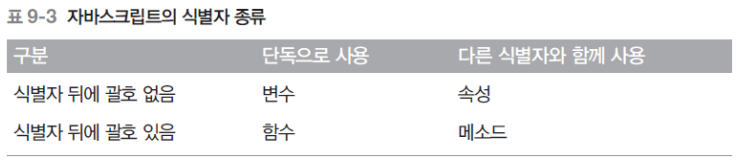
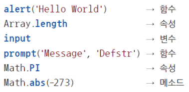

# javascript

## 기본 용어

### 표현식과 문장

* 표현식: 값을 만들어내는 간단한 코드
* 문장: 하나 이상의 표현식이 모인 것
  * 문장이 모여 프로그램 구성
  * 문장의 끝에는 세미콜론을 찍어 문장의 종결을 알려줌
  * 하나의 표현식에도 세미콜론만 찍히면 문장

### 키워드(=예약어)

: 자바스크립트가 처음 만들어질 때 정해진 특별한 의미가 있는 단어

ex) break:  루프 절을 빠져나오는 단어 (교재28p [표2-1] 참고)

### 식별자

: 변수명과 함수명 같은 이름을 붙일 때 사용

* 식별자 생성 시 규칙

  * 키워드 사용 불가

  * 숫자로 시작 불가

  * 특수문자는 _과 $만 허용

  * 공백 포함 불가

  * 모든 언어가 사용 가능하나 알파벳 사용이 개발자들 사이의 관례

  * input, output솨 샅은 의미 있는 단어 사용

  * 자바 스크립트 개발자가 식별자를 만들 때 지키는 관례

    * 생성자 함수의 이름은 대문자로 시작

    * 변수와 인스턴스, 함수, 메서드의 이름은 항상 소문자로 시작

    * 식별자가 여러 단어로 이루어지면 각 단어의 첫 글자는 대문

    * ex) willOut, willReturn ... (camel expression 방식)

      ex) will_out, will_return ... (snake expression 방식)

  

### 주석

* //를 사용해 한 줄 주석 표현

* /*와 */ 사이의 문장은싱해되지 않음

  ex) /*

  ​		주석문

  ​		주석문

  ​		*/

