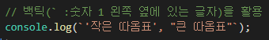

# javascript

## 출력

* alert() 함수

  * 가장 기본적인 출력방법
  * 웹 브라우저의 경고창

* 매개 변수

  * 함수의 괄호 안에 들어가는 것

  * ex) alert('Hello JavaScript .. !');

    

## 문자열 자료형

* 문자열(String)

  * 문자를 표현할 때 사용하는 자료의 형태

  * alert() 함수의 매개 변수로 쓰인 'Hello JavaScript .. !'와 같은 자료

  * 문자열을 만드는 방법

    * 큰 따옴표와 작은 따옴표 모두 사용 가능하지만 일관적으로 사용해야 함

    * 내부에 따옴표를 문자 그 자체로 사용하고 싶다면 특수한 기능을 수행하는 이스케이프 문자`\`를 사용한다

      ​									

    * 백틱을 이용하면 더 쉽게 표현 가능하다

      ​						

      

      ​				=> 이 때, 이스케이프 문자`\`는 의미 문자(meta-char)라고 한다

  * 이스케이프 문자

    

### 숫자 자료형

