# jQuery

## 기본

* 모든 브라우정에서 동작하는 클라이언트 자바스크립트 라이브러리
* 무료로 사용 가능하 오픈 소스 라이브러리
* jQuery는 다음 기능을 위해 제작됨
  * 문서 객체 모델과 관련된 처리를 쉽게 구현
  * 일관된 이벤트 연결을 쉽게 구현
  * 시각적 효과를 쉽게 구현
  * ajax 애플리케이션을 쉽게
* Download: [경로](https://jquery.com/download/)

* 설치 - 
  1. 터미널에서 'ctrl+c'를 눌러서 서버 종료
  2. 터미널에서 jquery 설치

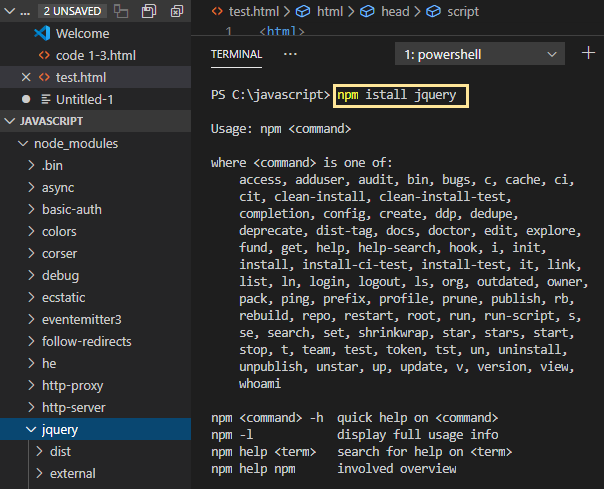

3. 다시 서버 실행

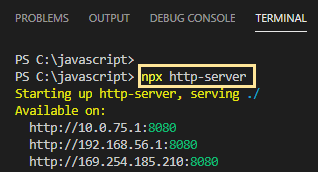

4. localhost:8080에 접속해보면 이런 모양의 창이 뜨는 걸 확인 가능

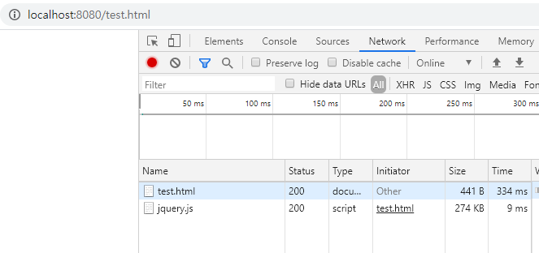

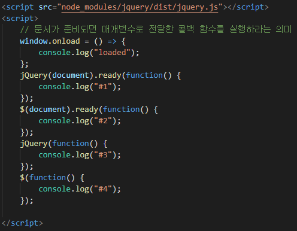

### $(document).ready()

indow.jQuery = window.$ = jQuery;

### 선택자

#### CSS 선택자 대부분을 지원

* $("*") ⇒ 전체 선택자, all selector
* $(".class") ⇒ 클래스 선택자
* $("#id") ⇒ 아이디 선택자
* $("element") ⇒ 요소(태그, element) 선택자
* $("selector1, selector2, … , selectorN") ⇒ 다중 선택자(multiple selector)

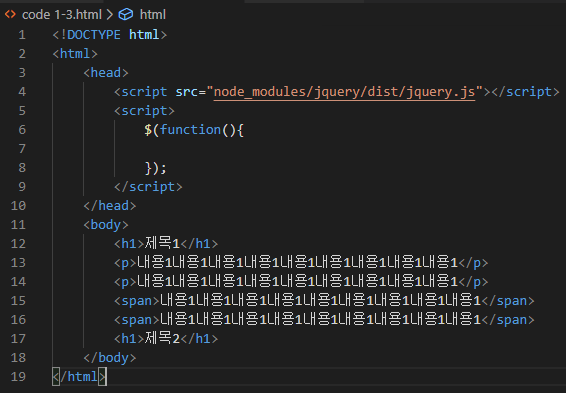

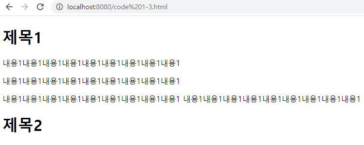

​	=> 
 태그는 공간이 남아도 다음 줄로 넘어가지만, 태그는 공간을			        	      모두 사용할 때까지 다음 줄로 넘어가지 않는다.

##### 예제 - $("*") ⇒ 전체 선택자, all selector

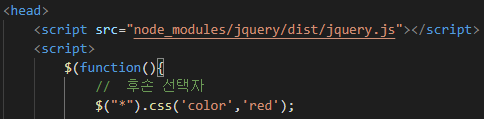

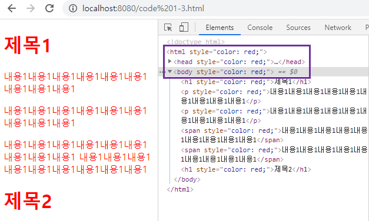

​	=> 전체 선택

---

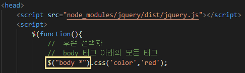

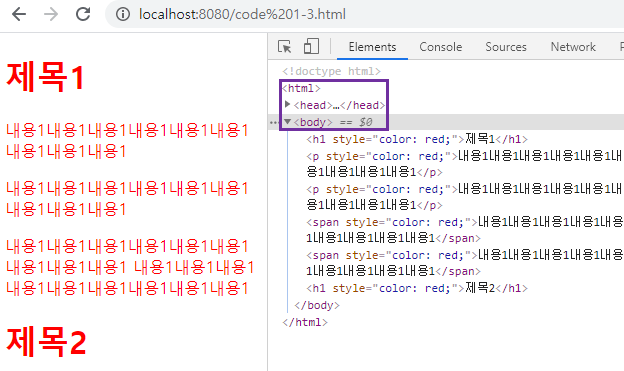

=> body 아래 항목 전체

##### 예제 - $("element") ⇒ 요소(태그, element) 선택자

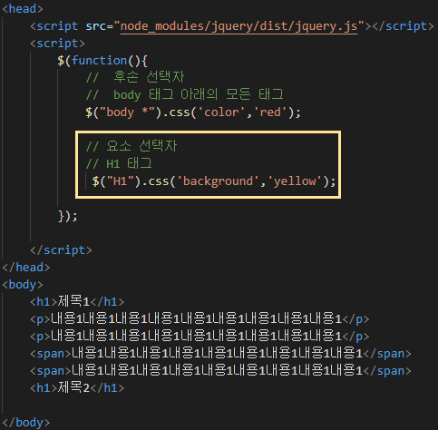

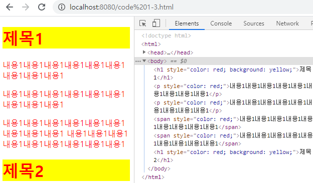

##### 예제 - $("#id") ⇒ 아이디 선택자

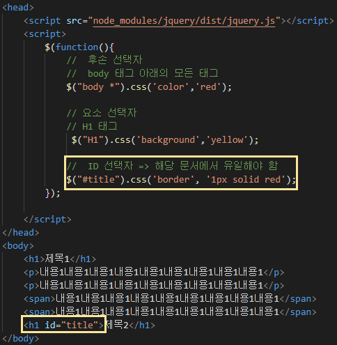

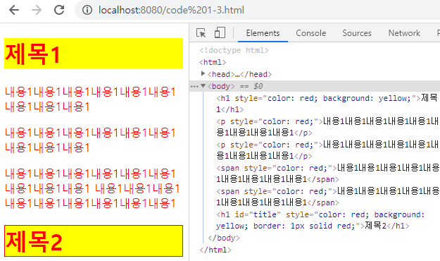

##### 예제 - $(".class") ⇒ 클래스 선택자

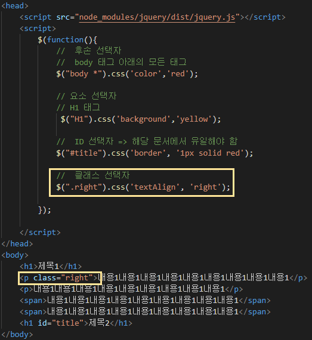

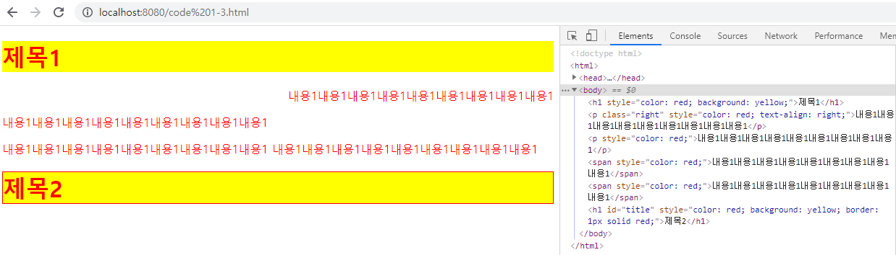

​	=> 첫번째 문장 뒤쪽 정렬

##### 예제 - $("selector1, selector2, … , selectorN") ⇒ 다중 선택자(multiple selector)

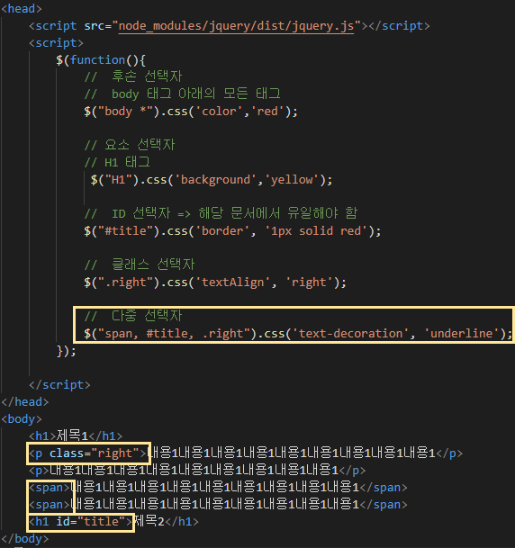

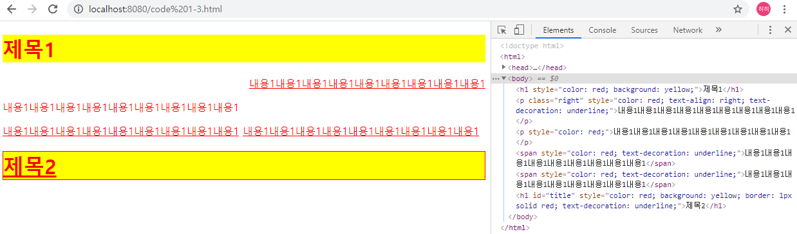

=> 밑 줄이 쳐진 모습

#### jQuery 선택자

* 자식 선택자 ⇒ $("parent > child")
* 후손 선택자 ⇒ $("parent child")
* 속성 선택자 ⇒ $("엘리먼트이름[속성이름='속성값']")

##### 예제 -  후손 선택자 ⇒ $("parent child"), 자식 선택자 ⇒ $("parent > child")

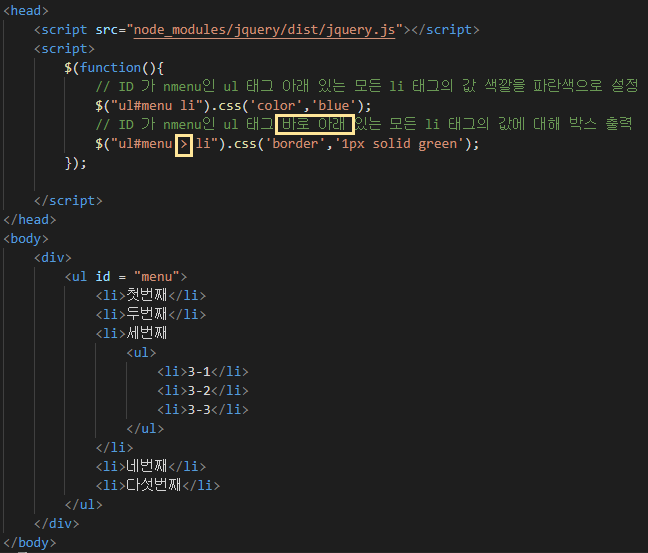

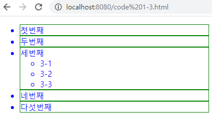

##### 예제 - 속성 선택자 ⇒ $("엘리먼트이름[속성이름='속성값']")

: 주로 <from> 아래에서 사용하는 사용자 입력을 처리하는 태그를 제어할 때 사용

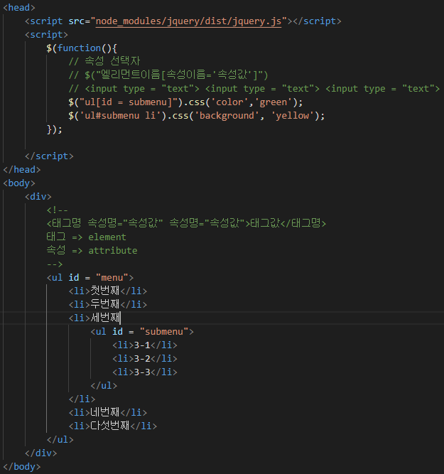

