# jQuery

## 선택자_2

### <필터 선택자>

#### 입력 양식 필터 선택자

##### 예제 - 회원가입

* 소스코드

* 출력창

* 제출버튼을 누른 후 url 모양이 변한다

> [http://localhost:8080/code%201-3.html?lastname=kim&firstname=sojung&pw=abc123&pw2=abc123&ismarried=on&color=yellow&photo=demo.png&%EC%A0%84%EC%86%A1=%EC%A0%9C%EC%B6%9C#](http://localhost:8080/code 1-3.html?lastname=kim&firstname=sojung&pw=abc123&pw2=abc123&ismarried=on&color=yellow&photo=demo.png&전송=제출#)

>  URL: wttp:// naver.com/abc/xyz/do.jsp?lastname=kim&firstname...

 																	#파라미터 유형 #값  반복

### <속성 선택자>

* 기본 선택자 뒤에 붙여 사용
* jQuery에서 지원하는 속성 선택자

##### 예제 - 회원가입창 편집

* 소스코드

  (body는 **예제-회원가입** 과 동일)

* 출력창

---

##### 예제 - type이나 class로 묶어서 편집해보기

* 소스코드(1)

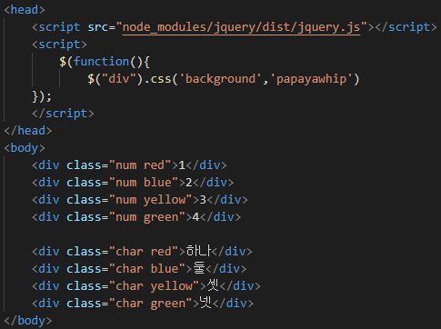

* 출력창(1)

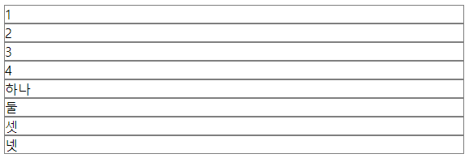

* 소스코드(2)

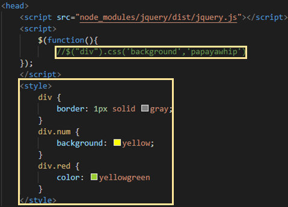

​					(body **소스코드(1)**과 동일 )	

* 출력창(2)

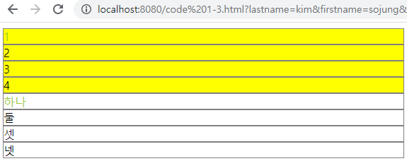

* 소스코드(3)

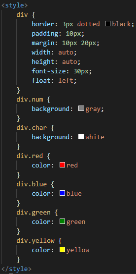

​											(body **소스코드(1)**과 동일 )	

​	=> padding은 외부 여백, margin은 내부 여백

​	=> margin 뒤의 값으로 오는 개수에 따라 1개일 경우(top, right, bottom, left 		모두 적용), 2개일 경우(top, bottom/ right, left 나눠 적용), 3개일 경우(top/ 		bottom/ right/ left는 default로 나눠 적용), 4개일 경우(top/ right/ bottom/ 		left 나눠 적용)로 나뉜다.

* 출력창(3)

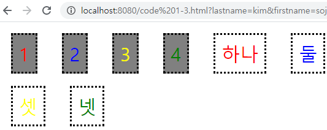

* 소스코드(4)

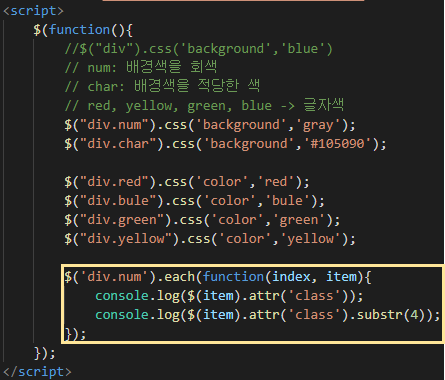

​				=> `substr(n)`함수는 앞에서 n번째 자리에서부터 출력해준다

* 출력창(4)

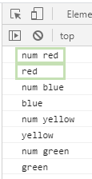

* 소스코드(5)

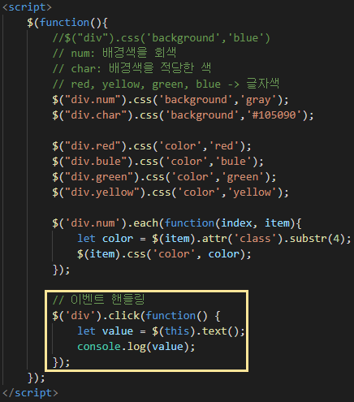

* 출력창(5)

  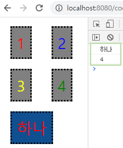

  ​							=> 클릭하는 것들의 텍스트를 출력해준다

---

##### 예제 - 동일한 속성값을 가진 엘리먼트를 토글링

* 소스코드(6)

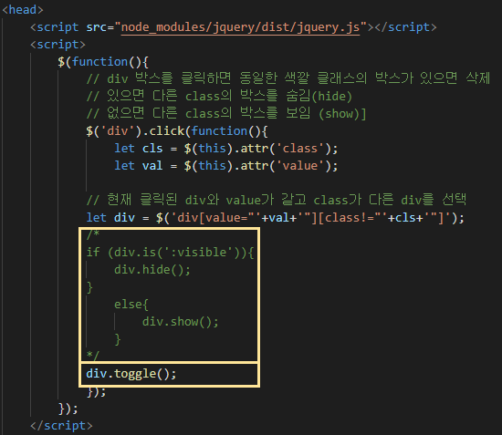

* 출력창(6)

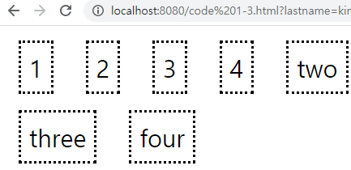

---

##### 예제 - 셀렉트 박스에서 선택한 숫자에 해당하는 구구단을 출력

* 소스코드(7)

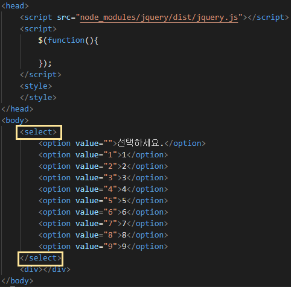

​			=> select를 이용해 선택메뉴를 만든다.

* 출력창(7)

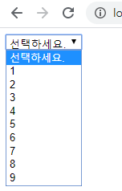

* 소스코드(8)

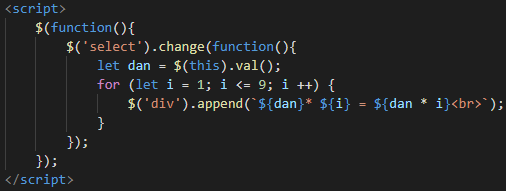

​			=> 숫자를 선택하면 해당하는 단의 구구단이 출력된다

​			(body **소스코드(1)**과 동일 )	

* 출력창(8)

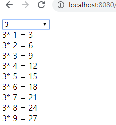

---

##### 예제 - mouseover, mouseleave 이벤트 처리

* 소스코드(9)

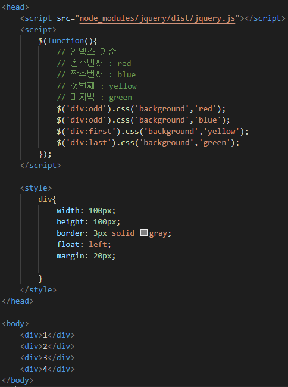

* 출력창(9)

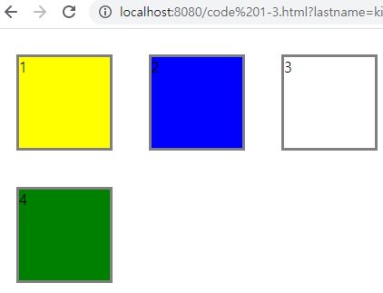

---

* 소스코드(10)

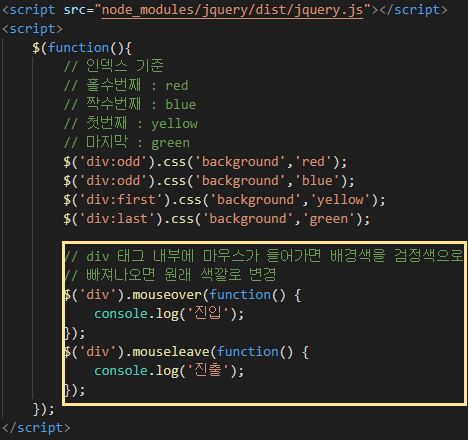

​		=> 네모 박스 내에 마우스가 들어갈때와 나올 때 '진입', '집출'을 출력한다

* 출력창(10)

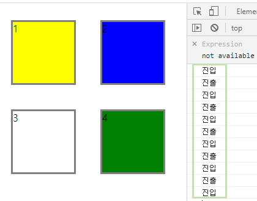

---

* 소스코드(11)

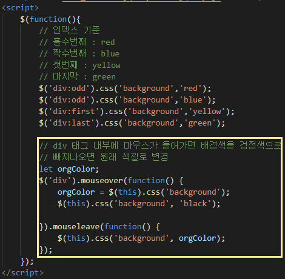

​		=> 마우스가 박스 위를 지나칠 때마다 배경색이 검정색으로 바뀌었다가 

​			 원래대로 돌아온다

* 출력창(11)

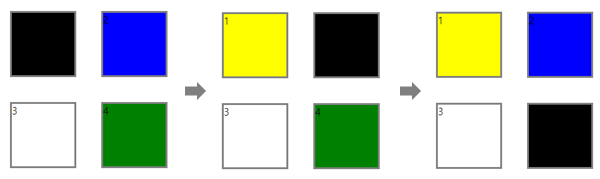

​		=> 마우스를 1-2-4 순서대로 이동시켰다

