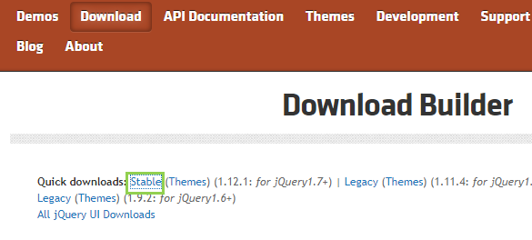
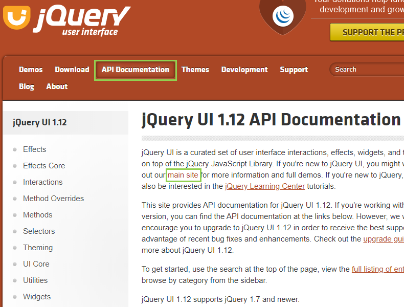
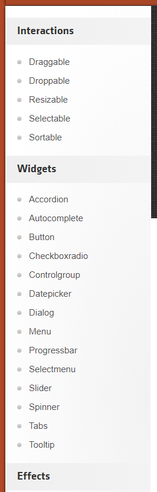
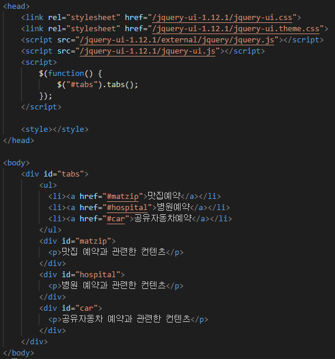
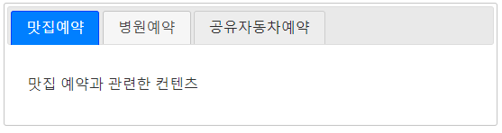
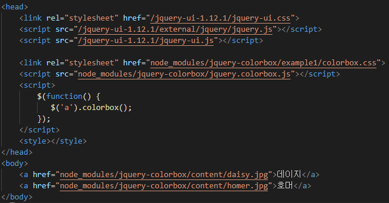
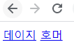
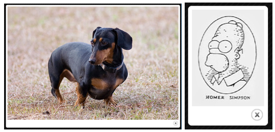

# jQuery

## UI

* 시작하기

  [다운로드 경로](https://jqueryui.com/themeroller/)

 		=> Stable 클릭하여 설치

​	=> 상단 메뉴에서 `API Documentation`를 클릭하고 `main site`에 들어간다.

​	=> 메뉴에 있는 항목들을 클릭해 원하는 소스코드를 얻을 수 있다.

---

##### 예제 - Tab 만들어 보기

* 소스코드(1)

* 출력창 (1)

---

##### 예제 - colorbox 이용해보기

* 소스코드(2)

* 출력창(2)

​		=> 이름을 클릭하면 데이지랑 호머 사진 파일을 볼 수 있다

