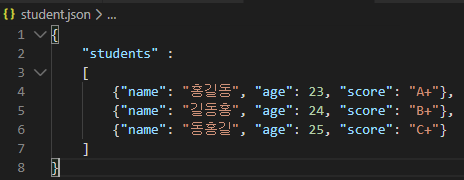
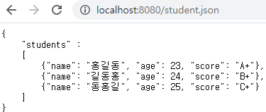
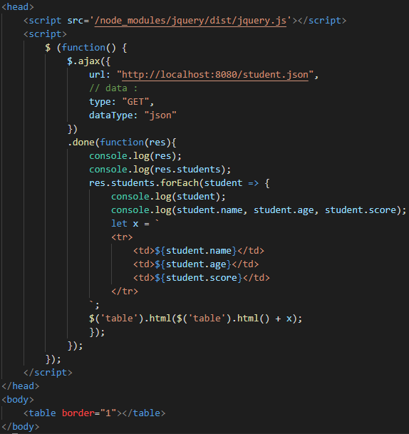
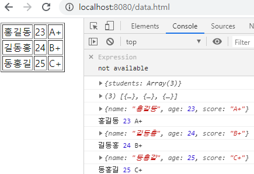

# jQuery

## Ajax

: Ajax를 사용하면 페이지를 전환하지 않고 서버에서 새로운 데이터를 받아와 사용자에게 보여줄 수 있다. 대표적인 예로 검색 사이트의 자동 완성 서비스가 있다. sns를 사용할 때 글을 입력하거나 친구가 새 글을 쓰더라도 페이지가 전환되지 않고 현재 페이지에 글이 추가되는 것도 예로 들 수 있다.

### 데이터 전송 형식

### csv

 각 항목을 쉼표로 구분해 데이터를 표현하는 방법이다. 형식이 짧아 많은 양의 데이터를 전송할 때 활용하면 편하다. 하지만 가독성이 떨어진다는 단점이 있다.

#### XML

CSV에서는 각각의 데이터가 무엇을 나타내는지 알기 힘들어 이를 대체하고자 나온 데이터 전달 형식이 XML이다. XML은 HTML처럼 태그로 데이터를 표현한다. 하지만 닫는 태그와 여는 태그 등이  없이 용량을 차지하는 문제가 있다.

#### JSON

CSV와 XML의 단점을 모두 극복한 형식이다. JSON은 자바스크립트에서 사용하는 객체 형태로 데이터를 표현하는 방법으로 Ajax를 사용할 때 거의 표준으로 사용되는 데이터 표현 방식이다.

##### JSON 사용해보기

1. `student.json` 파일에 데이터 만들기

2. `data.html`파일에 데이터를 불러올 수 있는 소스코드 작성

