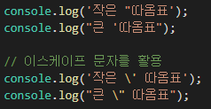
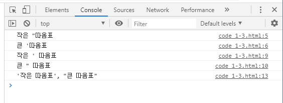
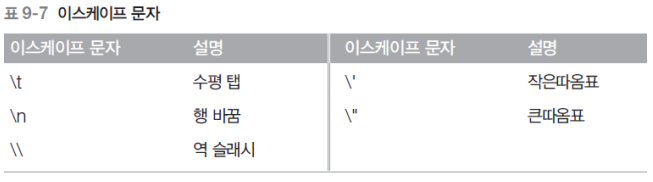
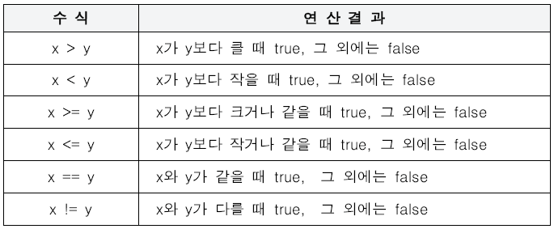
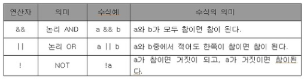
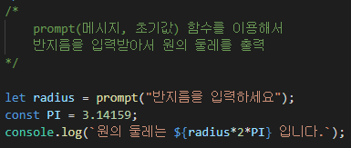
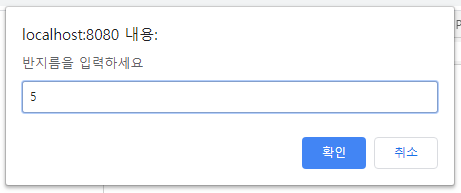
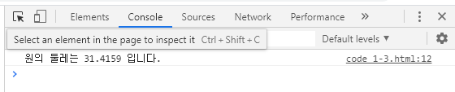

# javascript

## 출력

* alert() 함수

  * 가장 기본적인 출력방법
  * 웹 브라우저의 경고창

* 매개 변수

  * 함수의 괄호 안에 들어가는 것

  * ex) alert('Hello JavaScript .. !');

    

## 문자열 자료형

* 문자열(String)

  * 문자를 표현할 때 사용하는 자료의 형태

  * alert() 함수의 매개 변수로 쓰인 'Hello JavaScript .. !'와 같은 자료

  * 문자열을 만드는 방법

    * 큰 따옴표와 작은 따옴표 모두 사용 가능하지만 일관적으로 사용해야 함

    * 내부에 따옴표를 문자 그 자체로 사용하고 싶다면 특수한 기능을 수행하는 이스케이프 문자`\`를 사용한다

      ​									

    * 백틱을 이용하면 더 쉽게 표현 가능하다

      ​						

      

      ​				=> 이 때, 이스케이프 문자`\`는 의미 문자(meta-char)라고 한다

  * 이스케이프 문자

    

### 숫자 자료형

* 나머지 연산자(%)

  ​	좌변을 우변으로 나눈 나머지를 표시하는 연산자

### 불 자료형

: 참과 거짓이라는 값을 표현할 때 사용

* true = 1, false = 0

* 비교연산자

  

* 논리 연산자 (논리곱, 논리합, 논리 부정)

  ​				

### 변수

: 값을 저장할 때 사용하는 식별자

 * 숫자뿐 아니라 모든 자료형 저장 가능

 * 변수를 사용하려면?

   1. 변수 선언: 변수를 만듦 

   2. 변수에 값 할당

* 변수 선언 방법

  ex) let abcd;

* 변수 할당

  * 변수 초기화: 변수 선언 후 처음 값을 할당 하는 것

    

    

    

    

    

    