# javascript

## 함수

### 함수 리터럴

function add (x, y) { return x + y; }

#1    		#2   #3     #4

#1 function 키워드

#2 함수명

#3 매개변수 목표 = 파라미터

#4 함수 본문(body)

 ### 함수 정의 방식

=> 함수를 정의하는 방법에는 3가지가 있다.

* 함수 선언문 (function statement)
* 함수 표현식 (function expression)
* Function() 생성자 함수 

#### 함수 선언문을 이용한 함수 정의 방식

=> 함수 리터럴과 동일

=> 반드시 함수 이름을 정의해야 한다.

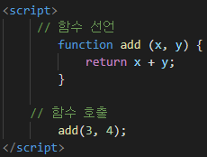

#### 함수 표현식을 이용한 함수 정의 방식

=> 자바스크립트에서는 함수가 하나의 값으로 취급되기 때문에 문자열이나 숫자와 같이 변수에 할당이 가능하다.

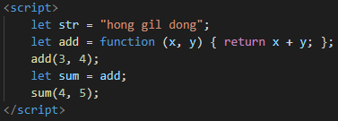

​		=> 익명함수를 add에 할당하여 선언한 후 또다른 변수 sum에 대입시켜줄 수 있다.

=> 이 때 함수의 이름이 부여된다면 '기명 함수'이고, 부여되지 않는다면 '익명 함수'이다.

=> 이 때, 주의해야 할 점은 기명함수의 경우 함수 표현식 내에서 사용된 이름은 외부 코드에서 접근할 수 없다. 

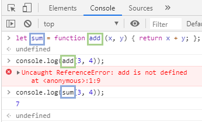

​					=> 초록박스: 함수 표현식 내에서 사용된 이름 => 외부 코드에서 접근 불가

=> 이에 대한 대안으로, 함수 선언문 형식으로 정의한 함수는 자바스크립트 내부에서 함수 이름과 함수 변수 이름이 동일한 함수 표현식 형식으로 변경한다.

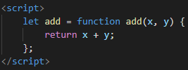

#### Function() 생성자 함수를 이용한 함수 생성

new Function ([arg1[, arg2[, ...argN]],] functionBody) 형태로 `Function()`함수를 이용해 함수를 생성할 수 있다.

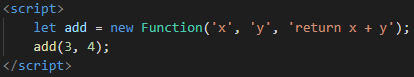

### 익명함수

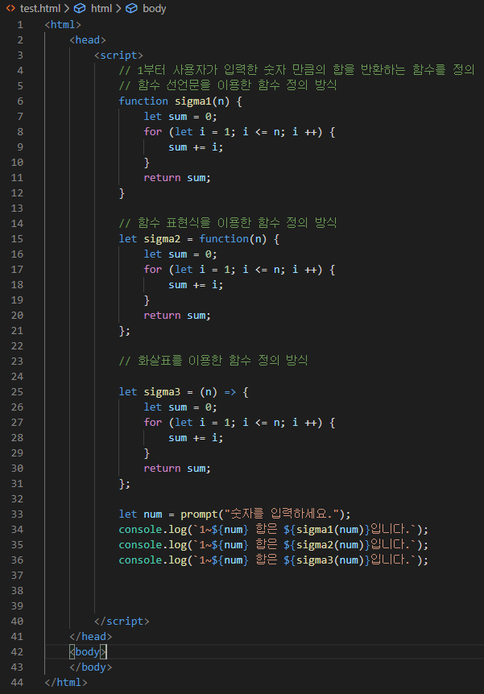

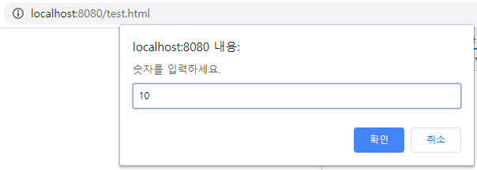

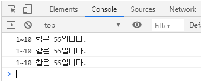

---

#### 함수 이름 중복

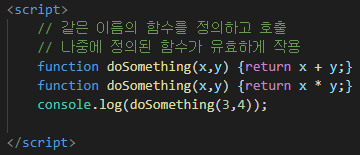

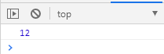

=> 같은 이름의 함수가 정의된 경우 나중에 정의되는 함수가 유효하게 작용된다. 

---

#### 선언문 형태와 표현식 형태 정의의 차이점

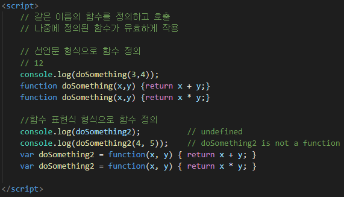

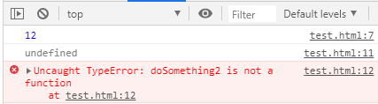

=> **선언문 형식으로 함수를 정의한 경우** 나중에 선언된 함수이더라도 실행 가능

=> **함수 표현식 형식으로 함수를 정의한 경우** 나중에 선언된 함수에 대해 실행 불가능

=> doSomething2에 대해 호이스팅 된 변수를 참조할 수 는 있지만 값이 입력되어 있지 않아 오류 발생

---

#### 선언문 형식과 표현식 형식의 공존

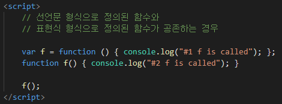

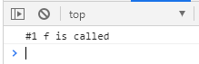

=> 선언문 형식이 먼저 생성된 후 익명 함수가 마지막에 생성되기 때문에 '#1 f is called'가 출력된다.

### 매개 변수

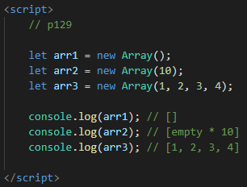

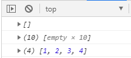

=> 다양한 형식의 매개변수를 전달할 수 있다. 

=> Array() : 빈 배열을 만든다

=> Array(n): 매개 변수 값만큼의 크기를 가지는 배열을 만든다

=> Array(any, any, ...):  매개변수를 배열로 만든다

---

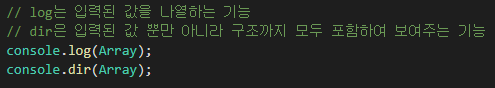

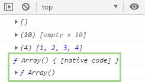

---

####  arguments

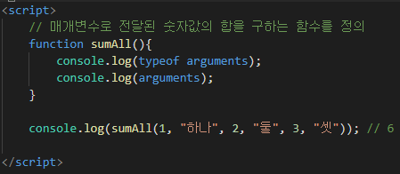

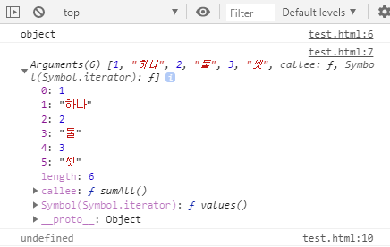

=> arguments: 매개변수의 배열로, 객체의 자료형와 배열의 길이를 출력할 수 있다.

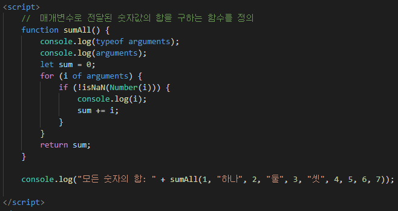

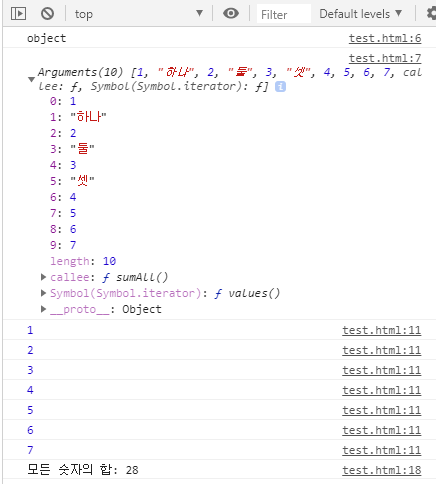

---

#### 함수 중간 반환

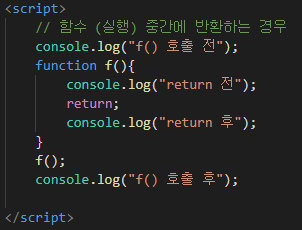

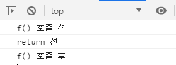

=>

### 내부함수

: 함수 내부에서 정의된 함수

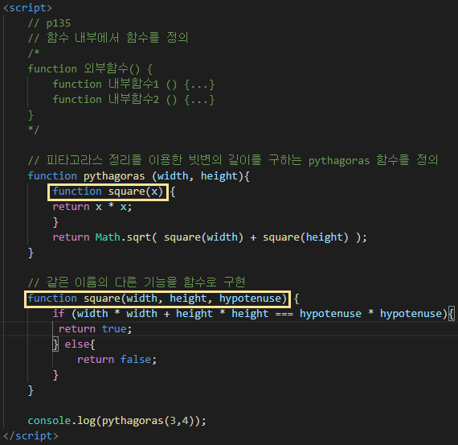

=> 같은 이름의 함수가 정의되는 경우 나중에 정의된 함수가 출력되지만, 먼저 정의된 함수가 내부 함수라면 외부에 같은 이름을 사용하는 함수가 있어도 내부 함수를 우선 실행한다.

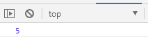

### 자기호출함수

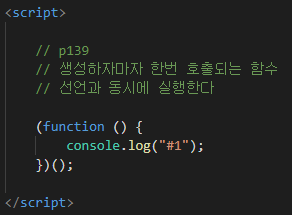

### 콜백함수

: 매개변수로 전달하는 함수

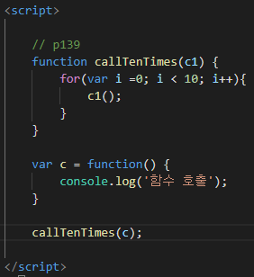

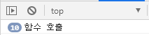

=> 함수 c를 callTenTime의 매개변수로 전달하면 '함수 호출'이 10번 반복 출력되는 모습을 확인할 수 있다

