# javascript

## 객체

### 객체 개요

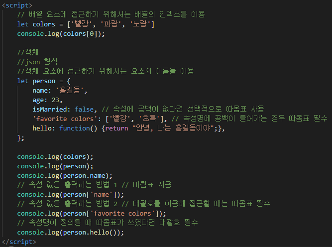

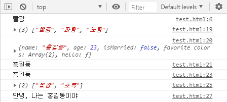

​			=> 객체에는 값으로 문자열, 숫자, 불값, 배열, 함수가 모두 올 수 있다.

####  

### 메서드와 this

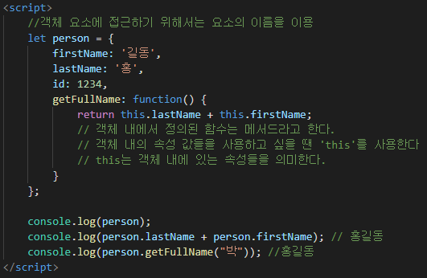

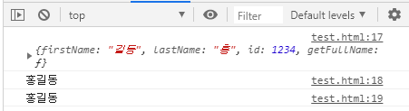

​		=> this를 쓰지 않고 변수를 호출한다면, 그 변수는 글로벌 변수로 선언이 			         	         되어있어야 한다.

​		=> 다음은 this를 사용하지 않은 글로벌 변수 예시

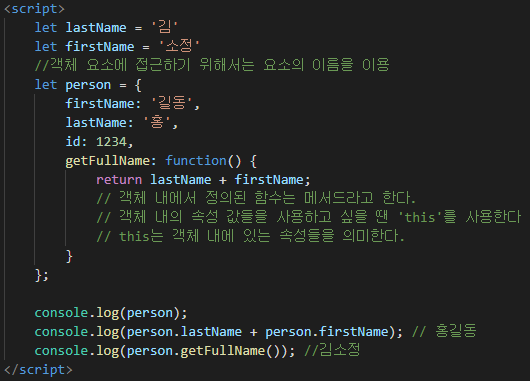

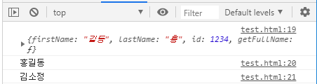

### 객체와 반복문

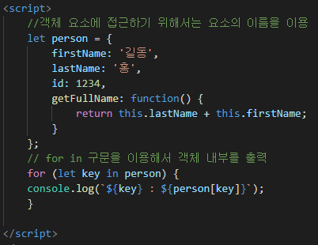

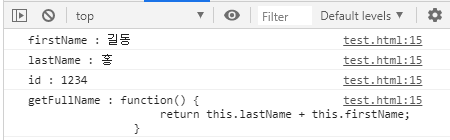

​				=> 단순 `for`문은 사용할 수 없고, 모든 객체 속성을 반환하기 위해서는 					`for in `구문을 사용해야 한다.

### 객체 관련 키워드 -  in, with

* in 

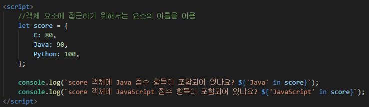

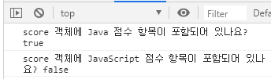

* with

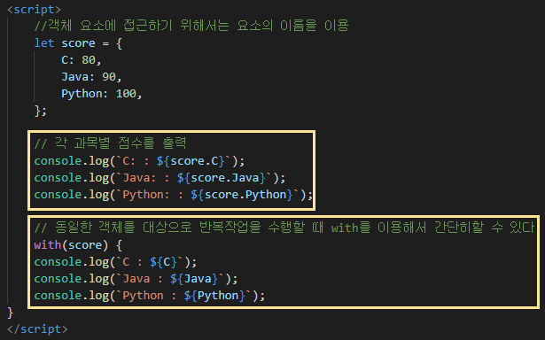

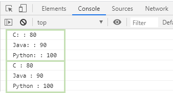

### 객체의 속성 추가와 제거

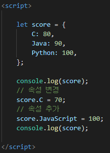

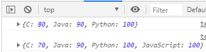

---

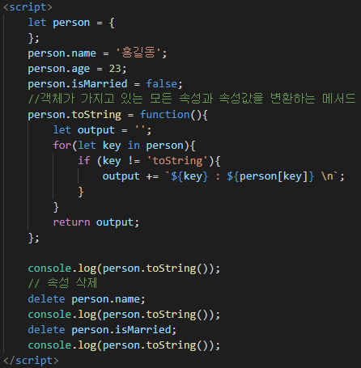

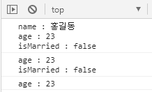

### 객체와 배열을 사용한 데이터

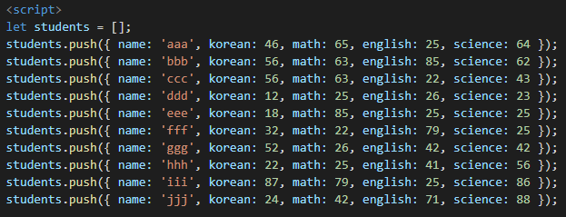

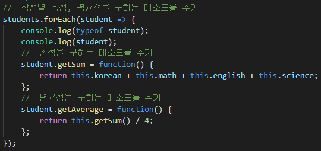

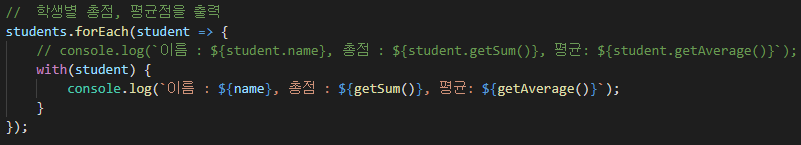

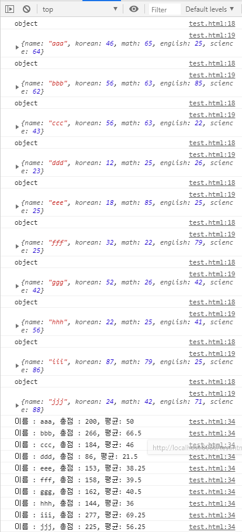

### 함수를 사용한 객체 생성

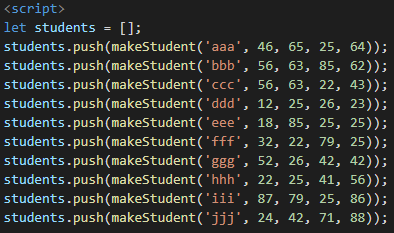

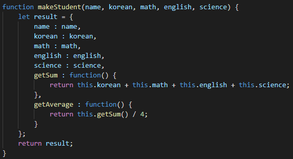

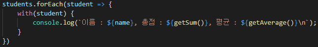

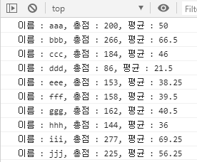

### 조금 더 나아가기

* 옵션 객체

: 함수의 매개변수로 전달되는 객체로, 입력해도 되고 되지 않아도 된다는 의미에서 옵션 객체라고 불림

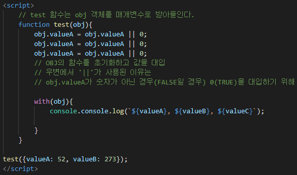

=> 옵션 객체는 초기화하는 과정이 중요하다.

=> 데이터의 순서에 상관없이 값을 대입해주기만 하면 된다는 것이 장점이다.

* 참조복사와 값 복사

  * 변수(기본 자료형의 복사)(깊은복사)

  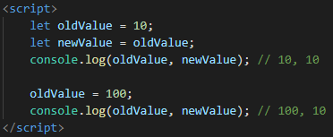

  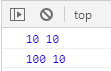

  

  * 배열(객체의 값 복사)(얕은 복사)

  * 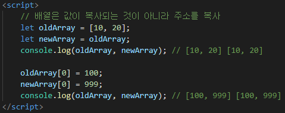

  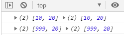

  ​					=> 배열은 주소를 복사하기 때문에 newArray의 값을 바꾸었을 때 						  oldArray의 값도 변경된다

  

  * 객체의 값 복사

    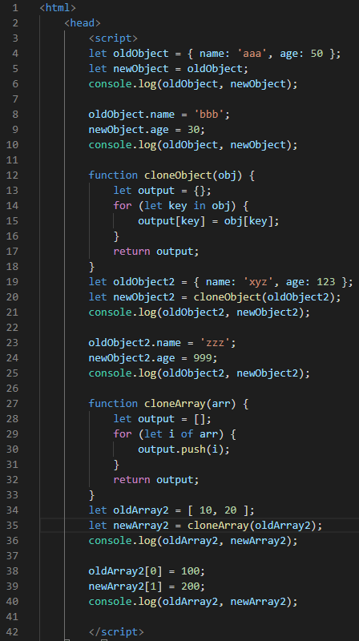

    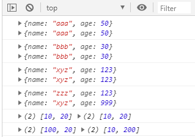

    => 객체 내에서의 속성의 한가지 값은 변경하는 것은 깊은 참조이다.

