# 리액트

### 리액트란 무엇인가

: 페이스북에서 개발하고 관리하는 UI라이브러리이다. UI 기능만을 제공하기 떄문에 전역상태관리, 라우팅, 빌드 시스템을 각 개발자가 직접 구축해야 한다. 직접 구축할 수 있으니 각자의 환경에 맞게 최적화가 가능하나 반대로 신경 쓸 것이 많기 때문에 초보자에게는 진입장벽이 높게 느껴질 수 있다. 이 진입장벽을 낮추기 위해 리액트 팀에서는 create-react-app을 만들었다. 이를 이용하면 이랙트를 처음 사용하는 사람도  하나의 명령어로 리액트 개발 환경을  구축할 수 있다. 


* 가상돔: 리액트의 장점은 가상 돔을 통해서 ui를 빠르게 업데이트한다는 점이다, 가상 돔은 이전 ui 상태를 메모리에 유지해서, 변경될 ui 의 최소 집합을 계산하는 기술이다, 가상 돔 덕분에 불필요한 ui 업데이트는 줄고, 성능은 좋아진다.


### 리액트 개발 환경 구축하기

#### 작업 디렉터리를 생성

#1 명령 프롬프트(cmd.exe) 실행
\#2 작업 디렉터리 생성 및 이동

```shell
C:\Users\HPE>mkdir c:\react
C:\Users\HPE>cd c:\react
```

#3 Visual Studio Code 실행

\#4 File > Open Folder … > C:\react 를 선택 후 Open

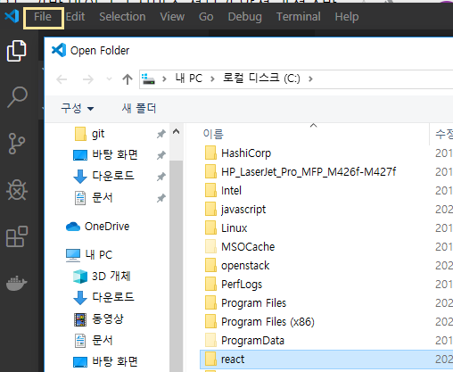

#5 create-react-app 패키지 설치

```shell
c:\react>npm install -g create-react-app
```

#6 create-react-app으로 리액트 프로젝트 생성

```shell
c:\react>create-react-app hello-react
Creating a new React app in c:\react\hello-react.
...
```


\#7 디렉터리 이동 후 실행

```shell
c:\react>cd hello-react
c:\react\hello-react>npm start
```

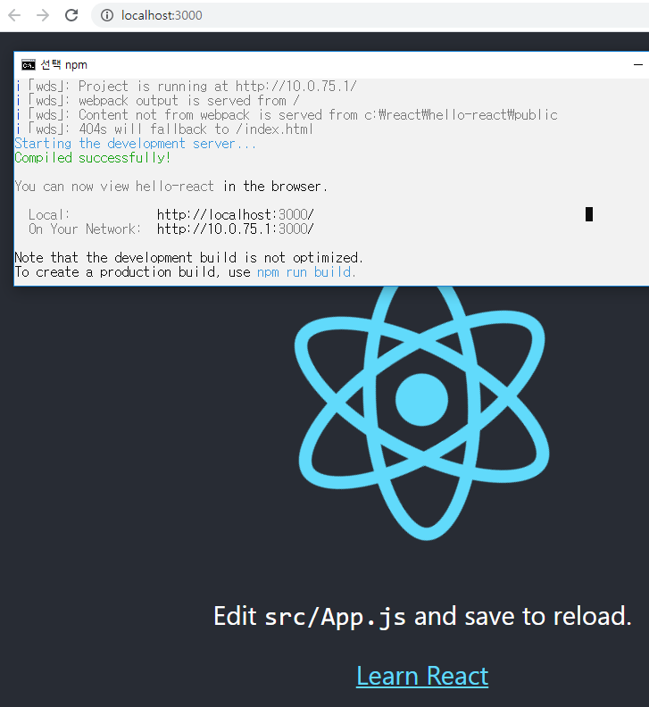

​													=> 자동으로 리액트 창 실행

\# 8 확인

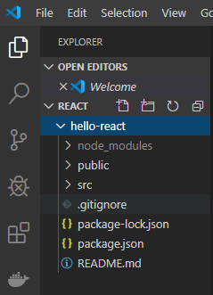

​					=> visual code의 작업 디렉토리에 파일이 생성된 것 확인 가능


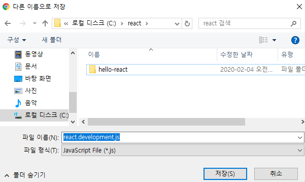

---


#### 외부 패키지를 사용하지 않고 리액트 웹 페이지 제작

\#1 작업 디렉터리 생성

 


\#2 리액트 라이브러리 다운로드 → C:\react\hello-world 디렉터리 아래에 저장

https://unpkg.com/react@16.12.0/umd/react.development.js

https://unpkg.com/react@16.12.0/umd/react.production.min.js

https://unpkg.com/react-dom@16.12.0/umd/react-dom.development.js

https://unpkg.com/react-dom@16.12.0/umd/react-dom.production.min.js

development: 개발 환경에서 사용하는 파일 → 에러 메시지 확인이 가능

production: 실행(배포) 환경에서 사용하는 파일

react: 플랫폼 구분 없이 공통으로 사용되는 파일 (리액트 코어)

react-dom: 웹 환경에서 사용되는 파일


\#3 c:\react\hello-world\sample1.html, c:\react\hello-world\sample1.js 파일 생성


* 예제 


 		=> "좋아요" 상태에서 버튼을 클릭하면 "좋아요 취소"로 변경 되는 예제 실행


* jQuery 이용 방법

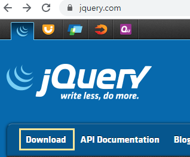

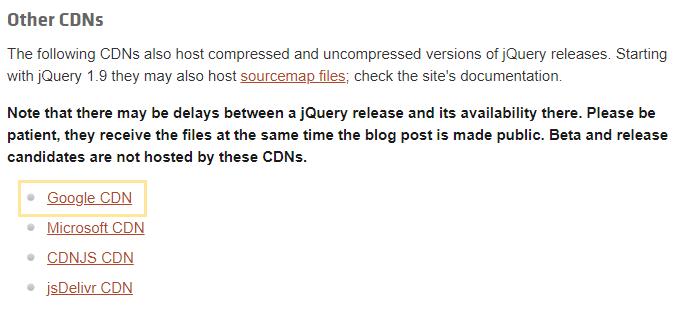

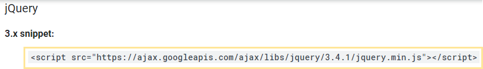

​				=> 이 코드를 이용해서 visual code에서 jQuery를 사용할 수 있다.


\#4 아래 화면과 같은 출력을 제공하는 sample1.html 작성

#4-1 react를 사용하지 않고 구현

* 소스코드

  **방법1**

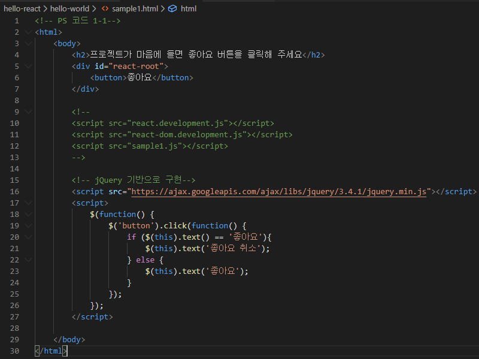

```html
<!-- PS 코드 1-1-->
<html>
    <body>
        <h2>프로젝트가 마음에 들면 좋아요 버튼을 클릭해 주세요</h2>
        <div id="react-root">
            <button>좋아요</button>
        </div>

        <!--
        <script src="react.development.js"></script>
        <script src="react-dom.development.js"></script>
        <script src="sample1.js"></script>
        -->

        <!-- jQuery 기반으로 구현-->
        <script src="https://ajax.googleapis.com/ajax/libs/jquery/3.4.1/jquery.min.js"></script>
        <script>
            $(function() {
                $('button').click(function() {
                    if ($(this).text() == '좋아요'){
                        $(this).text('좋아요 취소');
                    } else {
                        $(this).text('좋아요');
                    }                
                });
            });
        </script>

    </body>
</html>
```

​	**방법2- 변수 이용**

```html
<!-- P5 코드1-1 -->
<html>
    <body>
        <h2>프로젝트가 마음에 들면 좋아요 버튼을 클릭해 주세요</h2>
        <div id="react-root">
            <button>좋아요</button> <!-- #1 -->
        </div>

        <!-- jQuery 기반으로 구현 -->
        <script src="https://ajax.googleapis.com/ajax/libs/jquery/3.4.1/jquery.min.js"></script>
        <script>
            $(function() {
                //  liked 변수의 값이 false 이면 좋아요 취소
                //                   true 이면 좋아요 
                //  버튼을 클릭하면 liked 변수의 값은 토글
                let liked = false; /* #2 */
                $('button').click(function() {
                    liked = !liked;
                    if (liked) $(this).text('좋아요');
                    else $(this).text('좋아요 취소');
                });
                    
                $('button').trigger('click'); /* #3 */
            });  
        </script>
    </body>
</html>

```


\#4-2 react 기반으로 구현

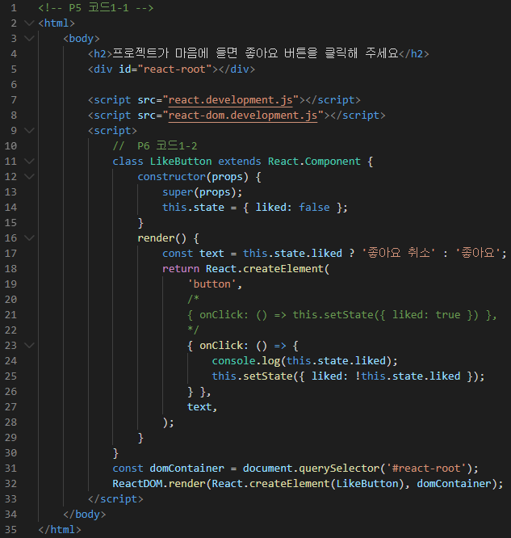

```html
<!-- P5 코드1-1 -->
<html>
    <body>
        <h2>프로젝트가 마음에 들면 좋아요 버튼을 클릭해 주세요</h2>
        <div id="react-root"></div>

        <script src="react.development.js"></script>
        <script src="react-dom.development.js"></script>
        <script>
            //  P6 코드1-2
            class LikeButton extends React.Component {
                constructor(props) {
                    super(props);
                    this.state = { liked: false };
                }
                render() {
                    const text = this.state.liked ? '좋아요 취소' : '좋아요';
                    return React.createElement(
                        'button',
                        /*
                        { onClick: () => this.setState({ liked: true }) },
                        */
                        { onClick: () => { 
                            console.log(this.state.liked); 
                            this.setState({ liked: !this.state.liked }); 
                        } },
                        text,
                    );
                }
            }
            const domContainer = document.querySelector('#react-root');
            ReactDOM.render(React.createElement(LikeButton), domContainer);
        </script>
    </body>
</html>

```


\#5 http-server를 실행해서 확인

#5-1 http-server 실행 ⇒ C:\react>npx http-server 

#5-2 브라우저로 접속 ⇒ http://localhost:8080/hello-world/sample1.html

* 출력창

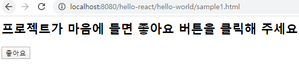

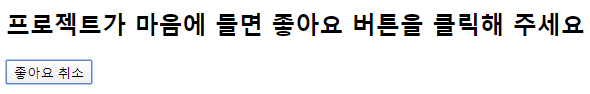

---

 상담~

---


\#6 여러 개의 돔 요소를 렌더링


\#6-1 jQuery를 이용한 구현 (#4-1 코드를 응용)

* 소스코드

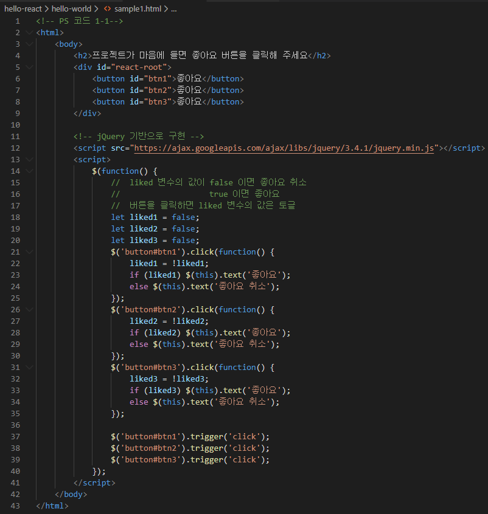

```html
<html>
    <body>
        <h2>프로젝트가 마음에 들면 좋아요 버튼을 클릭해 주세요</h2>
        <div id="react-root">
            <button id="btn1">좋아요</button>
            <button id="btn2">좋아요</button>
            <button id="btn3">좋아요</button>
        </div>

        <!-- jQuery 기반으로 구현 -->
        <script src="https://ajax.googleapis.com/ajax/libs/jquery/3.4.1/jquery.min.js"></script>
        <script>
            $(function() {
                //  liked 변수의 값이 false 이면 좋아요 취소
                //                   true 이면 좋아요 
                //  버튼을 클릭하면 liked 변수의 값은 토글
                let liked1 = false;
                let liked2 = false;
                let liked3 = false;
                $('button#btn1').click(function() {
                    liked1 = !liked1;
                    if (liked1) $(this).text('좋아요');
                    else $(this).text('좋아요 취소');
                });
                $('button#btn2').click(function() {
                    liked2 = !liked2;
                    if (liked2) $(this).text('좋아요');
                    else $(this).text('좋아요 취소');
                });
                $('button#btn3').click(function() {
                    liked3 = !liked3;
                    if (liked3) $(this).text('좋아요');
                    else $(this).text('좋아요 취소');
                });
                    
                $('button#btn1').trigger('click');
                $('button#btn2').trigger('click');
                $('button#btn3').trigger('click');
            });  
        </script>
    </body>
</html>
```

* 출력 창

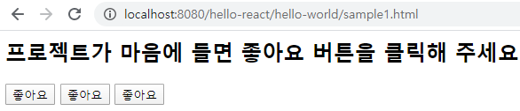

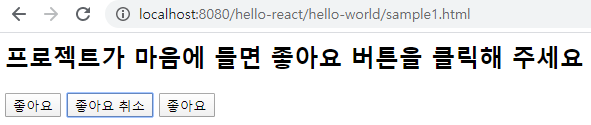


\#6-2 react를 이용한 구현 (#4-2 코드를 응용)

* 소스코드

```html
<html>
    <body>
        <h2>프로젝트가 마음에 들면 좋아요 버튼을 클릭해 주세요</h2>
        <div id="react-root1"></div>
        <div id="react-root2"></div>
        <div id="react-root3"></div>

        <script src="react.development.js"></script>
        <script src="react-dom.development.js"></script>
        <script>
            class LikeButton extends React.Component {
                constructor(props) {
                    super(props);
                    this.state = { liked: false };
                }
                render() {
                    const text = this.state.liked ? '좋아요 취소' : '좋아요';
                    return React.createElement(
                        'button',
                        { onClick: () => { 
                            console.log(this.state.liked); 
                            this.setState({ liked: !this.state.liked }); 
                        } },
                        text,
                    );
                }
            }
            ReactDOM.render(React.createElement(LikeButton), document.querySelector('#react-root1'));
            ReactDOM.render(React.createElement(LikeButton), document.querySelector('#react-root2'));
            ReactDOM.render(React.createElement(LikeButton), document.querySelector('#react-root3'));
        </script>
    </body>
</html>

```

* 출력 창

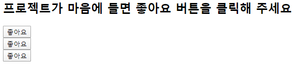


