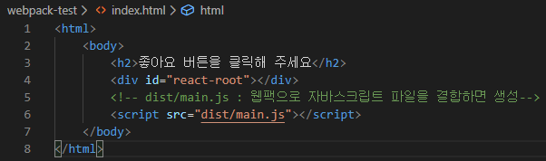
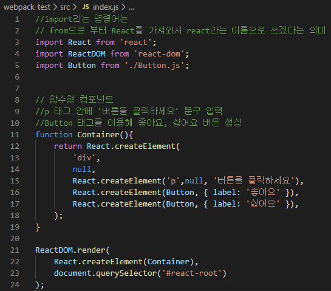
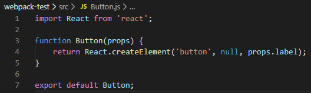
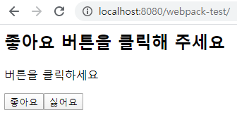

# 리액트

### 바벨(babel) 사용해보기

: 자바 스크립트 코드를 변환해주는 컴파일러이다. 바벨을 사용하면 최신 자바스크립트 문법을 지원하지 않는 환경에서도 최신 문법을 사용할 수 있다.

* 바벨 플러그인과 프리셋

  : 바벨은 자바스크립트 파일을 입력으로 받아서 또 다른 자바스크립트 파일을 출략으로 준다.  이렇게 자바스크립트 파일을 변환해 주는 작업은 플러그인 단위로 이루어진다. 두 번의 변환이 필요하다면 두 개의 플러그인을 사용한다. 하나의 목적을 위해 여러 개의 플러그인이 필요할 수 있는데, 이러한 플러그인 집합을 프리셋(preset)이라고 부른다. 예를 들어, 바벨에서는 자바스크립트 코드를 압축하는 플러그인을 모아 놓은 babel-preset-minify 프리셋을 제공한다.


\#1 증가, 감소 버튼으로 count 상태값을 변경하는 코드를 작성

* 소스코드

```html
<html>
    <body>
        <h2>프로젝트가 마음에 들면 좋아요 버튼을 클릭해 주세요</h2>
        <div id="react-root"></div>
        
        <script src="react.development.js"></script>
        <script src="react-dom.development.js"></script>
        <script>
            class LikeButton extends React.Component {
                constructor(props){
                    super(props);
                    this.state = { liked: false };
                }
                render(){
                    const text = this.state.liked ? '좋아요 취소' : '좋아요'
                    return React.createElement(
                        'button'
                        {onClick: () => this.setState({ liked: !this.state.liked})},
                        text,
                    );
                }
            }
            // P9 코드 1-6 참조
            class Container extends React.Component {
                constructor(props) {
                    super(props);
                    this.state = { count: 0 };
                }
                render() {
                    return React.createElement(
                        'div',
                        null, 
                        React.createElement(LikeButton), 
                        React.createElement(
                            'div',
                            { style: { marginTop: 20 } }, 
                            React.createElement('span', null, '현재 카운트: '),
                            React.createElement('span', null, this.state.count), 
                            React.createElement(
                                'button', 
                                { onClick: () => this.setState({ count: this.state.count + 1 })},
                                '증가',
                            ),
                            React.createElement(
                                'button', 
                                { onClick: () => this.setState({ count: this.state.count -1 })},
                                '감소',
                            ),
             s           ),
                    );
                }
            }


            ReactDOM.render(
                React.createElement(LikeButton), 
                document.querySelector('#react-root')
            );
        </script>
    </body>
</html>
```


* 출력 창


#1-2 React.createElement 메소드를 이용해서 구현

* 문서의 구조 및 엘리먼트의 포함 관계 등을 이해하기 어려움 → 문서의 구조와 
* 리먼트의 포함 관계를 쉽게 표현하고 파악할 수 있는 표현식이 필요 ⇒ JSX 
* JSX로 작성한 코드를 바벨을 이용해서 React.createElement 메소드 형식으로 트랜스 컴파일

* 소스코드 

```html
<html>
    <body>
        <h2>프로젝트가 마음에 들면 좋아요 버튼을 클릭해 주세요</h2>
        <div id="react-root"></div>

        <script src="react.development.js"></script>
        <script src="react-dom.development.js"></script>
        <script>
            class LikeButton extends React.Component {
                constructor(props) {
                    super(props);
                    this.state = { liked: false };
                }
                render() {
                    const text = this.state.liked ? '좋아요 취소' : '좋아요';
                    return React.createElement(
                        'button', 
                        { onClick: () => this.setState({ liked: !this.state.liked }) },
                        text,
                    );
                }
            }
            // P9 코드1-6 참조
            class Container extends React.Component {
                constructor(props) {
                    super(props);
                    this.state = { count: 0 };
                }
                render() {
                    return React.createElement(
                        'div',
                        null, 
                        React.createElement(LikeButton), 
                        React.createElement(
                            'div',
                            { style: { marginTop: 20 } }, 
                            React.createElement('span', null, '현재 카운트: '),
                            React.createElement('span', null, this.state.count), 
                            React.createElement(
                                'button', 
                                { onClick: () => this.setState({ count: this.state.count + 1 })},
                                '증가',
                            ),
                            React.createElement(
                                'button', 
                                { onClick: () => this.setState({ count: this.state.count -1 })},
                                '감소',
                            ),
                        ),
                    );
                }
            }

            ReactDOM.render(
                React.createElement(Container), 
                document.querySelector('#react-root')
            );
        </script>
    </body>
</html>

```


#1-3 JSX 버전으로 변경


```html
<html>
    <body>
        <h2>프로젝트가 마음에 들면 좋아요 버튼을 클릭해 주세요</h2>
        <div id="react-root"></div>

        <script src="react.development.js"></script>
        <script src="react-dom.development.js"></script>
        <script src="sample4.js"></script>
    </body>
</html>
```

 										=> C:\react\hello-world\sample4.html


```js
class LikeButton extends React.Component {
    constructor(props) {
        super(props);
        this.state = { liked: false };
    }
    render() {
        const text = this.state.liked ? '좋아요 취소' : '좋아요';
        return React.createElement(
            'button', 
            { onClick: () => this.setState({ liked: !this.state.liked }) },
            text,
        );
    }
}
// P9 코드1-6 참조
class Container extends React.Component {
    constructor(props) {
        super(props);
        this.state = { count: 0 };
    }
    render() {
        return React.createElement(
            'div',
            null, 
            React.createElement(LikeButton), 
            React.createElement(
                'div',
                { style: { marginTop: 20 } }, 
                React.createElement('span', null, '현재 카운트: '),
                React.createElement('span', null, this.state.count), 
                React.createElement(
                    'button', 
                    { onClick: () => this.setState({ count: this.state.count + 1 })},
                    '증가',
                ),
                React.createElement(
                    'button', 
                    { onClick: () => this.setState({ count: this.state.count -1 })},
                    '감소',
                ),
            ),
        );
    }
}

ReactDOM.render(
    React.createElement(Container), 
    document.querySelector('#react-root')
);
```

​	=> C:\react\hello-world\**src**\sample4.js (수정전: #1-2 코드 일부를 이전)


```js
class LikeButton extends React.Component {
    constructor(props) {
        super(props);
        this.state = { liked: false };
    }
    render() {
        const text = this.state.liked ? '좋아요 취소' : '좋아요';
        return React.createElement(
            'button', 
            { onClick: () => this.setState({ liked: !this.state.liked }) },
            text,
        );
    }
}
// P11 코드1-7 참조
class Container extends React.Component {
    constructor(props) {
        super(props);
        this.state = { count: 0 };
    }
    render() {
        return (
            <div>
                <LikeButton/>
                <div style={{ marginTop: 20 }}>
                    <span>현재 카운트: </span>
                    <span>{this.state.count}</span>
                    <button onClick={() => this.setState({ count: this.state.count + 1 })}>증가</button>
                    <button onClick={() => this.setState({ count: this.state.count - 1 })}>감소</button>
                </div>
            </div>
        );
    }
}

ReactDOM.render(
    React.createElement(Container), 
    document.querySelector('#react-root')
);

```

​			    => C:\react\hello-world\**src**\sample4.js (JSX 구문으로 수정 후)


#2 바벨 패키지를 설치하고 자바스크립트를 변환(컴파일) - P13

```shell
C:\react\hello-world>npm install @babel/core @babel/cli @babel/preset-react

C:\react\hello-world>npx babel --watch ./src --out-dir ./ --presets @babel/preset-react
```


​											 ⇒ 두개의 sample4.js 내용을 비교

#3 브라우저를 통해서 확인


### 웹팩

**P15 ESM 예제**

// file1.js

export default function func1() { … }

export function func2() { … }

export const variable1 = 123;export let variable2 = 'hello';


// file2.js

import myFunc1, { func2, variable1, variable2 } from './file1.js';


// file3.js

import { func2 as myFunc2 } from './file1.js';


**#1 작업 디렉터리 생성**

C:\react\hello-world>cd c:\react

C:\react>mkdir webpack-test

C:\react>cd webpack-test

C:\react\webpack-test>npm init -y

C:\react\webpack-test>mkdir src


=> 이런 속성관계로 파일 만들기

**#2 외부 패키지를 설치**C:\react\webpack-test>npm install webpack webpack-cli react react-dom


**#3 코드 작성**

\#3-1 C:\react\webpack-test\index.html



```html
<html>
    <body>
        <h2>좋아요 버튼을 클릭해 주세요</h2>
        <div id="react-root"></div>
        <!-- dist/main.js : 웹팩으로 자바스크립트 파일을 결합하면 생성 -->
        <script src="dist/main.js"></script>
    </body>
</html>
```


\#3-2 C:\react\webpack-test\src\index.js



````js
import React from 'react';
import ReactDOM from 'react-dom';
import Button from './Button.js';

//  함수형 컴포넌트
function Container() {
    return React.createElement(
        'div',
        null,
        React.createElement('p', null, '버튼을 클릭하세요'), 
        React.createElement(Button, { label: '좋아요' }),
        React.createElement(Button, { label: '싫어요' }),
    );
}

ReactDOM.render(
    React.createElement(Container), 
    document.querySelector('#react-root')
);
````


\#3-3 C:\react\webpack-test\src\Button.js



```js
import React from 'react';

function Button(props) {
    return React.createElement('button', null, props.label);
}

export default Button;
```


**#4 웹팩을 이용해서 두개의 자바스크립 파일을 하나로 결합**C:\react\webpack-test>npx webpack


**#5 브라우저를 통해서 확인**

