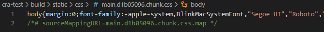
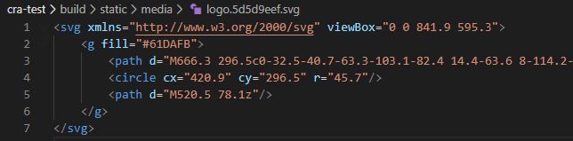

# 리액트

### create-react-app으로 시작하기

**P18**

* 리액트로 웹 애플리케이션을 만들기 위한 환경을 제공

* 바벨과 웹팩도 포함

* 테스트, HMR(Hot-Module-Replacement), ES6+ 문법, CSS 후처리 등을 제공

**#1 개발 환경 설정**

C:\react>cd c:\react

C:\react>npx create-react-app cra-test

C:\react>cd cra-test


**#2 개발 서버 실행**

C:\react\cra-test>npm start

=> 브라우저가 자동으로 http://localhost:3000/ 접속


=> cra-test 아래 src폴더에 저장된 파일 확인 가능


**#3 빌드**

```shell
c:\react\cra-test>npm run build

> cra-test@0.1.0 build c:\react\cra-test
> react-scripts build

Creating an optimized production build...
Compiled successfully.
```


=> build 폴더 안에 저장된 파일들 확인 가능

=> 자바스크립트 파일에서 import 키워드를 이용해서 가져온 CSS 파일 →  `main.{해시값}.chunk.css` 파일에 모두 저장



=> 자바스크립트 파일에서 import 키워드를 이용해서 가져온 폰트, 이미지 등의 리소스 파일 → build/static/media 폴더에 저장

