# 리액트

##

#### 예제 1 - 코드 분할하기 (p27)


##### <1 코드를 분할하지 않고 하나의 파일로 구성>

* 소스코드

  **Todo.js 파일**

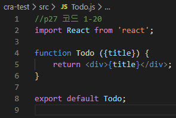

```js
// P27 코드1-20
import React from 'react';

function Todo({ title }) {
    return <div>{title}</div>;
}

export default Todo;
```

​	

​	**TodoList.js 파일**

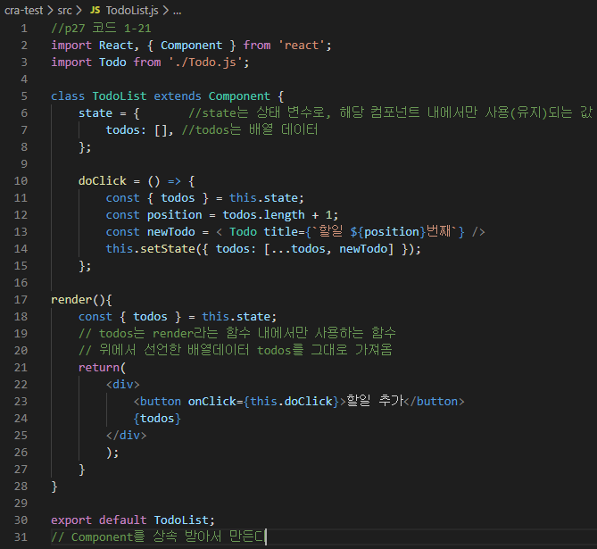

```js
//p27 코드 1-21
import React, { Component } from 'react';
import Todo from './Todo.js';

class TodoList extends Component {
    state = {       //state는 상태 변수로, 해당 컴포넌트 내에서만 사용(유지)되는 값 
        todos: [], //todos는 배열 데이터
    };

    doClick = () => {
        const { todos } = this.state;
        const position = todos.length + 1;
        const newTodo = < Todo title={`할일 ${position}번째`} />
        this.setState({ todos: [...todos, newTodo] });
    };

render(){
    const { todos } = this.state; 
    // todos는 render라는 함수 내에서만 사용하는 함수
    // 위에서 선언한 배열데이터 todos를 그대로 가져옴
    return(
        <div>
            <button onClick={this.doClick}>할일 추가</button>
            {todos}
        </div>
        );
    }
}

export default TodoList;
// Component를 상속 받아서 만든다
```


​	**App.js파일**

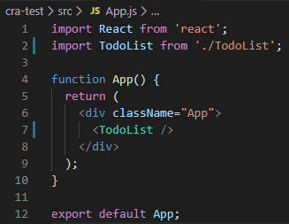

```js
import React from 'react';
import TodoList from './TodoList';

function App() {
  return (
    <div className="App">
      <TodoList />
    </div>
  );
}

export default App;
```


* 출력 창

```shell
C:\Users\HPE>cd C:\react\cra-test
C:\react\cra-test>npm start
> cra-test@0.1.0 start C:\react\cra-test
> react-scripts start
```

​		=>  localhost:3000창 자동 실행

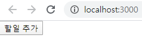


##### <2 코드 분할을 통해서 동적으로 자바스크립트 파일을 로딩>

* 소스코드

​	**Todo.js 파일**

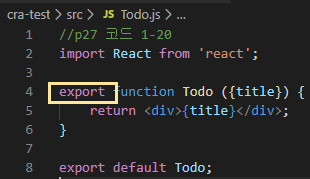


​	**TodoList.js 파일**

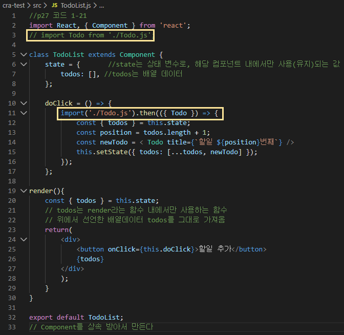


* 출력 창

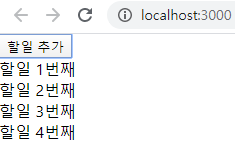


#### 예제 2 - P58 단축 속성명(shorthand property names)

* 소스코드

  C:\react\es6.html 생성

  http://localhost:8080/es6.html 주소로 결과 확인

  **es6.html 파일**

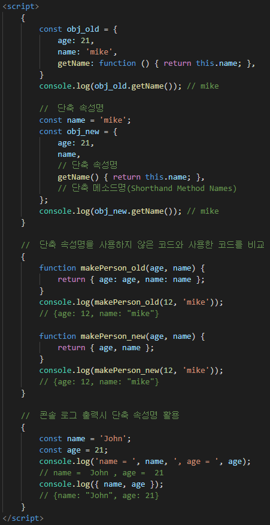

```html
<script>
    {
        const obj_old = {
            age: 21, 
            name: 'mike',
            getName: function () { return this.name; },        
        }
        console.log(obj_old.getName()); // mike
    
        //  단축 속성명
        const name = 'mike';
        const obj_new = {
            age: 21, 
            name,                                   
            // 단축 속성명
            getName() { return this.name; },        
            // 단축 메소드명(Shorthand Method Names) 
        };
        console.log(obj_new.getName()); // mike
    }
    
    //  단축 속성명을 사용하지 않은 코드와 사용한 코드를 비교
    {
        function makePerson_old(age, name) {
            return { age: age, name: name };
        }
        console.log(makePerson_old(12, 'mike'));    
        // {age: 12, name: "mike"}
        
        function makePerson_new(age, name) {
            return { age, name };
        }
        console.log(makePerson_new(12, 'mike'));    
        // {age: 12, name: "mike"}
    }
    
    //  콘솔 로그 출력시 단축 속성명 활용
    {
        const name = 'John';
        const age = 21;
        console.log('name = ', name, ', age = ', age);  
        // name =  John , age =  21
        console.log({ name, age });                     
        // {name: "John", age: 21}
    }
</script>
```


* 출력 창

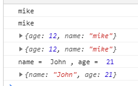


#### 예제 3 - **P59 계산된 속성명(computed property names)**

* 소스코드

  **es6.html 파일**

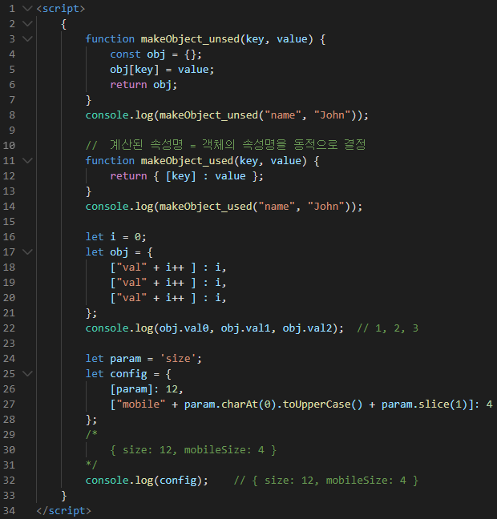

```html
<script>
    {
        function makeObject_unsed(key, value) {
            const obj = {};
            obj[key] = value;
            return obj;
        }
        console.log(makeObject_unsed("name", "John"));
    
        //  계산된 속성명 = 객체의 속성명을 동적으로 결정
        function makeObject_used(key, value) {
            return { [key] : value };
        }
        console.log(makeObject_used("name", "John"));    
    
        let i = 0;
        let obj = {
            ["val" + i++ ] : i, 
            ["val" + i++ ] : i, 
            ["val" + i++ ] : i, 
        };
        console.log(obj.val0, obj.val1, obj.val2);  // 1, 2, 3
    
        let param = 'size';
        let config = {
            [param]: 12, 
            ["mobile" + param.charAt(0).toUpperCase() + param.slice(1)]: 4
        };
        /*
            { size: 12, mobileSize: 4 }
        */
        console.log(config);    // { size: 12, mobileSize: 4 }
    }
</script>
```

* 출력 창

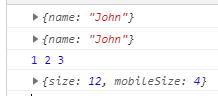


#### 예제 4 -  **P60 전개 연산자(spread operator)**

* 소스코드

  **es6.html 파일**

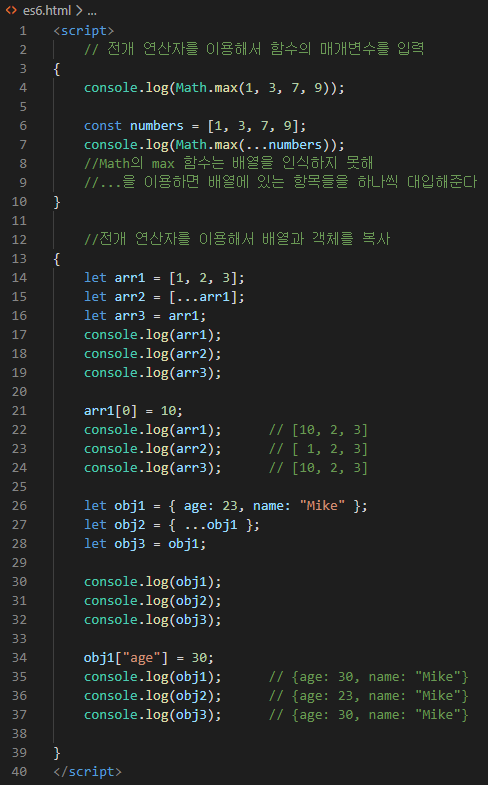

```html
<script>
    // 전개 연산자를 이용해서 함수의 매개변수를 입력
{
    console.log(Math.max(1, 3, 7, 9));

    const numbers = [1, 3, 7, 9];
    console.log(Math.max(...numbers));
    //Math의 max 함수는 배열을 인식하지 못해
    //...을 이용하면 배열에 있는 항목들을 하나씩 대입해준다
}

    //전개 연산자를 이용해서 배열과 객체를 복사
{
    let arr1 = [1, 2, 3];
    let arr2 = [...arr1];
    let arr3 = arr1;
    console.log(arr1);
    console.log(arr2);
    console.log(arr3);

    arr1[0] = 10;
    console.log(arr1);      // [10, 2, 3]
    console.log(arr2);      // [ 1, 2, 3]
    console.log(arr3);      // [10, 2, 3]

    let obj1 = { age: 23, name: "Mike" };
    let obj2 = { ...obj1 };
    let obj3 = obj1;
    
    console.log(obj1);
    console.log(obj2);
    console.log(obj3);
    
    obj1["age"] = 30;
    console.log(obj1);      // {age: 30, name: "Mike"}
    console.log(obj2);      // {age: 23, name: "Mike"}
    console.log(obj3);      // {age: 30, name: "Mike"}

}
</script>
```

* 출력 창

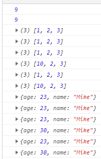

---

* 소스코드

  **es6.html 파일**

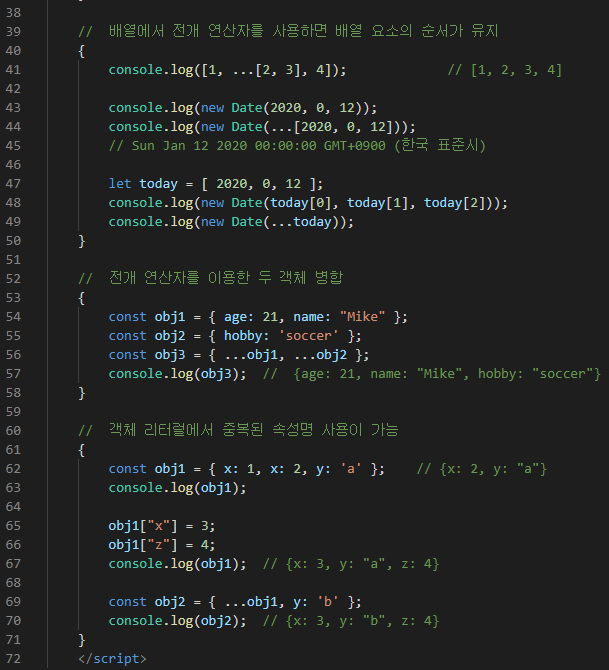

* 출력 창

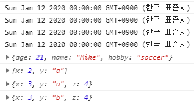


#### 예제 5 - **P61 배열 비구조화(array destructuring)**

: 배열의 여러 속성값을 변수로 쉽게 할당할 수 있는 문법

* 소스코드

  **es6.html 파일**

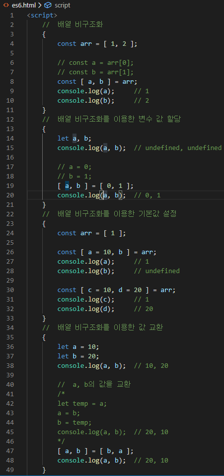

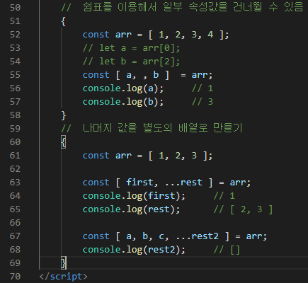

```html
<script>
//  배열 비구조화
{
    const arr = [ 1, 2 ];

    // const a = arr[0];
    // const b = arr[1];
    const [ a, b ] = arr;
    console.log(a);     // 1
    console.log(b);     // 2
}
//  배열 비구조화를 이용한 변수 값 할당
{
    let a, b;
    console.log(a, b);  // undefined, undefined

    // a = 0;
    // b = 1; 
    [ a, b ] = [ 0, 1 ];
    console.log(a, b);  // 0, 1
}
//  배열 비구조화를 이용한 기본값 설정
{
    const arr = [ 1 ];

    const [ a = 10, b ] = arr;
    console.log(a);     // 1
    console.log(b);     // undefined

    const [ c = 10, d = 20 ] = arr;
    console.log(c);     // 1
    console.log(d);     // 20
}
//  배열 비구조화를 이용한 값 교환
{
    let a = 10;
    let b = 20;
    console.log(a, b);  // 10, 20

    //  a, b의 값을 교환 
    /*
    let temp = a;
    a = b;
    b = temp;
    console.log(a, b);  // 20, 10
    */
    [ a, b ] = [ b, a ];
    console.log(a, b);  // 20, 10
}
//  쉼표를 이용해서 일부 속성값을 건너뛸 수 있음
{
    const arr = [ 1, 2, 3, 4 ];
    // let a = arr[0];
    // let b = arr[2];
    const [ a, , b ]  = arr;
    console.log(a);     // 1
    console.log(b);     // 3
}
//  나머지 값을 별도의 배열로 만들기
{
    const arr = [ 1, 2, 3 ];

    const [ first, ...rest ] = arr;
    console.log(first);     // 1
    console.log(rest);      // [ 2, 3 ]

    const [ a, b, c, ...rest2 ] = arr;
    console.log(rest2);     // []
}
</script>
```

* 출력 창

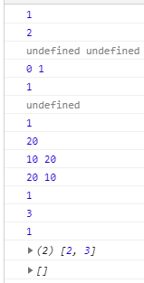


#### 예제 6 - **P63 객체 비구조화(object destructuring)**

: 객체의 여러 속성값을 변수로 쉽게 할당할 수 있는 문법

* 소스코드

  **es6.html 파일**

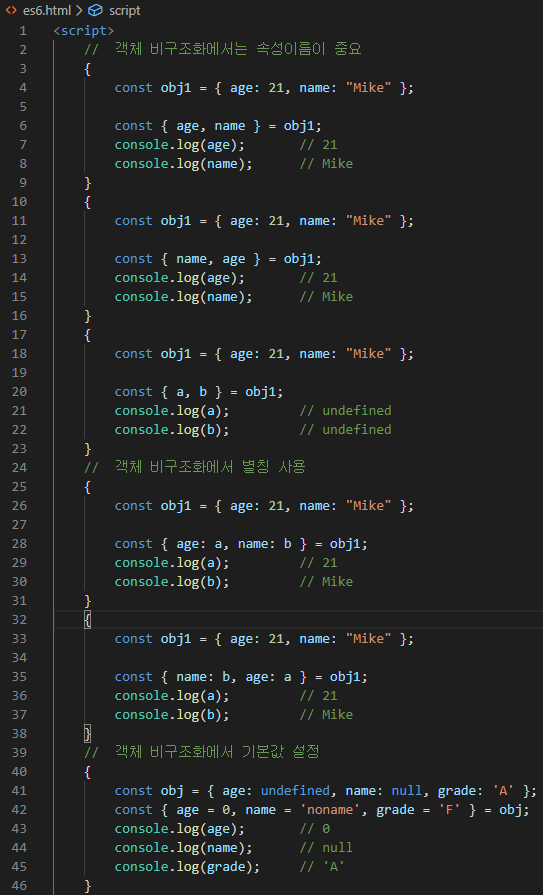

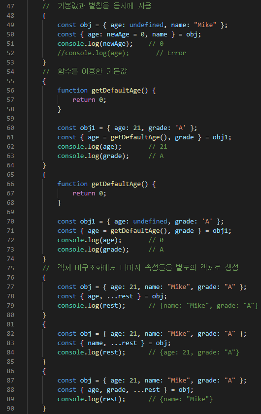

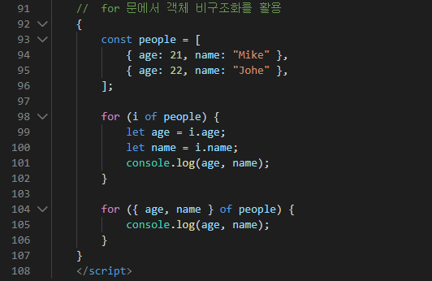

```html
<script>
    //  객체 비구조화에서는 속성이름이 중요
    {
        const obj1 = { age: 21, name: "Mike" };
    
        const { age, name } = obj1;
        console.log(age);       // 21
        console.log(name);      // Mike
    }    
    {
        const obj1 = { age: 21, name: "Mike" };
    
        const { name, age } = obj1;
        console.log(age);       // 21
        console.log(name);      // Mike
    }    
    {
        const obj1 = { age: 21, name: "Mike" };
    
        const { a, b } = obj1;
        console.log(a);         // undefined
        console.log(b);         // undefined
    }   
    //  객체 비구조화에서 별칭 사용
    {
        const obj1 = { age: 21, name: "Mike" };
    
        const { age: a, name: b } = obj1;
        console.log(a);         // 21
        console.log(b);         // Mike
    }   
    {
        const obj1 = { age: 21, name: "Mike" };
    
        const { name: b, age: a } = obj1;
        console.log(a);         // 21
        console.log(b);         // Mike
    }   
    //  객체 비구조화에서 기본값 설정
    {
        const obj = { age: undefined, name: null, grade: 'A' };
        const { age = 0, name = 'noname', grade = 'F' } = obj;
        console.log(age);       // 0
        console.log(name);      // null
        console.log(grade);     // 'A'
    }
    //  기본값과 별칭을 동시에 사용
    {
        const obj = { age: undefined, name: "Mike" };
        const { age: newAge = 0, name } = obj;
        console.log(newAge);    // 0
        //console.log(age);       // Error     
    }
    //  함수를 이용한 기본값
    {
        function getDefaultAge() {
            return 0;
        }
    
        const obj1 = { age: 21, grade: 'A' };
        const { age = getDefaultAge(), grade } = obj1;
        console.log(age);       // 21
        console.log(grade);     // A
    }
    {
        function getDefaultAge() {
            return 0;
        }
    
        const obj1 = { age: undefined, grade: 'A' };
        const { age = getDefaultAge(), grade } = obj1;
        console.log(age);       // 0
        console.log(grade);     // A
    }
    //  객체 비구조화에서 나머지 속성들을 별도의 객체로 생성
    {
        const obj = { age: 21, name: "Mike", grade: "A" };
        const { age, ...rest } = obj;
        console.log(rest);      // {name: "Mike", grade: "A"}
    }
    {
        const obj = { age: 21, name: "Mike", grade: "A" };
        const { name, ...rest } = obj;
        console.log(rest);      // {age: 21, grade: "A"}
    }
    {
        const obj = { age: 21, name: "Mike", grade: "A" };
        const { age, grade, ...rest } = obj;
        console.log(rest);      // {name: "Mike"}
    }
    //  for 문에서 객체 비구조화를 활용
    {
        const people = [
            { age: 21, name: "Mike" }, 
            { age: 22, name: "Johe" },
        ];
        
        for (i of people) {
            let age = i.age;
            let name = i.name;
            console.log(age, name);
        }
        
        for ({ age, name } of people) {
            console.log(age, name);
        }
    }
</script>
```

* 출력 창

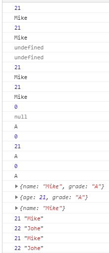


#### **예제 7 - P65 비구조화 심화 학습**

* 소스코드

  **es6.html 파일**

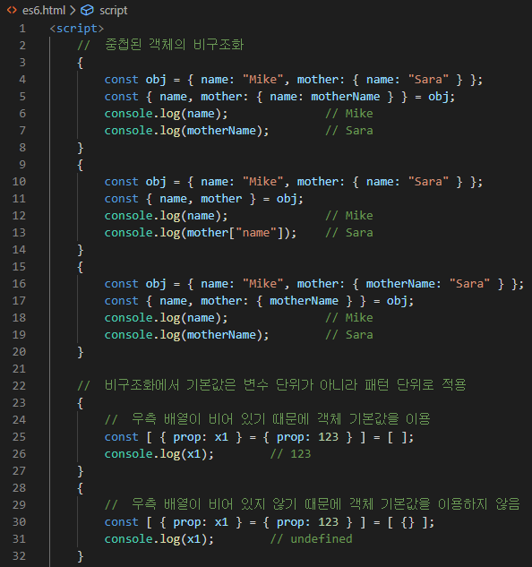

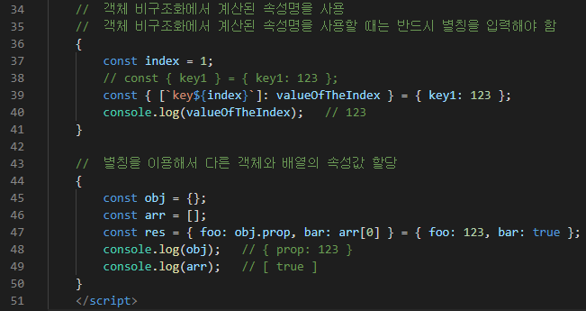

```html
<script>
//  중첩된 객체의 비구조화
{
    const obj = { name: "Mike", mother: { name: "Sara" } };
    const { name, mother: { name: motherName } } = obj;
    console.log(name);              // Mike
    console.log(motherName);        // Sara
}
{
    const obj = { name: "Mike", mother: { name: "Sara" } };
    const { name, mother } = obj;
    console.log(name);              // Mike
    console.log(mother["name"]);    // Sara
}
{
    const obj = { name: "Mike", mother: { motherName: "Sara" } };
    const { name, mother: { motherName } } = obj;
    console.log(name);              // Mike
    console.log(motherName);        // Sara
}

//  비구조화에서 기본값은 변수 단위가 아니라 패턴 단위로 적용
{
    //  우측 배열이 비어 있기 때문에 객체 기본값을 이용
    const [ { prop: x1 } = { prop: 123 } ] = [ ];
    console.log(x1);        // 123
}
{
    //  우측 배열이 비어 있지 않기 때문에 객체 기본값을 이용하지 않음
    const [ { prop: x1 } = { prop: 123 } ] = [ {} ];
    console.log(x1);        // undefined
}

//  객체 비구조화에서 계산된 속성명을 사용
//  객체 비구조화에서 계산된 속성명을 사용할 때는 반드시 별칭을 입력해야 함
{
    const index = 1;
    // const { key1 } = { key1: 123 };
    const { [`key${index}`]: valueOfTheIndex } = { key1: 123 };
    console.log(valueOfTheIndex);   // 123
}

//  별칭을 이용해서 다른 객체와 배열의 속성값 할당
{
    const obj = {};
    const arr = [];
    const res = { foo: obj.prop, bar: arr[0] } = { foo: 123, bar: true };
    console.log(obj);   // { prop: 123 }
    console.log(arr);   // [ true ]
}
</script>
```

* 출력 창

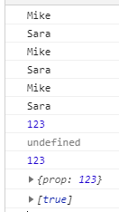


