# 리액트

## 비동기 프로그래밍 1: 프로미스

: 비동기 상태를 값으로 다룰 수 있는 객체로, 프로미스 이전에는 콜백 패턴을 주로 사용했다.


* 프로미스 상태

  * 대기중(pending) → 결과를 기다리는 상태
  * 이행됨(fulfilled) → 수행이 정상적으로 끝났고 결과값을 갖고 있는 상태
  * 거부됨(rejected) → 수행이 비정상적으로 끝난 상태
  * 이행됨, 거부됨 상태를 처리됨(settled) 상태라고 함

  프로미스는 처리됨(settled) 상태가 되면 더 이상 다른 상태로 변경되지 않으며, 대기중 상태에서만 이행됨, 거부됨 상태로 변경될 수 있음


#### 예제1- 이해하기

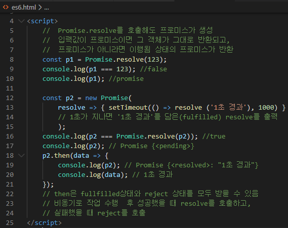

```html
<script>
    //  Promise.resolve를 호출해도 프로미스가 생성
    //  입력값이 프로미스이면 그 객체가 그대로 반환되고, 
    //  프로미스가 아니라면 이행됨 상태의 프로미스가 반환
    const p1 = Promise.resolve(123);
    console.log(p1 === 123); //false
    console.log(p1); //promise

    const p2 = new Promise(
        resolve => { setTimeout(() => resolve ('1초 경과'), 1000) }
        // 1초가 지나면 '1초 경과'를 담은(fulfilled) resolve를 출력
        );
    console.log(p2 === Promise.resolve(p2)); //true
    console.log(p2); // Promise {<pending>}
    p2.then(data => {
        console.log(p2); // Promise {<resolved>: "1초 경과"} 
        console.log(data); // 1초 경과
    });
    // then은 fullfilled상태와 reject 상태를 모두 받을 수 있음
    // 비동기로 작업 수행  후 성공했을 때 resolve를 호출하고, 
    // 실패했을 때 reject를 호출
</script>
```

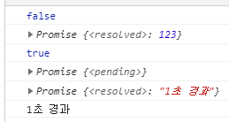


#### 예제2- 이해하기2

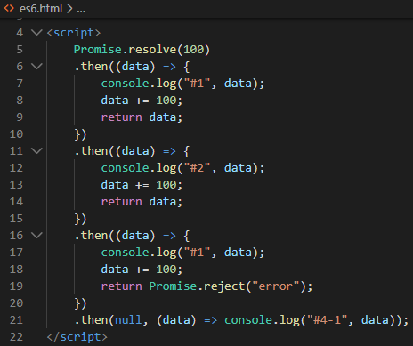

```html
<script>
    Promise.resolve(100)
    .then((data) => {
        console.log("#1", data);
        data += 100;
        return data;
    })
    .then((data) => {
        console.log("#2", data);
        data += 100;
        return data;
    })
    .then((data) => {
        console.log("#1", data);
        data += 100;
        return Promise.reject("error");
    })
    .then(null, (data) => console.log("#4-1", data));      
</script>
```

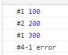


#### 예제 3 - finally 이해하기 

: finally 메소드는 새로운 프로미스를 생성하지 않아도 된다

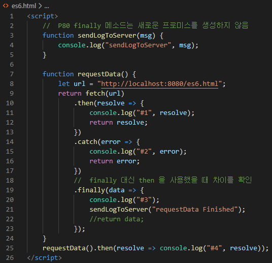

```html
<script>
    //  P80 finally 메소드는 새로운 프로미스를 생성하지 않음
    function sendLogToServer(msg) {
        console.log("sendLogToServer", msg);
    }

    function requestData() {
        let url = "http://localhost:8080/es6.html";
        return fetch(url) 
            .then(resolve => {
                console.log("#1", resolve);
                return resolve;
            })
            .catch(error => {
                console.log("#2", error);
                return error;
            })
            //  finally 대신 then 을 사용했을 때 차이를 확인
            .finally(data => {
                console.log("#3");
                sendLogToServer("requestData Finished");
                //return data;
            }); 
    }
    requestData().then(resolve => console.log("#4", resolve));
</script>
```

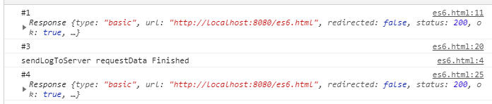

#### 예제 4

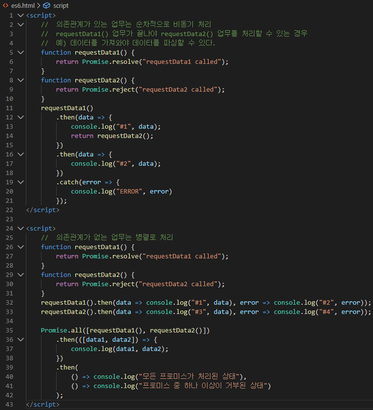

```html
<script>
    //  의존관계가 있는 업무는 순차적으로 비동기 처리
    //  requestData1() 업무가 끝나야 requestData2() 업무를 처리할 수 있는 경우
    //  예) 데이터를 가져와야 데이터를 파싱할 수 있다.
    function requestData1() {
        return Promise.resolve("requestData1 called");
    }
    function requestData2() {
        return Promise.reject("requestData2 called");    
    }
    requestData1() 
        .then(data => {
            console.log("#1", data);
            return requestData2();
        })
        .then(data => {
            console.log("#2", data);
        })
        .catch(error => {
            console.log("ERROR", error)
        });
</script>

<script>
    //  의존관계가 없는 업무는 병렬로 처리
    function requestData1() {
        return Promise.resolve("requestData1 called");
    }
    function requestData2() {
        return Promise.reject("requestData2 called");    
    }
    requestData1().then(data => console.log("#1", data), error => console.log("#2", error));
    requestData2().then(data => console.log("#3", data), error => console.log("#4", error));

    Promise.all([requestData1(), requestData2()])
        .then(([data1, data2]) => {
            console.log(data1, data2);
        })
        .then(
            () => console.log("모든 프로미스가 처리된 상태"), 
            () => console.log("프로미스 중 하나 이상이 거부된 상태")
        );
</script>
```

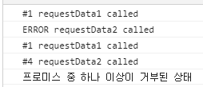


## 리액트를 다루는 기술

##### 함수 형태로 컴포넌트를 선언

```js
function App() {
  return (
    <div className="App">
      <header className="App-header">
        
        <p>
          Edit <code>src/App.js</code> and save to reload.
        </p>
        <a
          className="App-link"
          href="https://reactjs.org"
          target="_blank"
          rel="noopener noreferrer"
        >
          Learn React
        </a>
      </header>
    </div>
  );
}
```

##### 함수 형태로 컴포넌트를 선언

```js
function App() {
  return (
    <div className="App">
      <header className="App-header">
        
        <p>
          Edit <code>src/App.js</code> and save to reload.
        </p>
        <a
          className="App-link"
          href="https://reactjs.org"
          target="_blank"
          rel="noopener noreferrer"
        >
          Learn React
        </a>
      </header>
    </div>
  );
}
```

##### **클래스 형태로 컴포넌트를 선언 → render 함수를 포함**

```js
class App extends React.Component {
  render() {
    return (
      <div className="App">
        <header className="App-header">
          
          <p>
            Edit <code>src/App.js</code> and save to reload.
          </p>
          <a
            className="App-link"
            href="https://reactjs.org"
            target="_blank"
            rel="noopener noreferrer"
          >
            Learn React
          </a>
        </header>
      </div>
    );
  }
}
```

##### **JSX에서는 반드시 닫는 태그를 사용해야 한다.**

```js
<input type="text" />
<input type="text"></input>
<br />
<br></br>
```

##### **JSX에서는 반드시 하나의 태그(엘리먼트)로 감싸져 있어야 한다.**

```js
[ 잘못된 예 ]
<div> … </div>
<div> … </div>

[ 올바른 예 ]
<div>
	<div> … </div>
	<div> … </div>
</div>
```

엘리먼트를 묶어줄 때 다른 태그(<div>)를 사용하는 경우 ⇒ 2개의 <div> 엘리먼트를 묶어주는 역할의 <div>가 생성 → 불필요한 DOM 객체가 사용(생성)됨

```js
class App extends React.Component {
  render() {
    return (
      <div>
        <div>
          abc
        </div>
        <div>
          xyz
        </div>
      </div>
    );
  }
}
```


<></> 또는 <Fragment></Fragment>를 사용해서 엘리먼트를 묶을 수 있음 → 불필요한 DOM 요소 생성을 방지할 수 있음

```js
class App extends React.Component {
  render() {
    return (
      <>          { /* 또는 <Fragment> */ }
        <div>
          abc
        </div>
        <div>
          xyz
        </div>    { /* 또는 </Fragment> */ }
      </>
    );
  }
}
```


##### JSX 안에 자바스크립트 사용*

```js
class App extends React.Component {
  render() {
    const name = 'react';
    return (
      <div>Hello {name}!</div>
    );
  }
}

class App extends React.Component {
  render() {
    const name = '리액트';
    return (
      <div>
        {
          name == 'react' ? 'Hello react' : '안녕 리액트'
        }          
      </div>
    );
  }
}

class App extends React.Component {
  render() {
    const value = 1;
    return (
      <div>
        {
          (function() {
            if (value == 1) return <div>하나</div>;
            if (value == 2) return <div>둘</div>;
          })()
        }          
      </div>
    );
  }
}
```


```js
class App extends React.Component {
  render() {
    const style = {
      backgroundColor: 'black', 
      padding: '16px',
      color: 'white', 
      fontSize: '12px'
    };
    return (
      <div style={style}>
        안녕하세요.
      </div>
    );
  }
}
```


#### 컴포넌트 생성

* index.js

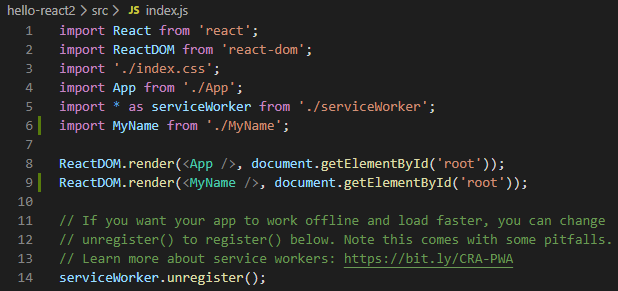

```js
import React from 'react';
import ReactDOM from 'react-dom';
import './index.css';
import App from './App';
import * as serviceWorker from './serviceWorker';
import MyName from './MyName';

ReactDOM.render(<App />, document.getElementById('root'));
ReactDOM.render(<MyName />, document.getElementById('root'));

// If you want your app to work offline and load faster, you can change
// unregister() to register() below. Note this comes with some pitfalls.
// Learn more about service workers: https://bit.ly/CRA-PWA
serviceWorker.unregister();
```

* App.js

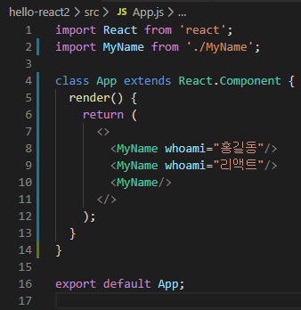

```js
import React from 'react';
import MyName from './MyName';

class App extends React.Component {
  render() {
    return (
      <>
        <MyName whoami="홍길동"/>
        <MyName whoami="리액트"/>
        <MyName/>
      </>
    );
  }
}

export default App;
```

* MyName.js

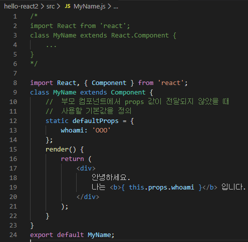

```js
/*
import React from 'react';
class MyName extends React.Component {
    ...
}
*/

import React, { Component } from 'react';
class MyName extends Component {
    //  부모 컴포넌트에서 props 값이 전달되지 않았을 때 
    //  사용할 기본값을 정의
    static defaultProps = {
        whoami: 'OOO'
    };
    render() {
        return (
            <div>
                안녕하세요.
                나는 <b>{ this.props.whoami }</b> 입니다.
            </div>
        );
    }
}
export default MyName;
```

* 출력 창 

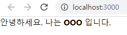


#### 함수형 컴포넌트

C:\react\hello-react2\src\MyName2.js 파일을 작성

* index.js

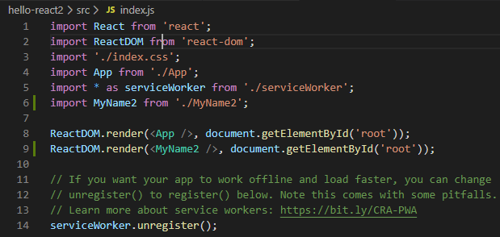

```js
import React from 'react';
import ReactDOM from 'react-dom';
import './index.css';
import App from './App';
import * as serviceWorker from './serviceWorker';
import MyName2 from './MyName2';

ReactDOM.render(<App />, document.getElementById('root'));
ReactDOM.render(<MyName2 />, document.getElementById('root'));

// If you want your app to work offline and load faster, you can change
// unregister() to register() below. Note this comes with some pitfalls.
// Learn more about service workers: https://bit.ly/CRA-PWA
serviceWorker.unregister();
```

* App.js

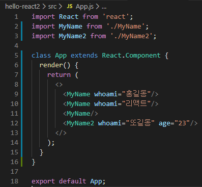

```js
import React from 'react';
import MyName from './MyName';
import MyName2 from './MyName2';

class App extends React.Component {
  render() {
    return (
      <>
        <MyName whoami="홍길동"/>
        <MyName whoami="리액트"/>
        <MyName/>
        <MyName2 whoami="또길동" age="23"/>
      </>
    );
  }
}

export default App;
```

* MyName2.js

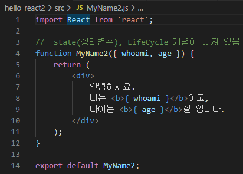

```js
import React from 'react';

//  state(상태변수), LifeCycle 개념이 빠져 있음
function MyName2({ whoami, age }) {
    return (
        <div>
            안녕하세요.
            나는 <b>{ whoami }</b>이고, 
            나이는 <b>{ age }</b>살 입니다.
        </div>
    );
}

export default MyName2;
```

* 출력 창


#### state

C:\react\hello-react2\src\Counter.js 파일을 작성

* App.js

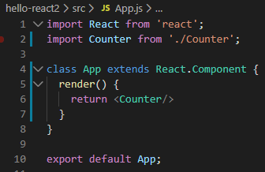

```js
import React from 'react';
import Counter from './Counter';

class App extends React.Component {
  render() {
    return <Counter/>
  }
}

export default App;
```

* Counter.js

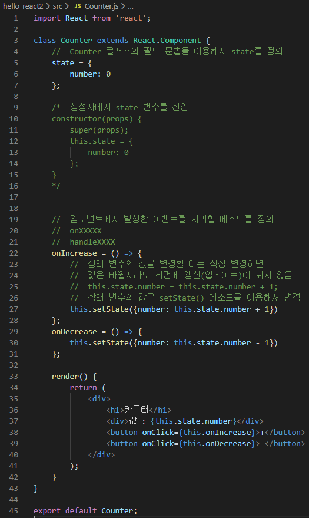

```js
import React from 'react';

class Counter extends React.Component {
    //  Counter 클래스의 필드 문법을 이용해서 state를 정의
    state = {
        number: 0
    };

    /*  생성자에서 state 변수를 선언        
    constructor(props) {
        super(props);
        this.state = {
            number: 0
        };
    }
    */


    //  컴포넌트에서 발생한 이벤트를 처리할 메소드를 정의
    //  onXXXXX 
    //  handleXXXX 
    onIncrease = () => {
        //  상태 변수의 값을 변경할 때는 직접 변경하면 
        //  값은 바뀔지라도 화면에 갱신(업데이트)이 되지 않음
        //  this.state.number = this.state.number + 1;
        //  상태 변수의 값은 setState() 메소드를 이용해서 변경
        this.setState({number: this.state.number + 1})         
    };
    onDecrease = () => {
        this.setState({number: this.state.number - 1}) 
    };
    
    render() {
        return (
            <div>
                <h1>카운터</h1>
                <div>값 : {this.state.number}</div>
                <button onClick={this.onIncrease}>+</button>
                <button onClick={this.onDecrease}>-</button>
            </div>
        );
    }
}

export default Counter;
```

* 출력 창

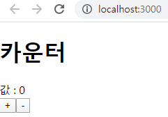


#### Todo 기능 구현

C:\react\hello-react2\todo.html 파일 작성

* todo.html

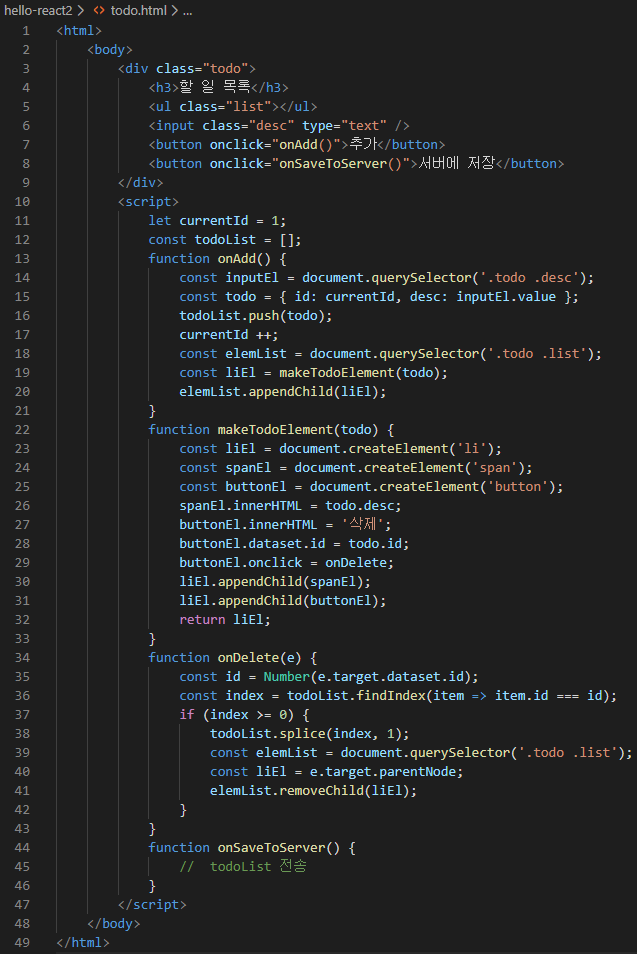

```js
<html>
    <body>
        <div class="todo">
            <h3>할 일 목록</h3>
            <ul class="list"></ul>
            <input class="desc" type="text" />
            <button onclick="onAdd()">추가</button>
            <button onclick="onSaveToServer()">서버에 저장</button>
        </div>
        <script>
            let currentId = 1;
            const todoList = [];
            function onAdd() {
                const inputEl = document.querySelector('.todo .desc');
                const todo = { id: currentId, desc: inputEl.value };
                todoList.push(todo);
                currentId ++;
                const elemList = document.querySelector('.todo .list');
                const liEl = makeTodoElement(todo);
                elemList.appendChild(liEl);
            }
            function makeTodoElement(todo) {
                const liEl = document.createElement('li');
                const spanEl = document.createElement('span');
                const buttonEl = document.createElement('button');
                spanEl.innerHTML = todo.desc;
                buttonEl.innerHTML = '삭제';
                buttonEl.dataset.id = todo.id;
                buttonEl.onclick = onDelete;
                liEl.appendChild(spanEl);
                liEl.appendChild(buttonEl);
                return liEl;
            }
            function onDelete(e) {
                const id = Number(e.target.dataset.id);
                const index = todoList.findIndex(item => item.id === id);
                if (index >= 0) {
                    todoList.splice(index, 1);
                    const elemList = document.querySelector('.todo .list');
                    const liEl = e.target.parentNode;
                    elemList.removeChild(liEl);
                }
            }
            function onSaveToServer() {
                //  todoList 전송
            }
        </script>
    </body>
</html>
```

* 출력 창

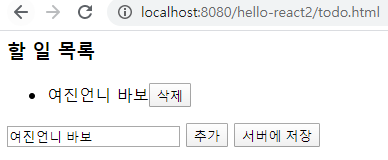

