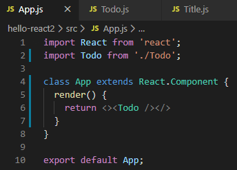
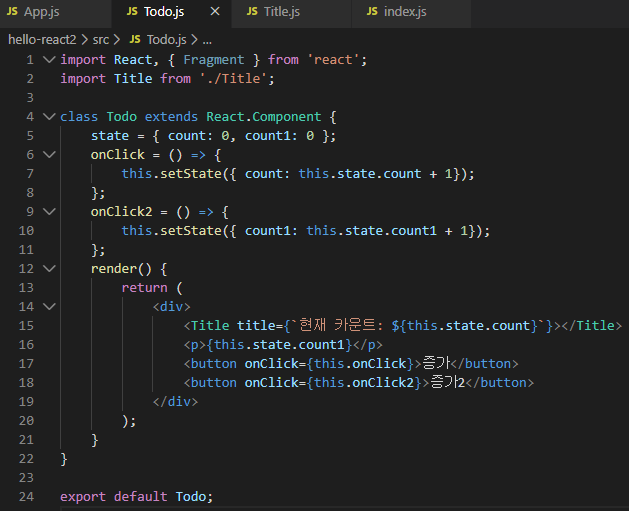
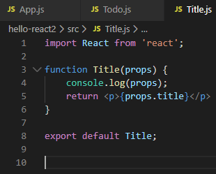
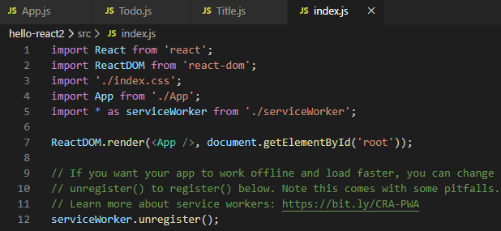
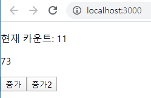

# 리액트

## 상태값과 속성값으로 관리하는 UI

#### 예제 1 - **P111 React.memo, React.PureComponent 사용**

자식 컴포넌트는 부모 컴포넌트가 렌더링될 때 함께 렌더링된다. "증가2" 버튼을 클릭했을 때 자식 컴포넌트도 함께 렌더링된다. ⇒ 불필요한 렌더링이 발생한다. ⇒ 방지하기 위해서는 React.memo, React.PureComponent를 사용

* **App.js**

* **Todo.js**

* **Title.js**

* **index.js**

* 출력 창

#### 예제 2 - setState

클래스형 컴포넌트에서 상태값을 변경할 때 호출하는 메소드setState 메소드로 입력된 객체는 기존 상태값에 병합(merge)됨

#### 예제 3 - **P113 setState 메소드를 연속해서 호출하면 발생하는 문제점**

리액트는 효율적인 렌더링을 위해서 여러개의 setState 메서드를 배치로 처리 → state 변수와 화면(UI)간 불일치가 발생할 수 있음

