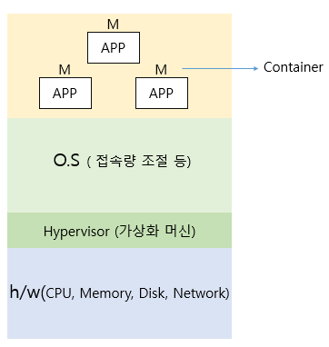
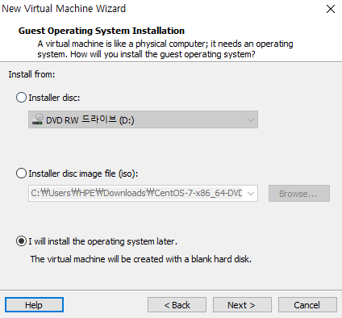
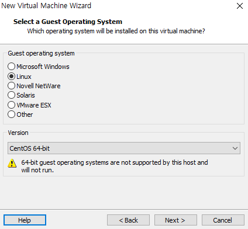
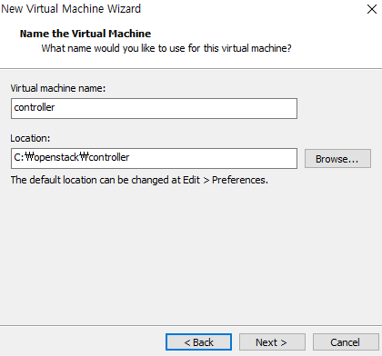
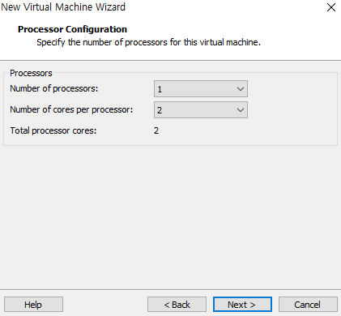
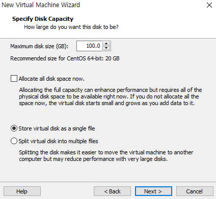
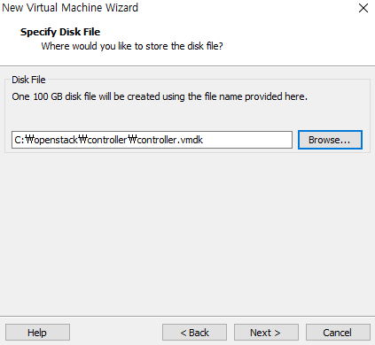
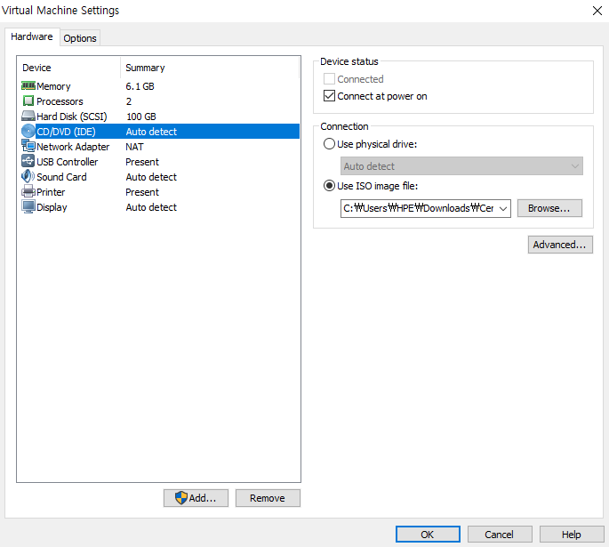
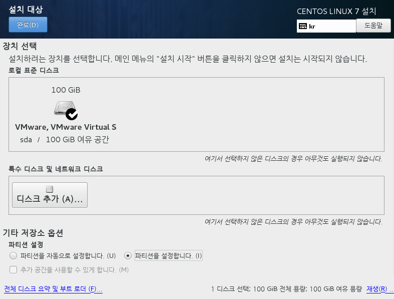

Open stack

## 오픈스택의 이해

### 클라우드 컴퓨팅

: 사용자의 요청에 따라 공유된 컴퓨터의 자원이나 데이터를 사용자가 이용하는 컴퓨터 및 휴대폰과 같은 장치로 제공하는 인터넷 기반의 컴퓨팅 환경을 의미한다.

* 클라우드 서비스 모델
  * IAAS:  통합개발환경, 스토리지, 네트워크 등 기본컴퓨터 자원들을 사용자에게 제공하는 클라우드 모델이다. 주 사용자는 it관계자이다.
  * PAAS: 프로그램 언어, 라이브러리, 툴 을 사용해서 제작한 어플리케이션을 클라우드 환경에서 배포할 수 있도록하는 클라우드 모델이다.
  * SAAS: 클라우드 환경에서 운영 중인 서비스 제공자의 애플리케이션을 사용자가 사용할 수 있는 클라우드 컴퓨팅 모델이다. 주 사용자는 END-user이다.

### 오픈스택

:클라우드 컴퓨팅의 IAAS로서 클라우드 컴퓨팅 환경에서 사용되는 무료 오픈소스 클라우드 운영체제이다.

### 오픈스택 릴리즈 종류

:  

### 오픈스택 서비스 종류

* 통합 인증 서비스 - Keystone: 사용자관리 
  
  * 사용자 및 API에 대한 인증 및 권한 설정 서비스를 제공한다.
* 컴퓨트 서비스 - Nova: 가상 머신 관리
  
  * Nova 서비스는 처음 컴퓨터의 자원 풀을 관리하고 자동화하기 위해 설계되었으며 고성능컴퓨팅 설정, 소프트웨어가 설치되지 않은 베어메탈 시스템 그리고 가상화 기술과도 널리 사용되고 있다.
* 이미지 서비스 - Glance: 커널이나 디스크 이미지와 같은 가상 이미지 관리
  
* 다양한 하이퍼바이저에서 사용할 수 있는 가상 머신 이미지를 관리하고 가상머신에 설치 된 운영체제를 보관 및 관리한다. 디스크와 인스턴스를 생성할 서버 이미지를 발견해서 등록하고 전송하는 역할을 수행한다.
  
* 대시보드 - Horizon: 웹 브라우저를 이용해 GUI콘솔 제공 

* 오브젝트 스토리지 서비스 - Swift: 클라우드 저장 스토리지 제공

* 블록 스토리지 - Cinder: 가상머신을 위한 스토리지 관리

  * 블록 장치를 생성하고 서버에 부착하고 분리하는 업무를 담당한다.

    #### * 스토리지 유형

    ​	- Block 기반 storage: 장치FILE 형태로 접근 (client의 접근 방식이 다르다)

       	ex) Cinder, EBS, SAN

    ​	- Object 기반 storage : Http 기반 RESTful API

       	ex) swift, S3

    ​	 -File  기반 storage: 특정 Directory에 연결하여 사용(마운트)

       	ex) Manila, EFS, NFS, glusterfs 

    ​	- Database  기반 storage  

       	ex) Trove, RDS

* 네트워크 서비스 - Neutron: 가상 네트워크 관리

* 오케스트레이션 서비스 - Heat: 가상머신을 위한 오케스트레이션 기능 제공 

* 데이터 미터링 서비스 - Ceilometer:  각 계정들의 사용량 통계 서비스 제공

## 오픈스택 설치

### 설치방법

  * Manual 설치

  * 자동화 툴을 이용한 설치\

    

    

    

    

    

    

    

    

    

    

    .

    .

    .

    중간 생략 부분은 기본 값

    

    

    

    새로운 가상머신 controller  설치 후 setting 설정

    

    

    

    

    

real 36m.34m857s

user 0m10.813s

sys 0m36.752s

