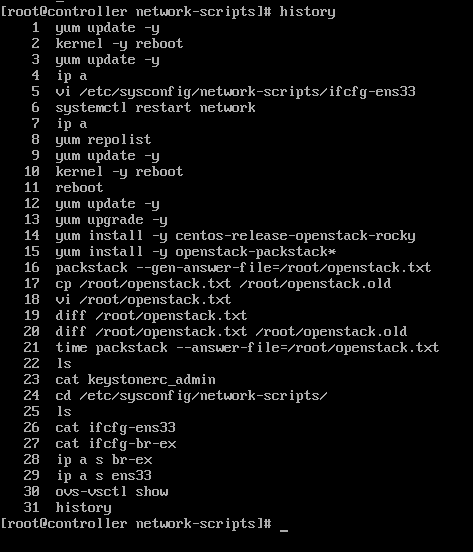

### ntp 클라이언트 설정하기

=>  NTP(Network Time Protocol)은 지연이 있을 수 있는 네트워크 상에서, 컴퓨터와 컴퓨터간의 시간을 동기화 하기 위한 네트워크 프로토콜이다.

```shell
[root@controller ~]# getenforce
Enforcing

[root@controller ~]# id -a
uid=0(root) gid=0(root) groups=0(root) context=unconfined_u:unconfined_r:unconfined_t:s0-s0:c0.c1023

[root@controller ~]# ps -efZ|grep ssh
system_u:system_r:sshd_t:s0-s0:c0.c1023 root 1147    1  0 13:19 ?        00:00:00 /usr/sbin/sshd -D
...

[root@controller ~]# ls -lZ /etc/ssh
-rw-r--r--. root root     system_u:object_r:etc_t:s0       moduli
-rw-r--r--. root root     system_u:object_r:etc_t:s0       ssh_config
...

[root@controller ~]# ls -lZ /tmp
-rwx------. root root system_u:object_r:initrc_tmp_t:s0 ks-script-zSjW55
drwx------. root root system_u:object_r:tmp_t:s0       systemd-private-33653959da494e1bbc71a4f2590b72fe-chronyd.service-OVo9Ub
...

[root@controller ~]# setenforce 
usage:  setenforce [ Enforcing | Permissive | 1 | 0 ]
[root@controller ~]# setenforce 0
[root@controller ~]# getenforce 
Permissive
[root@controller ~]# vi /etc/chrony.conf
[root@controller ~]# systemctl start chronyd
[root@controller ~]# systemctl enable chronyd
[root@controller ~]# chronyc sources
210 Number of sources = 4
MS Name/IP address         Stratum Poll Reach LastRx Last sample               
===============================================================================
^* 106.247.248.106               2   7   177   119   -371us[ -356us] +/-   48ms
^+ dadns.cdnetworks.co.kr        2   7   377   120   -474us[ -458us] +/-   58ms
^+ send.mx.cdnetworks.com        2   6   377    54   +506us[ +506us] +/-   58ms
^+ ec2-54-180-134-81.ap-nor>     2   7   377   121   +620us[ +636us] +/-   51ms
```





```
1.컨트롤러 준비작업
   os update,/etc/hosts,ntp server 구축,centos 최적화(filrewalld/NetworkManager/SELinux),repository 추가

2.오픈스택 설치(packstack on centos)
vi /etc/chrony.conf(수정)
----------------------------------------------------
server 0.centos.pool.ntp.org iburst
server 1.centos.pool.ntp.org iburst
#server 2.centos.pool.ntp.org iburst
#server 3.centos.pool.ntp.org iburst
server 2.kr.pool.ntp.org iburst
server 127.127.1.0 

allow 10.0.0.0/24
-----------------------------------------------------
vi openstack.txt(수정-diff로 확인)
-----------------------------------------------------
326 CONFIG_KEYSTONE_ADMIN_PW=abc123
1185 CONFIG_PROVISION_DEMO=n
11 CONFIG_DEFAULT_PASSWORD=abc123
46 CONFIG_CEILOMETER_INSTALL=n
 50 CONFIG_AODH_INSTALL=n
873 CONFIG_NEUTRON_OVS_BRIDGE_IFACES=br-ex:ens33
----------------------------------------------------------------------------

3.packstack을 이용한 all-in-one 구성

4.오픈스택 서비스 사용하기

Horizon 접속
Horizon 메뉴
Openstack 용어 정의
프로젝트/사용자 /Flavor 생성 

--------------------------------------------------------------------------
네트워크/라우터
Floating IP용: ext1->subext1->10.0.0.0/24,gw: 10.0.0.2, dns:10.0.0.2,dhcp X, 사용 IP pool(10.0.0.210,10.0.0.220),외부네트워크
Fixed IP 용: int1->subint1->192.168.0.0/24,gw:192.168.0.254,dns:10.0.0.2,dhcp 활성화)
router1 생성
외부 네트워크과 router간 연결: 게이트웨이 설정
내부 네트워크와 router간 연결: 인터페이스 추가
--------------------------------------------------------------------------
```