# OPENSTACK - 3일차

OpenStack_4차혁신.pdf  150p

## Security Group 생성


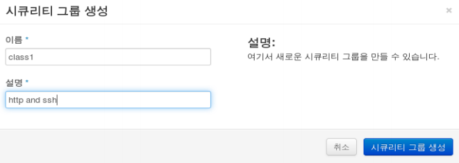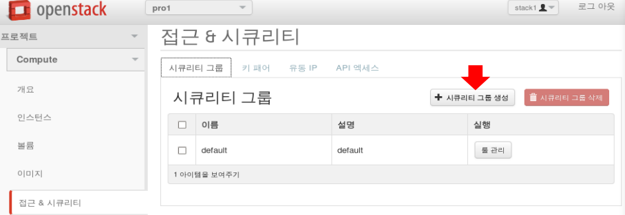

### Security Group에 rule 추가

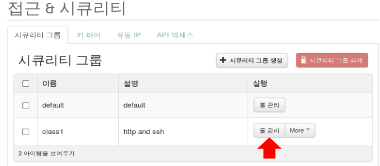

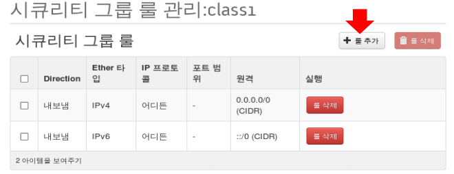

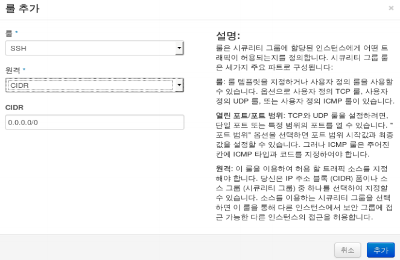

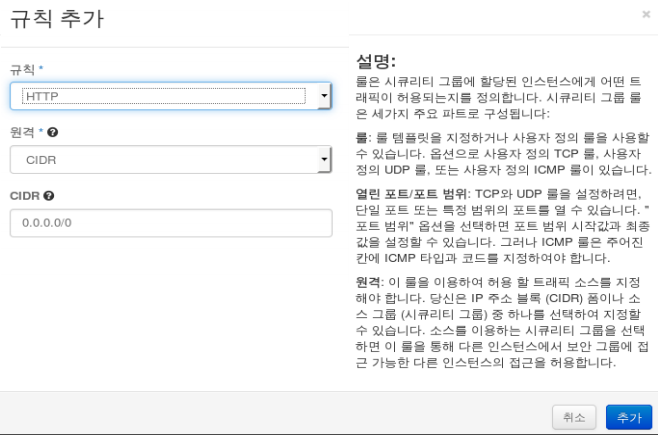


## 키 페어

##### ssh 인증방식

* password 기반 인증 (default)

* key기반 인증 (비대칭 key) - public key (공개key) 또는 private key(개인 key)

  


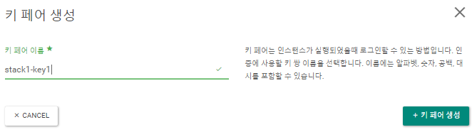


## Floating IP 생성

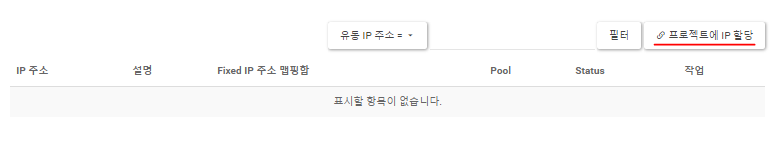


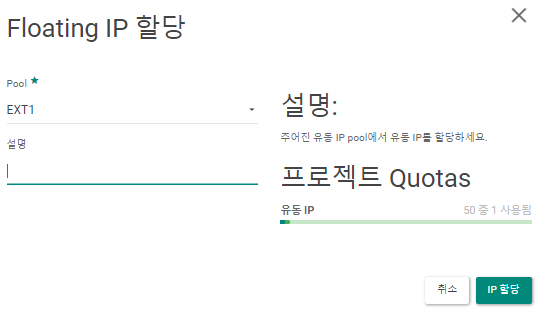


## IMAGE

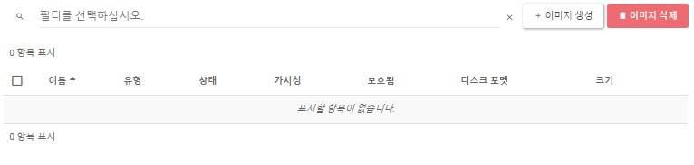


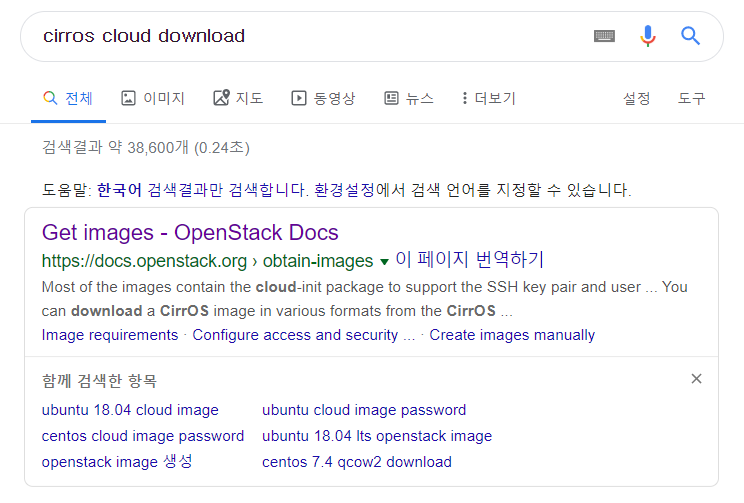

=> Cirros 이미지 다운로드 경로   http://download.cirros-cloud.net/0.3.5/ 

=> `cirros-0.3.5-x86_64-disk.img` 다운받기: 이미지 소스 파일


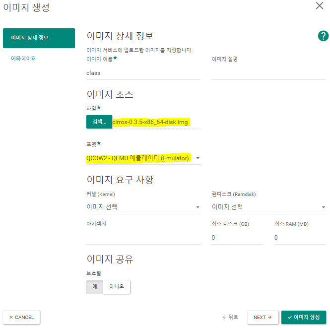


## Instance

* 인스턴스 생성

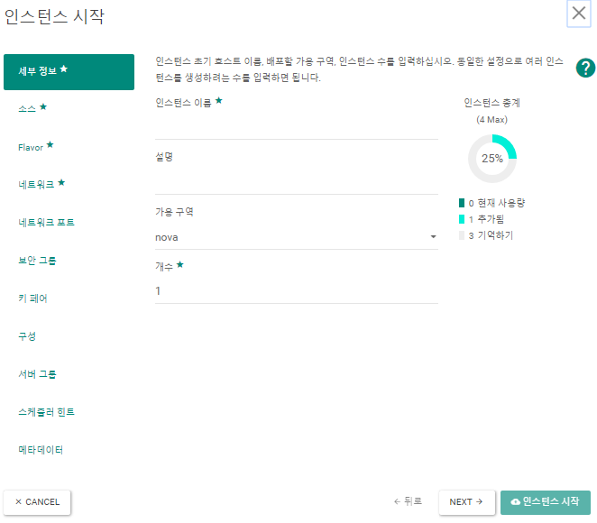


* 다음과 같은 설정으로 인스턴스 생성

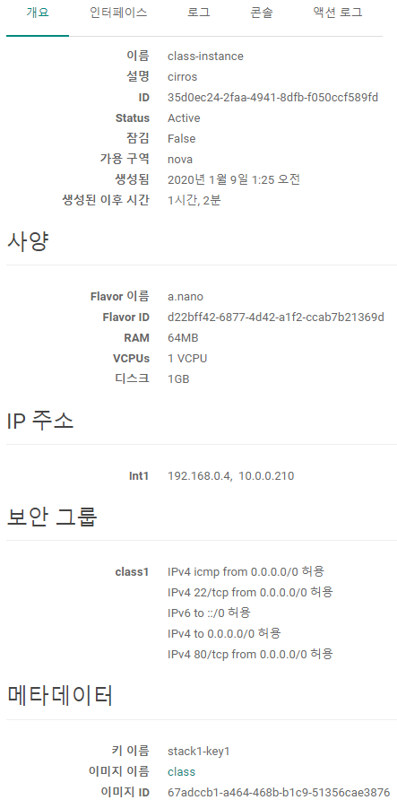

* 인스턴스 확인

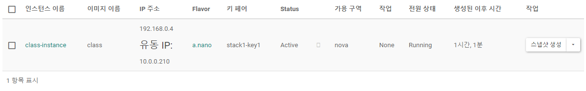


### password 기반 인증 (default)

* 인스턴스 콘솔 로그 에서 확인했던 login정보로 접속
  *  user: cirros/ password: cubswin:)

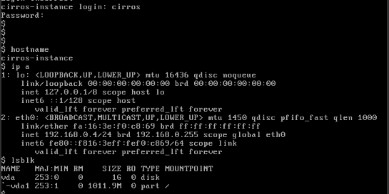

* 만약 인스턴스 생성이나 콘솔에서 에러가 발생시

Xshell - controller에서 

```shell
[root@controller ~]# yum install -y openstack-utils
   //openstack 상태확인 명령어를 실행할 수 있는 서비스 실행
Loaded plugins: fastestmirror
Loading mirror speeds from cached hostfile
...
[root@controller ~]# openstack-status
   //출력 결과중 neutron-openvswitch-agent가 inactive한 상태라면 'systemctl (re)start       	  neutron-openvswitch-agent'를 명령해서 active상태로 변경할 수 있다 => error 해결
...
neutron-openvswitch-agent:              active
...
```


#### 네트워크 토폴로지 

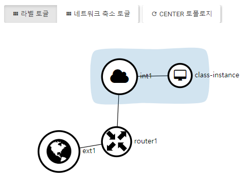


#### 볼륨

* 볼륨생성

  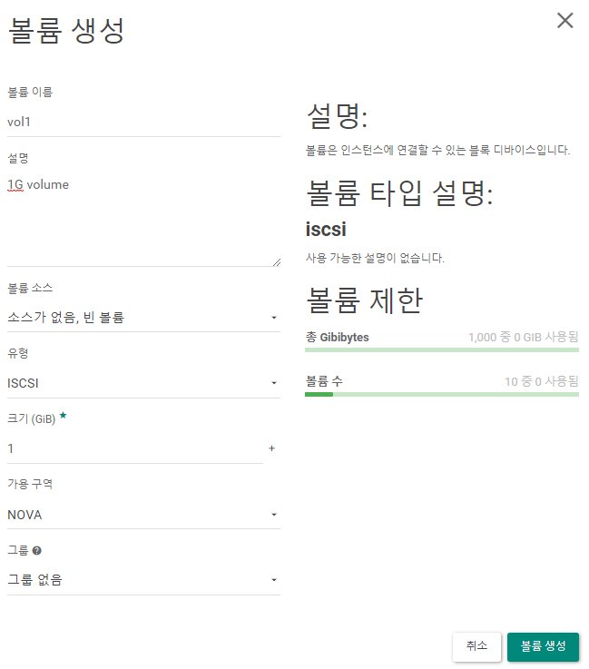

* 볼륨편집 - 인스턴스 할당

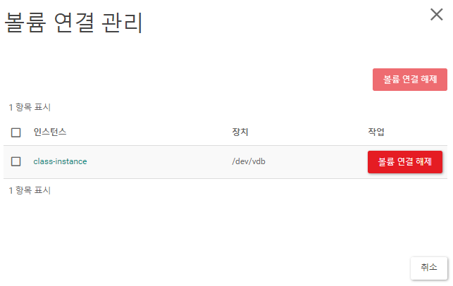

* 볼륨 확인

  * 인스턴스 콘솔

    ```bash
    $ lsblk
    ```

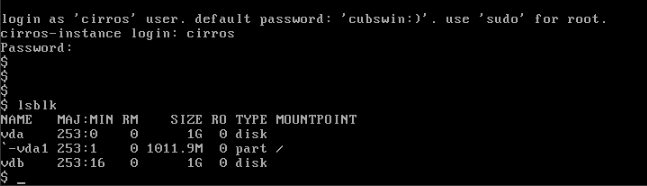

​					=>  'vdb'가 추가된 것을 확인할 수 있다.					

* * ```bash
    $ sudo sh
    $ fdisk /dev/vdb #기본으로 접속
    ```

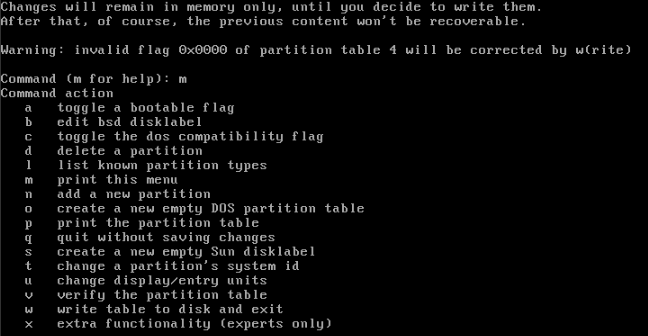

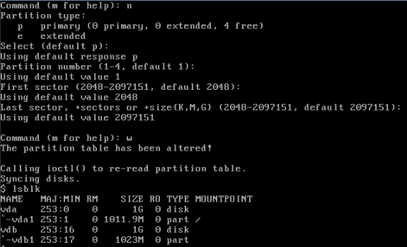

* * ```bash
    $ mkfs -t ext4 /dev/vdb1 #파일 시스템 포멧 명령어
    ```

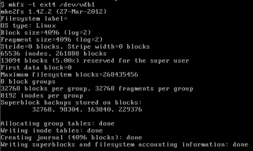

```bash
$ mkdir /app
```

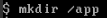


```bash
$ mount /dev/vdb1 /app
$ df -h
$ cp /etc/p* /app
$ ls /app
```

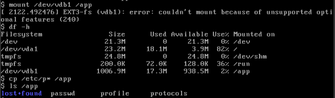


### key기반 인증 (비대칭 key) - public key 또는 private key

```shell
[root@controller ~]# ip netns
qdhcp-1e2a0885-4b0f-4b19-bda3-3a4d252776e9 (id: 1)
qrouter-f659f5ab-5917-4a9c-a0a7-42b25842cd94 (id: 0)

[root@controller ~]# ip netns exec qdhcp-1e2a0885-4b0f-4b19-bda3-3a4d252776e9 /bin/sh 

sh-4.2# ip a
1: lo: <LOOPBACK,UP,LOWER_UP> mtu 65536 qdisc noqueue state UNKNOWN group default qlen 1000
    link/loopback 00:00:00:00:00:00 brd 00:00:00:00:00:00
    inet 127.0.0.1/8 scope host lo
       valid_lft forever preferred_lft forever
    inet6 ::1/128 scope host 
       valid_lft forever preferred_lft forever
12: tap31693c5b-c8: <BROADCAST,MULTICAST,UP,LOWER_UP> mtu 1450 qdisc noqueue state UNKNOWN group default qlen 1000
    link/ether fa:16:3e:43:0e:8a brd ff:ff:ff:ff:ff:ff
    inet 192.168.0.1/24 brd 192.168.0.255 scope global tap31693c5b-c8
       valid_lft forever preferred_lft forever
    inet6 fe80::f816:3eff:fe43:e8a/64 scope link 
       valid_lft forever preferred_lft forever

sh-4.2# ssh cirros@10.0.0.210
The authenticity of host '10.0.0.210 (10.0.0.210)' can't be established.
RSA key fingerprint is SHA256:6wagQSkVmf+NSgd/kHsa1O7mP+I71TKxtqAeN3B/Rfo.
RSA key fingerprint is MD5:e3:bf:d9:11:35:99:bb:65:df:89:e0:60:e4:13:77:34.
Are you sure you want to continue connecting (yes/no)? yes
Warning: Permanently added '10.0.0.210' (RSA) to the list of known hosts.

cirros@10.0.0.210's password: 

$ lsblk
NAME   MAJ:MIN RM    SIZE RO TYPE MOUNTPOINT
vda    253:0    0      1G  0 disk 
`-vda1 253:1    0 1011.9M  0 part /
vdb    253:16   0      1G  0 disk 
`-vdb1 253:17   0   1023M  0 part /app
```

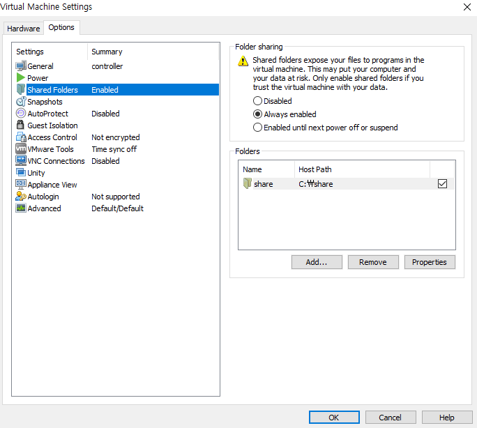

```shell
[root@controller ~]# vmhgfs-fuse /mnt
fuse: mountpoint is not empty
fuse: if you are sure this is safe, use the 'nonempty' mount option

[root@controller ~]# cd /mnt/hgfs/

[root@controller hgfs]# cd share/

[root@controller share]# ls
stack1-key1.pem

[root@controller share]# cp stack1-key1.pem /root

[root@controller share]# ip netns
qdhcp-1e2a0885-4b0f-4b19-bda3-3a4d252776e9 (id: 1)
qrouter-f659f5ab-5917-4a9c-a0a7-42b25842cd94 (id: 0)

[root@controller share]# ssh cirros@10.0.0.210  
	//접근 권한 없음
ssh: connect to host 10.0.0.210 port 22: No route to host

[root@controller share]# ip netns exec qrouter-f659f5ab-5917-4a9c-a0a7-42b25842cd94 ssh -i /root/stack1-key1.pem cirros@10.0.0.210
@@@@@@@@@@@@@@@@@@@@@@@@@@@@@@@@@@@@@@@@@@@@@@@@@@@@@@@@@@@
@         WARNING: UNPROTECTED PRIVATE KEY FILE!          @
@@@@@@@@@@@@@@@@@@@@@@@@@@@@@@@@@@@@@@@@@@@@@@@@@@@@@@@@@@@
Permissions 0755 for '/root/stack1-key1.pem' are too open.
It is required that your private key files are NOT accessible by others.
This private key will be ignored.
Load key "/root/stack1-key1.pem": bad permissions
cirros@10.0.0.210's password: 
Permission denied, please try again.
cirros@10.0.0.210's password: 
   
[root@controller share]# chmod 600 /root/stack1-key1.pem 
	//접근 권한 부여
[root@controller share]# ip netns exec qrouter-f659f5ab-5917-4a9c-a0a7-42b25842cd94 ssh -i /root/stack1-key1.pem cirros@10.0.0.210

$ ls .ssh
authorized_keys
$ cat .ssh/authorized_keys 
	//key 정상적으로 작동
ssh-rsa AAAAB3NzaC1yc2EAAAADAQABAAABAQDKZC7IMVj244CwLexVKoVp6mmcUMfXzXvs/jCWLSQgiPKaFX4KkrGoEeuMvALYL4jbcR8Q2LRCM7D61pRbN5W+KdhsiqsR/iJnWXPs0B7ZzHDjTF8P3hi/ArsEq1lSA/Ig+5tQrxlwN7VZZPCYcm...

```


## snapshot 생성

: root 디스크를 vm snapshot, volume snapshot을 이용해 백업 -> 새로운 인스턴스, 볼륨으로 올릴 수 있다.\

```bash
$ sudo umount /app
	# 오류 방지를 위해 unmount와 볼륨 연결 해지 실행

```


### 컨테이너 생성

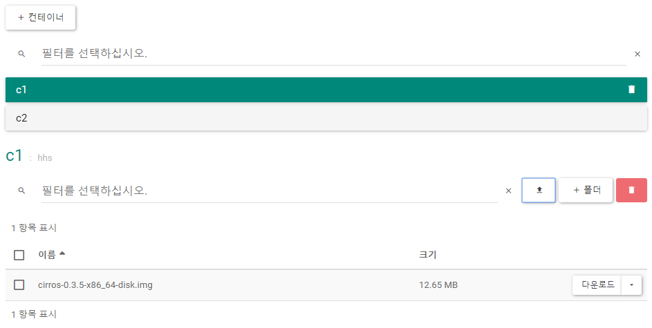


